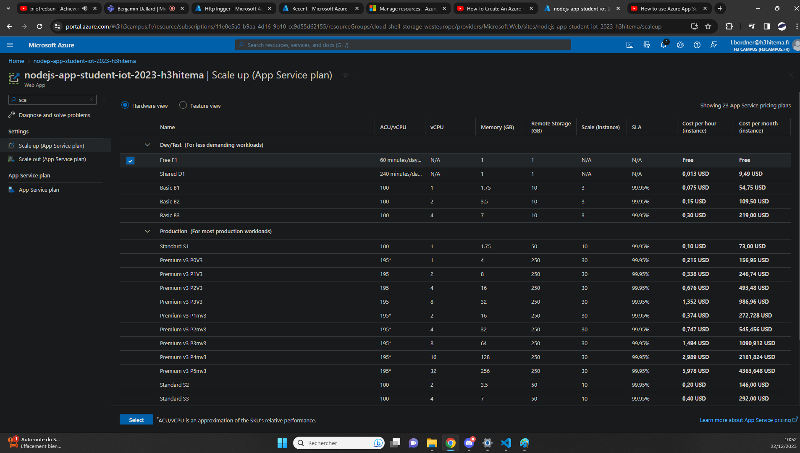
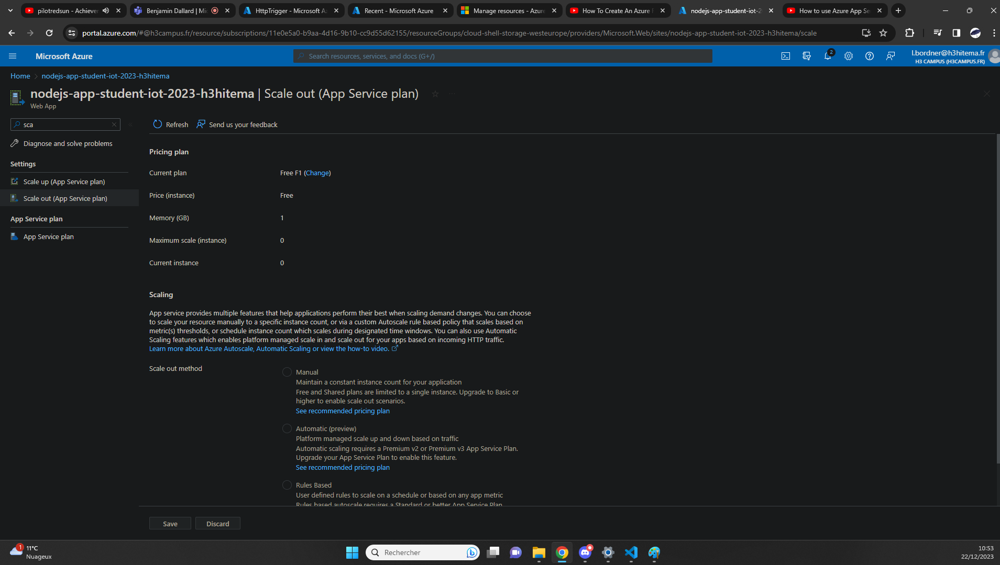
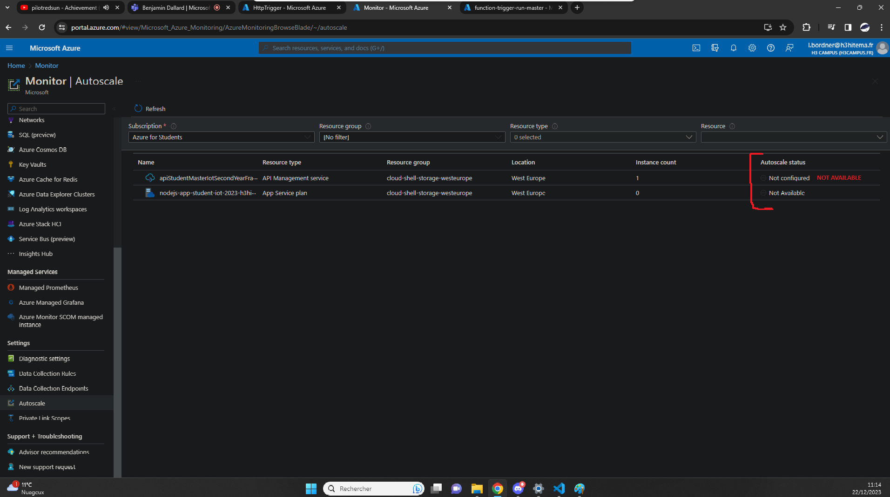

## Set Up Auto-Scaling [/AutoScaling]
[Back to Source](../README.md)

Suppose you have a variable workload and need to adjust resources based on demand. Auto-scaling in Azure allows you to dynamically adjust resources to maintain performance and manage costs.

### Where Autoscaling (App Service, Didn't Apply but still showed some config case)

#### Scale Up (App Service)

#### Scale Out (App Service)

#### Autoscale Monitoring (Seem to not have anything to config?)

