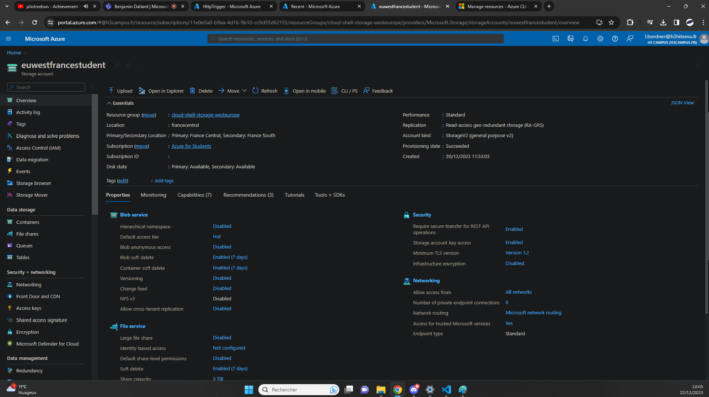
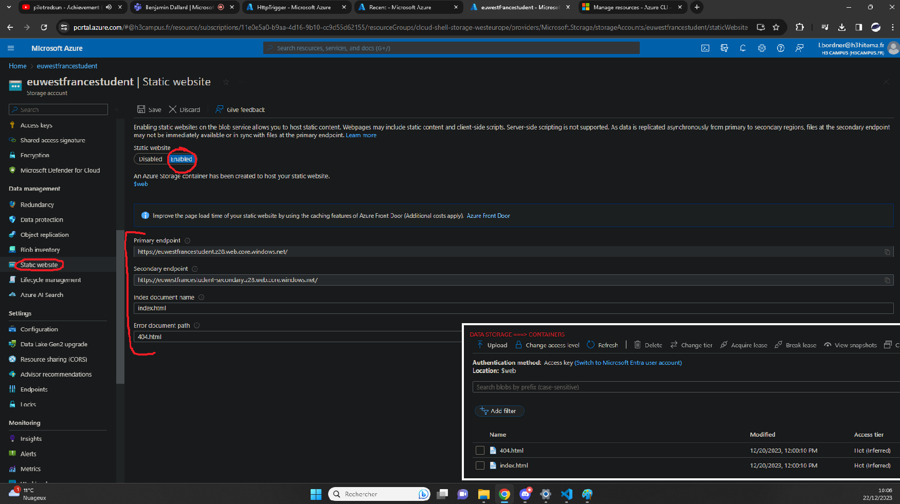

## Create Bucket [/createbucket]
[Back to Source](../README.md)

Consider a scenario where your application generates a large number of log files or images that need to be stored and accessed securely. Azure Blob Storage can be used to store such 
unstructured data.

### Bucket Showcase

### Static Website Config

