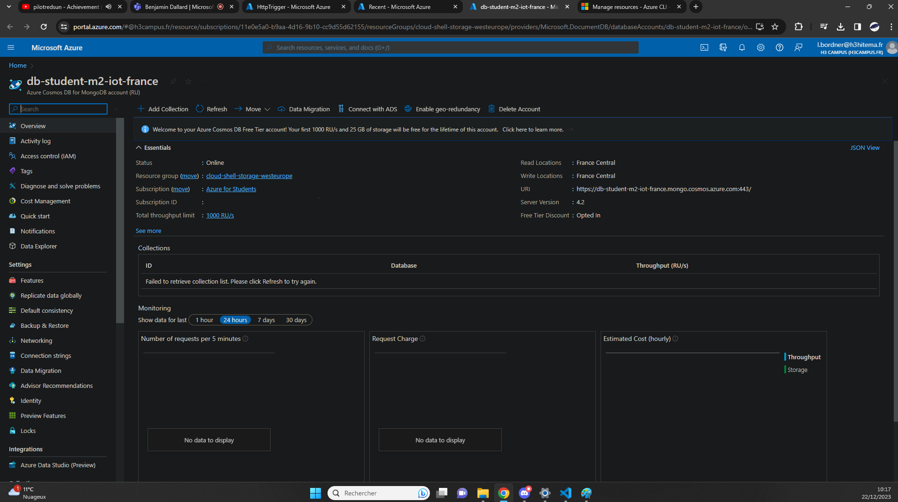

## Create a SQL Database (MongoDB) [/createdb]
[Back to Source](../README.md)

Imagine developing an application that requires a relational database backend. Creating an Azure SQL Database allows you to have a scalable and managed database service..

### Database Showcase



### Collection (will probably do something with it later)


### Export Template

```
{
    "$schema": "https://schema.management.azure.com/schemas/2019-04-01/deploymentTemplate.json#",
    "contentVersion": "1.0.0.0",
    "parameters": {
        "databaseAccounts_db_student_m2_iot_france_name": {
            "defaultValue": "db-student-m2-iot-france",
            "type": "String"
        }
    },
    "variables": {},
    "resources": [
        {
            "type": "Microsoft.DocumentDB/databaseAccounts",
            "apiVersion": "2023-09-15",
            "name": "[parameters('databaseAccounts_db_student_m2_iot_france_name')]",
            "location": "France Central",
            "tags": {
                "defaultExperience": "Azure Cosmos DB for MongoDB API",
                "hidden-cosmos-mmspecial": ""
            },
            "kind": "MongoDB",
            "identity": {
                "type": "None"
            },
            "properties": {
                "publicNetworkAccess": "Enabled",
                "enableAutomaticFailover": false,
                "enableMultipleWriteLocations": false,
                "isVirtualNetworkFilterEnabled": false,
                "virtualNetworkRules": [],
                "disableKeyBasedMetadataWriteAccess": false,
                "enableFreeTier": true,
                "enableAnalyticalStorage": false,
                "analyticalStorageConfiguration": {
                    "schemaType": "FullFidelity"
                },
                "databaseAccountOfferType": "Standard",
                "defaultIdentity": "FirstPartyIdentity",
                "networkAclBypass": "None",
                "disableLocalAuth": false,
                "enablePartitionMerge": false,
                "enableBurstCapacity": false,
                "minimalTlsVersion": "Tls12",
                "consistencyPolicy": {
                    "defaultConsistencyLevel": "Session",
                    "maxIntervalInSeconds": 5,
                    "maxStalenessPrefix": 100
                },
                "apiProperties": {
                    "serverVersion": "4.2"
                },
                "locations": [
                    {
                        "locationName": "France Central",
                        "provisioningState": "Succeeded",
                        "failoverPriority": 0,
                        "isZoneRedundant": false
                    }
                ],
                "cors": [],
                "capabilities": [
                    {
                        "name": "EnableMongo"
                    },
                    {
                        "name": "DisableRateLimitingResponses"
                    }
                ],
                "ipRules": [],
                "backupPolicy": {
                    "type": "Periodic",
                    "periodicModeProperties": {
                        "backupIntervalInMinutes": 240,
                        "backupRetentionIntervalInHours": 8,
                        "backupStorageRedundancy": "Geo"
                    }
                },
                "networkAclBypassResourceIds": [],
                "capacity": {
                    "totalThroughputLimit": 1000
                },
                "keysMetadata": {}
            }
        },
        {
            "type": "Microsoft.DocumentDB/databaseAccounts/mongodbDatabases",
            "apiVersion": "2023-09-15",
            "name": "[concat(parameters('databaseAccounts_db_student_m2_iot_france_name'), '/database-student-iot-m2-france')]",
            "dependsOn": [
                "[resourceId('Microsoft.DocumentDB/databaseAccounts', parameters('databaseAccounts_db_student_m2_iot_france_name'))]"
            ],
            "properties": {
                "resource": {
                    "id": "database-student-iot-m2-france"
                }
            }
        },
        {
            "type": "Microsoft.DocumentDB/databaseAccounts/mongodbDatabases/collections",
            "apiVersion": "2023-09-15",
            "name": "[concat(parameters('databaseAccounts_db_student_m2_iot_france_name'), '/database-student-iot-m2-france/ananas')]",
            "dependsOn": [
                "[resourceId('Microsoft.DocumentDB/databaseAccounts/mongodbDatabases', parameters('databaseAccounts_db_student_m2_iot_france_name'), 'database-student-iot-m2-france')]",
                "[resourceId('Microsoft.DocumentDB/databaseAccounts', parameters('databaseAccounts_db_student_m2_iot_france_name'))]"
            ],
            "properties": {
                "resource": {
                    "id": "ananas",
                    "shardKey": {
                        "sharding": "Hash"
                    },
                    "indexes": [
                        {
                            "key": {
                                "keys": [
                                    "_id"
                                ]
                            }
                        },
                        {
                            "key": {
                                "keys": [
                                    "$**"
                                ]
                            }
                        }
                    ]
                }
            }
        },
        {
            "type": "Microsoft.DocumentDB/databaseAccounts/mongodbDatabases/throughputSettings",
            "apiVersion": "2023-09-15",
            "name": "[concat(parameters('databaseAccounts_db_student_m2_iot_france_name'), '/database-student-iot-m2-france/default')]",
            "dependsOn": [
                "[resourceId('Microsoft.DocumentDB/databaseAccounts/mongodbDatabases', parameters('databaseAccounts_db_student_m2_iot_france_name'), 'database-student-iot-m2-france')]",
                "[resourceId('Microsoft.DocumentDB/databaseAccounts', parameters('databaseAccounts_db_student_m2_iot_france_name'))]"
            ],
            "properties": {
                "resource": {
                    "throughput": 100,
                    "autoscaleSettings": {
                        "maxThroughput": 1000
                    }
                }
            }
        }
    ]
}
```