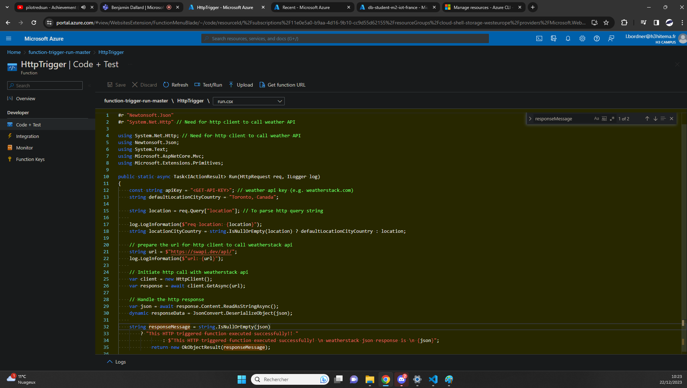
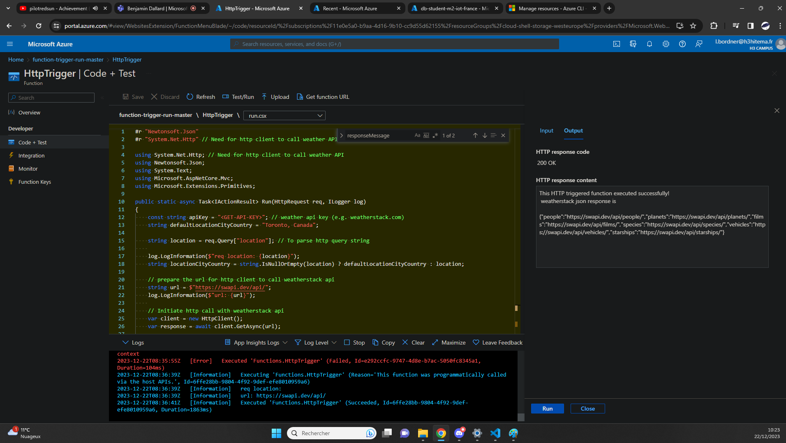

## Implement a simple Azure Functions [/createfunction]
[Back to Source](../README.md)

Consider a scenario where you need to process data or respond to events without a dedicated server. Azure Functions allow you to write event-driven functions that can be triggered on-demand.

### Cloud Function Showcase



### Is the Function working anyway ? (yes)



### Code Showcase (Thanks to https://github.com/RoyKimYYZ)

```
#r "Newtonsoft.Json"
#r "System.Net.Http" // Need for http client to call weather API

using System.Net.Http; // Need for http client to call weather API
using Newtonsoft.Json;
using System.Text;
using Microsoft.AspNetCore.Mvc;
using Microsoft.Extensions.Primitives;

public static async Task<IActionResult> Run(HttpRequest req, ILogger log)
{
    const string apiKey = "<GET-API-KEY>"; // weather api key (e.g. weatherstack.com)
    string defaultLocationCityCountry = "Toronto, Canada";

    string location = req.Query["location"]; // To parse http query string
    
    log.LogInformation($"req location: {location}");
    string locationCityCountry = string.IsNullOrEmpty(location) ? defaultLocationCityCountry : location;

    // prepare the url for http client to call weatherstack api
    string url = $"https://swapi.dev/api/";
    log.LogInformation($"url: {url}");
    
    // Initiate http call with weatherstack api
    var client = new HttpClient();
    var response = await client.GetAsync(url);

    // Handle the http response
    var json = await response.Content.ReadAsStringAsync();
    dynamic responseData = JsonConvert.DeserializeObject(json);
    
    string responseMessage = string.IsNullOrEmpty(json)
        ? "This HTTP triggered function executed successfully!! "
                : $"This HTTP triggered function executed successfully! \n weatherstack json response is \n {json}";
            return new OkObjectResult(responseMessage);

}
```

### Export Template

```
{
    "$schema": "https://schema.management.azure.com/schemas/2019-04-01/deploymentTemplate.json#",
    "contentVersion": "1.0.0.0",
    "parameters": {
        "sites_function_trigger_run_master_name": {
            "defaultValue": "function-trigger-run-master",
            "type": "String"
        },
        "serverfarms_ASP_cloudshellstoragewesteurope_971a_externalid": {
            "defaultValue": "/subscriptions/11e0e5a0-b9aa-4d16-9b10-cc9d55d62155/resourceGroups/cloud-shell-storage-westeurope/providers/Microsoft.Web/serverfarms/ASP-cloudshellstoragewesteurope-971a",
            "type": "String"
        }
    },
    "variables": {},
    "resources": [
        {
            "type": "Microsoft.Web/sites",
            "apiVersion": "2023-01-01",
            "name": "[parameters('sites_function_trigger_run_master_name')]",
            "location": "France Central",
            "tags": {
                "hidden-link: /app-insights-resource-id": "/subscriptions/11e0e5a0-b9aa-4d16-9b10-cc9d55d62155/resourceGroups/cloud-shell-storage-westeurope/providers/microsoft.insights/components/function-trigger-run-master",
                "hidden-link: /app-insights-instrumentation-key": "f346bf52-3b0d-448a-a7bd-c88207e96629",
                "hidden-link: /app-insights-conn-string": "InstrumentationKey=f346bf52-3b0d-448a-a7bd-c88207e96629;IngestionEndpoint=https://francecentral-1.in.applicationinsights.azure.com/;LiveEndpoint=https://francecentral.livediagnostics.monitor.azure.com/"
            },
            "kind": "functionapp",
            "properties": {
                "enabled": true,
                "hostNameSslStates": [
                    {
                        "name": "[concat(parameters('sites_function_trigger_run_master_name'), '.azurewebsites.net')]",
                        "sslState": "Disabled",
                        "hostType": "Standard"
                    },
                    {
                        "name": "[concat(parameters('sites_function_trigger_run_master_name'), '.scm.azurewebsites.net')]",
                        "sslState": "Disabled",
                        "hostType": "Repository"
                    }
                ],
                "serverFarmId": "[parameters('serverfarms_ASP_cloudshellstoragewesteurope_971a_externalid')]",
                "reserved": false,
                "isXenon": false,
                "hyperV": false,
                "vnetRouteAllEnabled": false,
                "vnetImagePullEnabled": false,
                "vnetContentShareEnabled": false,
                "siteConfig": {
                    "numberOfWorkers": 1,
                    "acrUseManagedIdentityCreds": false,
                    "alwaysOn": false,
                    "http20Enabled": false,
                    "functionAppScaleLimit": 200,
                    "minimumElasticInstanceCount": 0
                },
                "scmSiteAlsoStopped": false,
                "clientAffinityEnabled": false,
                "clientCertEnabled": false,
                "clientCertMode": "Required",
                "hostNamesDisabled": false,
                "customDomainVerificationId": "4712F96CAF992C67E1CEF5C55D839AA5E89905F29929A532195FD81ED4099409",
                "containerSize": 1536,
                "dailyMemoryTimeQuota": 0,
                "httpsOnly": true,
                "redundancyMode": "None",
                "publicNetworkAccess": "Enabled",
                "storageAccountRequired": false,
                "keyVaultReferenceIdentity": "SystemAssigned"
            }
        },
        {
            "type": "Microsoft.Web/sites/basicPublishingCredentialsPolicies",
            "apiVersion": "2023-01-01",
            "name": "[concat(parameters('sites_function_trigger_run_master_name'), '/ftp')]",
            "location": "France Central",
            "dependsOn": [
                "[resourceId('Microsoft.Web/sites', parameters('sites_function_trigger_run_master_name'))]"
            ],
            "tags": {
                "hidden-link: /app-insights-resource-id": "/subscriptions/11e0e5a0-b9aa-4d16-9b10-cc9d55d62155/resourceGroups/cloud-shell-storage-westeurope/providers/microsoft.insights/components/function-trigger-run-master",
                "hidden-link: /app-insights-instrumentation-key": "f346bf52-3b0d-448a-a7bd-c88207e96629",
                "hidden-link: /app-insights-conn-string": "InstrumentationKey=f346bf52-3b0d-448a-a7bd-c88207e96629;IngestionEndpoint=https://francecentral-1.in.applicationinsights.azure.com/;LiveEndpoint=https://francecentral.livediagnostics.monitor.azure.com/"
            },
            "properties": {
                "allow": true
            }
        },
        {
            "type": "Microsoft.Web/sites/basicPublishingCredentialsPolicies",
            "apiVersion": "2023-01-01",
            "name": "[concat(parameters('sites_function_trigger_run_master_name'), '/scm')]",
            "location": "France Central",
            "dependsOn": [
                "[resourceId('Microsoft.Web/sites', parameters('sites_function_trigger_run_master_name'))]"
            ],
            "tags": {
                "hidden-link: /app-insights-resource-id": "/subscriptions/11e0e5a0-b9aa-4d16-9b10-cc9d55d62155/resourceGroups/cloud-shell-storage-westeurope/providers/microsoft.insights/components/function-trigger-run-master",
                "hidden-link: /app-insights-instrumentation-key": "f346bf52-3b0d-448a-a7bd-c88207e96629",
                "hidden-link: /app-insights-conn-string": "InstrumentationKey=f346bf52-3b0d-448a-a7bd-c88207e96629;IngestionEndpoint=https://francecentral-1.in.applicationinsights.azure.com/;LiveEndpoint=https://francecentral.livediagnostics.monitor.azure.com/"
            },
            "properties": {
                "allow": true
            }
        },
        {
            "type": "Microsoft.Web/sites/config",
            "apiVersion": "2023-01-01",
            "name": "[concat(parameters('sites_function_trigger_run_master_name'), '/web')]",
            "location": "France Central",
            "dependsOn": [
                "[resourceId('Microsoft.Web/sites', parameters('sites_function_trigger_run_master_name'))]"
            ],
            "tags": {
                "hidden-link: /app-insights-resource-id": "/subscriptions/11e0e5a0-b9aa-4d16-9b10-cc9d55d62155/resourceGroups/cloud-shell-storage-westeurope/providers/microsoft.insights/components/function-trigger-run-master",
                "hidden-link: /app-insights-instrumentation-key": "f346bf52-3b0d-448a-a7bd-c88207e96629",
                "hidden-link: /app-insights-conn-string": "InstrumentationKey=f346bf52-3b0d-448a-a7bd-c88207e96629;IngestionEndpoint=https://francecentral-1.in.applicationinsights.azure.com/;LiveEndpoint=https://francecentral.livediagnostics.monitor.azure.com/"
            },
            "properties": {
                "numberOfWorkers": 1,
                "defaultDocuments": [
                    "Default.htm",
                    "Default.html",
                    "Default.asp",
                    "index.htm",
                    "index.html",
                    "iisstart.htm",
                    "default.aspx",
                    "index.php"
                ],
                "netFrameworkVersion": "v6.0",
                "requestTracingEnabled": false,
                "remoteDebuggingEnabled": false,
                "httpLoggingEnabled": false,
                "acrUseManagedIdentityCreds": false,
                "logsDirectorySizeLimit": 35,
                "detailedErrorLoggingEnabled": false,
                "publishingUsername": "$function-trigger-run-master",
                "scmType": "None",
                "use32BitWorkerProcess": true,
                "webSocketsEnabled": false,
                "alwaysOn": false,
                "managedPipelineMode": "Integrated",
                "virtualApplications": [
                    {
                        "virtualPath": "/",
                        "physicalPath": "site\\wwwroot",
                        "preloadEnabled": false
                    }
                ],
                "loadBalancing": "LeastRequests",
                "experiments": {
                    "rampUpRules": []
                },
                "autoHealEnabled": false,
                "vnetRouteAllEnabled": false,
                "vnetPrivatePortsCount": 0,
                "publicNetworkAccess": "Enabled",
                "cors": {
                    "allowedOrigins": [
                        "https://portal.azure.com"
                    ],
                    "supportCredentials": false
                },
                "localMySqlEnabled": false,
                "ipSecurityRestrictions": [
                    {
                        "ipAddress": "Any",
                        "action": "Allow",
                        "priority": 2147483647,
                        "name": "Allow all",
                        "description": "Allow all access"
                    }
                ],
                "scmIpSecurityRestrictions": [
                    {
                        "ipAddress": "Any",
                        "action": "Allow",
                        "priority": 2147483647,
                        "name": "Allow all",
                        "description": "Allow all access"
                    }
                ],
                "scmIpSecurityRestrictionsUseMain": false,
                "http20Enabled": false,
                "minTlsVersion": "1.2",
                "scmMinTlsVersion": "1.2",
                "ftpsState": "FtpsOnly",
                "preWarmedInstanceCount": 0,
                "functionAppScaleLimit": 200,
                "functionsRuntimeScaleMonitoringEnabled": false,
                "minimumElasticInstanceCount": 0,
                "azureStorageAccounts": {}
            }
        },
        {
            "type": "Microsoft.Web/sites/functions",
            "apiVersion": "2023-01-01",
            "name": "[concat(parameters('sites_function_trigger_run_master_name'), '/HttpTrigger')]",
            "location": "France Central",
            "dependsOn": [
                "[resourceId('Microsoft.Web/sites', parameters('sites_function_trigger_run_master_name'))]"
            ],
            "properties": {
                "script_root_path_href": "https://function-trigger-run-master.azurewebsites.net/admin/vfs/site/wwwroot/HttpTrigger/",
                "script_href": "https://function-trigger-run-master.azurewebsites.net/admin/vfs/site/wwwroot/HttpTrigger/run.csx",
                "config_href": "https://function-trigger-run-master.azurewebsites.net/admin/vfs/site/wwwroot/HttpTrigger/function.json",
                "test_data_href": "https://function-trigger-run-master.azurewebsites.net/admin/vfs/data/Functions/sampledata/HttpTrigger.dat",
                "href": "https://function-trigger-run-master.azurewebsites.net/admin/functions/HttpTrigger",
                "config": {},
                "test_data": "{\"method\":\"post\",\"queryStringParams\":[],\"headers\":[],\"body\":\"{\\\"name\\\":\\\"Azure\\\"}\"}",
                "invoke_url_template": "https://function-trigger-run-master.azurewebsites.net/api/httptrigger",
                "language": "CSharp",
                "isDisabled": false
            }
        },
        {
            "type": "Microsoft.Web/sites/hostNameBindings",
            "apiVersion": "2023-01-01",
            "name": "[concat(parameters('sites_function_trigger_run_master_name'), '/', parameters('sites_function_trigger_run_master_name'), '.azurewebsites.net')]",
            "location": "France Central",
            "dependsOn": [
                "[resourceId('Microsoft.Web/sites', parameters('sites_function_trigger_run_master_name'))]"
            ],
            "properties": {
                "siteName": "function-trigger-run-master",
                "hostNameType": "Verified"
            }
        }
    ]
}
```