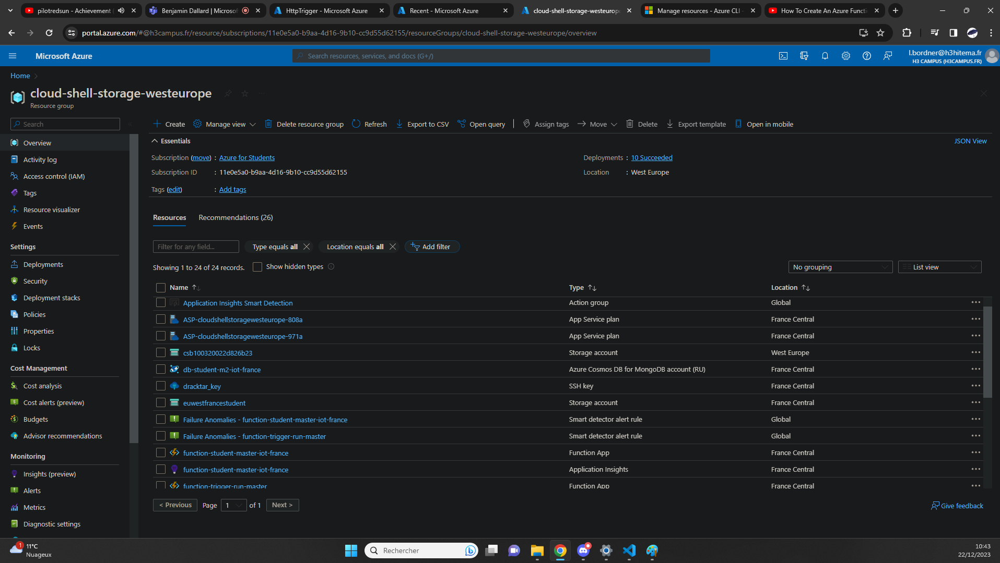
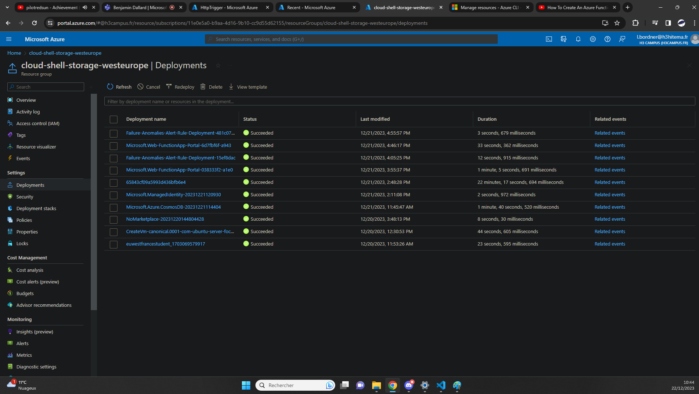

## Create a personalized Resource Group [/creategroup]
[Back to Source](../README.md)

Imagine needing to organize and manage related Azure resources. Resource Groups in Azure provide a way to group resources based on lifecycle, permissions, or other criteria.

### Resource Group Showcase



### Deployment List



### Export Template

```
{
    "$schema": "https://schema.management.azure.com/schemas/2019-04-01/deploymentTemplate.json#",
    "contentVersion": "1.0.0.0",
    "parameters": {
        "operations_get_people_by_id_type": {
            "type": "SecureString"
        },
        "subscriptions_65843e405e1980006d070001_displayName": {
            "type": "SecureString"
        },
        "subscriptions_65843e405e1980006d070002_displayName": {
            "type": "SecureString"
        },
        "users_1_lastName": {
            "type": "SecureString"
        },
        "virtualMachines_vm_name": {
            "defaultValue": "vm",
            "type": "String"
        },
        "publicIPAddresses_vm_ip_name": {
            "defaultValue": "vm-ip",
            "type": "String"
        },
        "virtualNetworks_vm_vnet_name": {
            "defaultValue": "vm-vnet",
            "type": "String"
        },
        "sshPublicKeys_dracktar_key_name": {
            "defaultValue": "dracktar_key",
            "type": "String"
        },
        "networkInterfaces_vm493_z1_name": {
            "defaultValue": "vm493_z1",
            "type": "String"
        },
        "networkSecurityGroups_vm_nsg_name": {
            "defaultValue": "vm-nsg",
            "type": "String"
        },
        "sites_function_trigger_run_master_name": {
            "defaultValue": "function-trigger-run-master",
            "type": "String"
        },
        "schedules_shutdown_computevm_vm_name": {
            "defaultValue": "shutdown-computevm-vm",
            "type": "String"
        },
        "storageAccounts_csb100320022d826b23_name": {
            "defaultValue": "csb100320022d826b23",
            "type": "String"
        },
        "storageAccounts_euwestfrancestudent_name": {
            "defaultValue": "euwestfrancestudent",
            "type": "String"
        },
        "sites_function_student_master_iot_france_name": {
            "defaultValue": "function-student-master-iot-france",
            "type": "String"
        },
        "sites_nodejs_app_student_iot_2023_h3hitema_name": {
            "defaultValue": "nodejs-app-student-iot-2023-h3hitema",
            "type": "String"
        },
        "components_function_trigger_run_master_name": {
            "defaultValue": "function-trigger-run-master",
            "type": "String"
        },
        "userAssignedIdentities_userIdentity_name": {
            "defaultValue": "userIdentity",
            "type": "String"
        },
        "databaseAccounts_db_student_m2_iot_france_name": {
            "defaultValue": "db-student-m2-iot-france",
            "type": "String"
        },
        "serverfarms_ASP_cloudshellstoragewesteurope_808a_name": {
            "defaultValue": "ASP-cloudshellstoragewesteurope-808a",
            "type": "String"
        },
        "serverfarms_ASP_cloudshellstoragewesteurope_971a_name": {
            "defaultValue": "ASP-cloudshellstoragewesteurope-971a",
            "type": "String"
        },
        "serverfarms_nodejs_app_student_iot_2023_h3hitema_name": {
            "defaultValue": "nodejs-app-student-iot-2023-h3hitema",
            "type": "String"
        },
        "components_function_student_master_iot_france_name": {
            "defaultValue": "function-student-master-iot-france",
            "type": "String"
        },
        "dnszones_prefix_francecentral_cloudapp_azure_com_name": {
            "defaultValue": "prefix.francecentral.cloudapp.azure.com",
            "type": "String"
        },
        "service_apiStudentMasterIotSecondYearFrance_name": {
            "defaultValue": "apiStudentMasterIotSecondYearFrance",
            "type": "String"
        },
        "actionGroups_Application_Insights_Smart_Detection_name": {
            "defaultValue": "Application Insights Smart Detection",
            "type": "String"
        },
        "smartdetectoralertrules_failure_anomalies___function_trigger_run_master_name": {
            "defaultValue": "failure anomalies - function-trigger-run-master",
            "type": "String"
        },
        "smartdetectoralertrules_failure_anomalies___function_student_master_iot_france_name": {
            "defaultValue": "failure anomalies - function-student-master-iot-france",
            "type": "String"
        },
        "workspaces_DefaultWorkspace_11e0e5a0_b9aa_4d16_9b10_cc9d55d62155_PAR_externalid": {
            "defaultValue": "/subscriptions/11e0e5a0-b9aa-4d16-9b10-cc9d55d62155/resourceGroups/DefaultResourceGroup-PAR/providers/Microsoft.OperationalInsights/workspaces/DefaultWorkspace-11e0e5a0-b9aa-4d16-9b10-cc9d55d62155-PAR",
            "type": "String"
        }
    },
    "variables": {},
    "resources": [
        {
            "type": "Microsoft.ApiManagement/service",
            "apiVersion": "2023-03-01-preview",
            "name": "[parameters('service_apiStudentMasterIotSecondYearFrance_name')]",
            "location": "West Europe",
            "sku": {
                "name": "Developer",
                "capacity": 1
            },
            "properties": {
                "publisherEmail": "lucas.bordner@gmail.com",
                "publisherName": "h3hitema",
                "notificationSenderEmail": "apimgmt-noreply@mail.windowsazure.com",
                "hostnameConfigurations": [
                    {
                        "type": "Proxy",
                        "hostName": "apistudentmasteriotsecondyearfrance.azure-api.net",
                        "negotiateClientCertificate": false,
                        "defaultSslBinding": true,
                        "certificateSource": "BuiltIn"
                    }
                ],
                "customProperties": {
                    "Microsoft.WindowsAzure.ApiManagement.Gateway.Security.Protocols.Tls11": "false",
                    "Microsoft.WindowsAzure.ApiManagement.Gateway.Security.Protocols.Tls10": "false",
                    "Microsoft.WindowsAzure.ApiManagement.Gateway.Security.Backend.Protocols.Tls11": "false",
                    "Microsoft.WindowsAzure.ApiManagement.Gateway.Security.Backend.Protocols.Tls10": "false",
                    "Microsoft.WindowsAzure.ApiManagement.Gateway.Security.Backend.Protocols.Ssl30": "false",
                    "Microsoft.WindowsAzure.ApiManagement.Gateway.Protocols.Server.Http2": "false",
                    "Microsoft.WindowsAzure.ApiManagement.Gateway.Security.Ciphers.TripleDes168": "false",
                    "Microsoft.WindowsAzure.ApiManagement.Gateway.Security.Protocols.Ssl30": "false"
                },
                "virtualNetworkType": "None",
                "disableGateway": false,
                "natGatewayState": "Unsupported",
                "apiVersionConstraint": {},
                "publicNetworkAccess": "Enabled",
                "legacyPortalStatus": "Enabled",
                "developerPortalStatus": "Enabled"
            }
        },
        {
            "type": "Microsoft.Compute/sshPublicKeys",
            "apiVersion": "2023-03-01",
            "name": "[parameters('sshPublicKeys_dracktar_key_name')]",
            "location": "francecentral",
            "properties": {
                "publicKey": "ssh-rsa AAAAB3NzaC1yc2EAAAADAQABAAABgQC8pqgX9GelsO/wXhy0jH7EefsZB3aIik3EWx71UTPywsmUQ7uo4LguTyVxTFp7LSi4rmUG635z8owTYsGm9sT5osKKmNsBeDbYKxwHvT/4c+0zv+e/YGmP02Y4Pn2iZ8RkK6TOtkBDtcpyfrR8Nj9lV2kk4eONuoMXdOEBSORtdwjWWLU/BsHQ/GiQACM8MaFPZdroE2GFkJFUdfGSLq9DlYQ1ZACFM0XhbaTKg65LJQiExxraG/hDACxoYrMRdgNu05RnlbypIjDlEOi0z85BkKT25fkfuXzAMATT+ER/pwpvrGt+d8PSboAfA6CuGnLjgBbYqaX1g8RZqBLAPGc5zIw1RM+s5yxYsDXfdKI1S9UbCzOGZCBQ1z3WLmKZMSn9h6dSrE0TWb9Uiu2VNxMeSI2ynP3eeVln6GoI/nxUgxa0Tvz64uiRtF2GFhsHGUvjPU/3vch7loAFAaLtFtup2aSFDgD6zYrh/q3xwWeYXWTBAKmKbDonRPk8sIYw5Ck= generated-by-azure"
            }
        },
        {
            "type": "Microsoft.DocumentDB/databaseAccounts",
            "apiVersion": "2023-09-15",
            "name": "[parameters('databaseAccounts_db_student_m2_iot_france_name')]",
            "location": "France Central",
            "tags": {
                "defaultExperience": "Azure Cosmos DB for MongoDB API",
                "hidden-cosmos-mmspecial": ""
            },
            "kind": "MongoDB",
            "identity": {
                "type": "None"
            },
            "properties": {
                "publicNetworkAccess": "Enabled",
                "enableAutomaticFailover": false,
                "enableMultipleWriteLocations": false,
                "isVirtualNetworkFilterEnabled": false,
                "virtualNetworkRules": [],
                "disableKeyBasedMetadataWriteAccess": false,
                "enableFreeTier": true,
                "enableAnalyticalStorage": false,
                "analyticalStorageConfiguration": {
                    "schemaType": "FullFidelity"
                },
                "databaseAccountOfferType": "Standard",
                "defaultIdentity": "FirstPartyIdentity",
                "networkAclBypass": "None",
                "disableLocalAuth": false,
                "enablePartitionMerge": false,
                "enableBurstCapacity": false,
                "minimalTlsVersion": "Tls12",
                "consistencyPolicy": {
                    "defaultConsistencyLevel": "Session",
                    "maxIntervalInSeconds": 5,
                    "maxStalenessPrefix": 100
                },
                "apiProperties": {
                    "serverVersion": "4.2"
                },
                "locations": [
                    {
                        "locationName": "France Central",
                        "provisioningState": "Succeeded",
                        "failoverPriority": 0,
                        "isZoneRedundant": false
                    }
                ],
                "cors": [],
                "capabilities": [
                    {
                        "name": "EnableMongo"
                    },
                    {
                        "name": "DisableRateLimitingResponses"
                    }
                ],
                "ipRules": [],
                "backupPolicy": {
                    "type": "Periodic",
                    "periodicModeProperties": {
                        "backupIntervalInMinutes": 240,
                        "backupRetentionIntervalInHours": 8,
                        "backupStorageRedundancy": "Geo"
                    }
                },
                "networkAclBypassResourceIds": [],
                "capacity": {
                    "totalThroughputLimit": 1000
                },
                "keysMetadata": {}
            }
        },
        {
            "type": "microsoft.insights/actionGroups",
            "apiVersion": "2023-01-01",
            "name": "[parameters('actionGroups_Application_Insights_Smart_Detection_name')]",
            "location": "Global",
            "properties": {
                "groupShortName": "SmartDetect",
                "enabled": true,
                "emailReceivers": [],
                "smsReceivers": [],
                "webhookReceivers": [],
                "eventHubReceivers": [],
                "itsmReceivers": [],
                "azureAppPushReceivers": [],
                "automationRunbookReceivers": [],
                "voiceReceivers": [],
                "logicAppReceivers": [],
                "azureFunctionReceivers": [],
                "armRoleReceivers": [
                    {
                        "name": "Monitoring Contributor",
                        "roleId": "749f88d5-cbae-40b8-bcfc-e573ddc772fa",
                        "useCommonAlertSchema": true
                    },
                    {
                        "name": "Monitoring Reader",
                        "roleId": "43d0d8ad-25c7-4714-9337-8ba259a9fe05",
                        "useCommonAlertSchema": true
                    }
                ]
            }
        },
        {
            "type": "microsoft.insights/components",
            "apiVersion": "2020-02-02",
            "name": "[parameters('components_function_student_master_iot_france_name')]",
            "location": "francecentral",
            "kind": "web",
            "properties": {
                "Application_Type": "web",
                "Flow_Type": "Redfield",
                "Request_Source": "IbizaWebAppExtensionCreate",
                "RetentionInDays": 90,
                "WorkspaceResourceId": "[parameters('workspaces_DefaultWorkspace_11e0e5a0_b9aa_4d16_9b10_cc9d55d62155_PAR_externalid')]",
                "IngestionMode": "LogAnalytics",
                "publicNetworkAccessForIngestion": "Enabled",
                "publicNetworkAccessForQuery": "Enabled"
            }
        },
        {
            "type": "microsoft.insights/components",
            "apiVersion": "2020-02-02",
            "name": "[parameters('components_function_trigger_run_master_name')]",
            "location": "francecentral",
            "kind": "web",
            "properties": {
                "Application_Type": "web",
                "Flow_Type": "Redfield",
                "Request_Source": "IbizaWebAppExtensionCreate",
                "RetentionInDays": 90,
                "WorkspaceResourceId": "[parameters('workspaces_DefaultWorkspace_11e0e5a0_b9aa_4d16_9b10_cc9d55d62155_PAR_externalid')]",
                "IngestionMode": "LogAnalytics",
                "publicNetworkAccessForIngestion": "Enabled",
                "publicNetworkAccessForQuery": "Enabled"
            }
        },
        {
            "type": "Microsoft.ManagedIdentity/userAssignedIdentities",
            "apiVersion": "2023-01-31",
            "name": "[parameters('userAssignedIdentities_userIdentity_name')]",
            "location": "francecentral"
        },
        {
            "type": "Microsoft.Network/dnszones",
            "apiVersion": "2018-05-01",
            "name": "[parameters('dnszones_prefix_francecentral_cloudapp_azure_com_name')]",
            "location": "global",
            "properties": {
                "zoneType": "Public"
            }
        },
        {
            "type": "Microsoft.Network/networkSecurityGroups",
            "apiVersion": "2023-06-01",
            "name": "[parameters('networkSecurityGroups_vm_nsg_name')]",
            "location": "francecentral",
            "properties": {
                "securityRules": [
                    {
                        "name": "SSH",
                        "id": "[resourceId('Microsoft.Network/networkSecurityGroups/securityRules', parameters('networkSecurityGroups_vm_nsg_name'), 'SSH')]",
                        "type": "Microsoft.Network/networkSecurityGroups/securityRules",
                        "properties": {
                            "protocol": "TCP",
                            "sourcePortRange": "*",
                            "destinationPortRange": "22",
                            "sourceAddressPrefix": "*",
                            "destinationAddressPrefix": "*",
                            "access": "Allow",
                            "priority": 300,
                            "direction": "Inbound",
                            "sourcePortRanges": [],
                            "destinationPortRanges": [],
                            "sourceAddressPrefixes": [],
                            "destinationAddressPrefixes": []
                        }
                    },
                    {
                        "name": "HTTPS",
                        "id": "[resourceId('Microsoft.Network/networkSecurityGroups/securityRules', parameters('networkSecurityGroups_vm_nsg_name'), 'HTTPS')]",
                        "type": "Microsoft.Network/networkSecurityGroups/securityRules",
                        "properties": {
                            "protocol": "TCP",
                            "sourcePortRange": "*",
                            "destinationPortRange": "443",
                            "sourceAddressPrefix": "*",
                            "destinationAddressPrefix": "*",
                            "access": "Allow",
                            "priority": 320,
                            "direction": "Inbound",
                            "sourcePortRanges": [],
                            "destinationPortRanges": [],
                            "sourceAddressPrefixes": [],
                            "destinationAddressPrefixes": []
                        }
                    },
                    {
                        "name": "HTTP",
                        "id": "[resourceId('Microsoft.Network/networkSecurityGroups/securityRules', parameters('networkSecurityGroups_vm_nsg_name'), 'HTTP')]",
                        "type": "Microsoft.Network/networkSecurityGroups/securityRules",
                        "properties": {
                            "protocol": "TCP",
                            "sourcePortRange": "*",
                            "destinationPortRange": "80",
                            "sourceAddressPrefix": "*",
                            "destinationAddressPrefix": "*",
                            "access": "Allow",
                            "priority": 340,
                            "direction": "Inbound",
                            "sourcePortRanges": [],
                            "destinationPortRanges": [],
                            "sourceAddressPrefixes": [],
                            "destinationAddressPrefixes": []
                        }
                    },
                    {
                        "name": "AllowAnyCustom5000Inbound",
                        "id": "[resourceId('Microsoft.Network/networkSecurityGroups/securityRules', parameters('networkSecurityGroups_vm_nsg_name'), 'AllowAnyCustom5000Inbound')]",
                        "type": "Microsoft.Network/networkSecurityGroups/securityRules",
                        "properties": {
                            "protocol": "*",
                            "sourcePortRange": "*",
                            "destinationPortRange": "5000",
                            "sourceAddressPrefix": "*",
                            "destinationAddressPrefix": "*",
                            "access": "Allow",
                            "priority": 350,
                            "direction": "Inbound",
                            "sourcePortRanges": [],
                            "destinationPortRanges": [],
                            "sourceAddressPrefixes": [],
                            "destinationAddressPrefixes": []
                        }
                    }
                ]
            }
        },
        {
            "type": "Microsoft.Network/publicIPAddresses",
            "apiVersion": "2023-06-01",
            "name": "[parameters('publicIPAddresses_vm_ip_name')]",
            "location": "francecentral",
            "sku": {
                "name": "Standard",
                "tier": "Regional"
            },
            "zones": [
                "1"
            ],
            "properties": {
                "ipAddress": "4.178.123.141",
                "publicIPAddressVersion": "IPv4",
                "publicIPAllocationMethod": "Static",
                "idleTimeoutInMinutes": 4,
                "dnsSettings": {
                    "domainNameLabel": "prefix",
                    "fqdn": "prefix.francecentral.cloudapp.azure.com"
                },
                "ipTags": [],
                "ddosSettings": {
                    "protectionMode": "VirtualNetworkInherited"
                }
            }
        },
        {
            "type": "Microsoft.Network/virtualNetworks",
            "apiVersion": "2023-06-01",
            "name": "[parameters('virtualNetworks_vm_vnet_name')]",
            "location": "francecentral",
            "properties": {
                "addressSpace": {
                    "addressPrefixes": [
                        "10.0.0.0/16"
                    ]
                },
                "subnets": [
                    {
                        "name": "default",
                        "id": "[resourceId('Microsoft.Network/virtualNetworks/subnets', parameters('virtualNetworks_vm_vnet_name'), 'default')]",
                        "properties": {
                            "addressPrefix": "10.0.0.0/24",
                            "delegations": [],
                            "privateEndpointNetworkPolicies": "Disabled",
                            "privateLinkServiceNetworkPolicies": "Enabled"
                        },
                        "type": "Microsoft.Network/virtualNetworks/subnets"
                    }
                ],
                "virtualNetworkPeerings": [],
                "enableDdosProtection": false
            }
        },
        {
            "type": "Microsoft.Storage/storageAccounts",
            "apiVersion": "2023-01-01",
            "name": "[parameters('storageAccounts_csb100320022d826b23_name')]",
            "location": "westeurope",
            "tags": {
                "ms-resource-usage": "azure-cloud-shell"
            },
            "sku": {
                "name": "Standard_LRS",
                "tier": "Standard"
            },
            "kind": "StorageV2",
            "properties": {
                "allowCrossTenantReplication": false,
                "minimumTlsVersion": "TLS1_2",
                "allowBlobPublicAccess": false,
                "networkAcls": {
                    "bypass": "AzureServices",
                    "virtualNetworkRules": [],
                    "ipRules": [],
                    "defaultAction": "Allow"
                },
                "supportsHttpsTrafficOnly": true,
                "encryption": {
                    "services": {
                        "file": {
                            "keyType": "Account",
                            "enabled": true
                        },
                        "blob": {
                            "keyType": "Account",
                            "enabled": true
                        }
                    },
                    "keySource": "Microsoft.Storage"
                },
                "accessTier": "Hot"
            }
        },
        {
            "type": "Microsoft.Storage/storageAccounts",
            "apiVersion": "2023-01-01",
            "name": "[parameters('storageAccounts_euwestfrancestudent_name')]",
            "location": "francecentral",
            "sku": {
                "name": "Standard_RAGRS",
                "tier": "Standard"
            },
            "kind": "StorageV2",
            "properties": {
                "dnsEndpointType": "Standard",
                "defaultToOAuthAuthentication": false,
                "publicNetworkAccess": "Enabled",
                "allowCrossTenantReplication": false,
                "minimumTlsVersion": "TLS1_2",
                "allowBlobPublicAccess": false,
                "allowSharedKeyAccess": true,
                "networkAcls": {
                    "bypass": "AzureServices",
                    "virtualNetworkRules": [],
                    "ipRules": [],
                    "defaultAction": "Allow"
                },
                "supportsHttpsTrafficOnly": true,
                "encryption": {
                    "requireInfrastructureEncryption": false,
                    "services": {
                        "file": {
                            "keyType": "Account",
                            "enabled": true
                        },
                        "blob": {
                            "keyType": "Account",
                            "enabled": true
                        }
                    },
                    "keySource": "Microsoft.Storage"
                },
                "accessTier": "Hot"
            }
        },
        {
            "type": "Microsoft.Web/serverfarms",
            "apiVersion": "2023-01-01",
            "name": "[parameters('serverfarms_ASP_cloudshellstoragewesteurope_808a_name')]",
            "location": "France Central",
            "sku": {
                "name": "Y1",
                "tier": "Dynamic",
                "size": "Y1",
                "family": "Y",
                "capacity": 0
            },
            "kind": "functionapp",
            "properties": {
                "perSiteScaling": false,
                "elasticScaleEnabled": false,
                "maximumElasticWorkerCount": 1,
                "isSpot": false,
                "reserved": false,
                "isXenon": false,
                "hyperV": false,
                "targetWorkerCount": 0,
                "targetWorkerSizeId": 0,
                "zoneRedundant": false
            }
        },
        {
            "type": "Microsoft.Web/serverfarms",
            "apiVersion": "2023-01-01",
            "name": "[parameters('serverfarms_ASP_cloudshellstoragewesteurope_971a_name')]",
            "location": "France Central",
            "sku": {
                "name": "Y1",
                "tier": "Dynamic",
                "size": "Y1",
                "family": "Y",
                "capacity": 0
            },
            "kind": "functionapp",
            "properties": {
                "perSiteScaling": false,
                "elasticScaleEnabled": false,
                "maximumElasticWorkerCount": 1,
                "isSpot": false,
                "reserved": false,
                "isXenon": false,
                "hyperV": false,
                "targetWorkerCount": 0,
                "targetWorkerSizeId": 0,
                "zoneRedundant": false
            }
        },
        {
            "type": "Microsoft.Web/serverfarms",
            "apiVersion": "2023-01-01",
            "name": "[parameters('serverfarms_nodejs_app_student_iot_2023_h3hitema_name')]",
            "location": "West Europe",
            "sku": {
                "name": "F1",
                "tier": "Free",
                "size": "F1",
                "family": "F",
                "capacity": 0
            },
            "kind": "app",
            "properties": {
                "perSiteScaling": false,
                "elasticScaleEnabled": false,
                "maximumElasticWorkerCount": 1,
                "isSpot": false,
                "reserved": false,
                "isXenon": false,
                "hyperV": false,
                "targetWorkerCount": 0,
                "targetWorkerSizeId": 0,
                "zoneRedundant": false
            }
        },
        {
            "type": "Microsoft.ApiManagement/service/apis",
            "apiVersion": "2023-03-01-preview",
            "name": "[concat(parameters('service_apiStudentMasterIotSecondYearFrance_name'), '/echo-api')]",
            "dependsOn": [
                "[resourceId('Microsoft.ApiManagement/service', parameters('service_apiStudentMasterIotSecondYearFrance_name'))]"
            ],
            "properties": {
                "displayName": "Echo API",
                "apiRevision": "1",
                "subscriptionRequired": true,
                "serviceUrl": "http://echoapi.cloudapp.net/api",
                "path": "echo",
                "protocols": [
                    "https"
                ],
                "authenticationSettings": {
                    "oAuth2AuthenticationSettings": [],
                    "openidAuthenticationSettings": []
                },
                "subscriptionKeyParameterNames": {
                    "header": "Ocp-Apim-Subscription-Key",
                    "query": "subscription-key"
                },
                "isCurrent": true
            }
        },
        {
            "type": "Microsoft.ApiManagement/service/apis",
            "apiVersion": "2023-03-01-preview",
            "name": "[concat(parameters('service_apiStudentMasterIotSecondYearFrance_name'), '/student-api-master-iot')]",
            "dependsOn": [
                "[resourceId('Microsoft.ApiManagement/service', parameters('service_apiStudentMasterIotSecondYearFrance_name'))]"
            ],
            "properties": {
                "displayName": "Student api master iot",
                "apiRevision": "1",
                "subscriptionRequired": false,
                "serviceUrl": "https://swapi.dev/api",
                "path": "cool",
                "protocols": [
                    "https"
                ],
                "authenticationSettings": {
                    "oAuth2AuthenticationSettings": [],
                    "openidAuthenticationSettings": []
                },
                "subscriptionKeyParameterNames": {
                    "header": "Ocp-Apim-Subscription-Key",
                    "query": "subscription-key"
                },
                "isCurrent": true
            }
        },
        {
            "type": "Microsoft.ApiManagement/service/groups",
            "apiVersion": "2023-03-01-preview",
            "name": "[concat(parameters('service_apiStudentMasterIotSecondYearFrance_name'), '/administrators')]",
            "dependsOn": [
                "[resourceId('Microsoft.ApiManagement/service', parameters('service_apiStudentMasterIotSecondYearFrance_name'))]"
            ],
            "properties": {
                "displayName": "Administrators",
                "description": "Administrators is a built-in group containing the admin email account provided at the time of service creation. Its membership is managed by the system.",
                "type": "system"
            }
        },
        {
            "type": "Microsoft.ApiManagement/service/groups",
            "apiVersion": "2023-03-01-preview",
            "name": "[concat(parameters('service_apiStudentMasterIotSecondYearFrance_name'), '/developers')]",
            "dependsOn": [
                "[resourceId('Microsoft.ApiManagement/service', parameters('service_apiStudentMasterIotSecondYearFrance_name'))]"
            ],
            "properties": {
                "displayName": "Developers",
                "description": "Developers is a built-in group. Its membership is managed by the system. Signed-in users fall into this group.",
                "type": "system"
            }
        },
        {
            "type": "Microsoft.ApiManagement/service/groups",
            "apiVersion": "2023-03-01-preview",
            "name": "[concat(parameters('service_apiStudentMasterIotSecondYearFrance_name'), '/guests')]",
            "dependsOn": [
                "[resourceId('Microsoft.ApiManagement/service', parameters('service_apiStudentMasterIotSecondYearFrance_name'))]"
            ],
            "properties": {
                "displayName": "Guests",
                "description": "Guests is a built-in group. Its membership is managed by the system. Unauthenticated users visiting the developer portal fall into this group.",
                "type": "system"
            }
        },
        {
            "type": "Microsoft.ApiManagement/service/notifications",
            "apiVersion": "2023-03-01-preview",
            "name": "[concat(parameters('service_apiStudentMasterIotSecondYearFrance_name'), '/AccountClosedPublisher')]",
            "dependsOn": [
                "[resourceId('Microsoft.ApiManagement/service', parameters('service_apiStudentMasterIotSecondYearFrance_name'))]"
            ]
        },
        {
            "type": "Microsoft.ApiManagement/service/notifications",
            "apiVersion": "2023-03-01-preview",
            "name": "[concat(parameters('service_apiStudentMasterIotSecondYearFrance_name'), '/BCC')]",
            "dependsOn": [
                "[resourceId('Microsoft.ApiManagement/service', parameters('service_apiStudentMasterIotSecondYearFrance_name'))]"
            ]
        },
        {
            "type": "Microsoft.ApiManagement/service/notifications",
            "apiVersion": "2023-03-01-preview",
            "name": "[concat(parameters('service_apiStudentMasterIotSecondYearFrance_name'), '/NewApplicationNotificationMessage')]",
            "dependsOn": [
                "[resourceId('Microsoft.ApiManagement/service', parameters('service_apiStudentMasterIotSecondYearFrance_name'))]"
            ]
        },
        {
            "type": "Microsoft.ApiManagement/service/notifications",
            "apiVersion": "2023-03-01-preview",
            "name": "[concat(parameters('service_apiStudentMasterIotSecondYearFrance_name'), '/NewIssuePublisherNotificationMessage')]",
            "dependsOn": [
                "[resourceId('Microsoft.ApiManagement/service', parameters('service_apiStudentMasterIotSecondYearFrance_name'))]"
            ]
        },
        {
            "type": "Microsoft.ApiManagement/service/notifications",
            "apiVersion": "2023-03-01-preview",
            "name": "[concat(parameters('service_apiStudentMasterIotSecondYearFrance_name'), '/PurchasePublisherNotificationMessage')]",
            "dependsOn": [
                "[resourceId('Microsoft.ApiManagement/service', parameters('service_apiStudentMasterIotSecondYearFrance_name'))]"
            ]
        },
        {
            "type": "Microsoft.ApiManagement/service/notifications",
            "apiVersion": "2023-03-01-preview",
            "name": "[concat(parameters('service_apiStudentMasterIotSecondYearFrance_name'), '/QuotaLimitApproachingPublisherNotificationMessage')]",
            "dependsOn": [
                "[resourceId('Microsoft.ApiManagement/service', parameters('service_apiStudentMasterIotSecondYearFrance_name'))]"
            ]
        },
        {
            "type": "Microsoft.ApiManagement/service/notifications",
            "apiVersion": "2023-03-01-preview",
            "name": "[concat(parameters('service_apiStudentMasterIotSecondYearFrance_name'), '/RequestPublisherNotificationMessage')]",
            "dependsOn": [
                "[resourceId('Microsoft.ApiManagement/service', parameters('service_apiStudentMasterIotSecondYearFrance_name'))]"
            ]
        },
        {
            "type": "Microsoft.ApiManagement/service/policies",
            "apiVersion": "2023-03-01-preview",
            "name": "[concat(parameters('service_apiStudentMasterIotSecondYearFrance_name'), '/policy')]",
            "dependsOn": [
                "[resourceId('Microsoft.ApiManagement/service', parameters('service_apiStudentMasterIotSecondYearFrance_name'))]"
            ],
            "properties": {
                "value": "<!--\r\n    IMPORTANT:\r\n    - Policy elements can appear only within the <inbound>, <outbound>, <backend> section elements.\r\n    - Only the <forward-request> policy element can appear within the <backend> section element.\r\n    - To apply a policy to the incoming request (before it is forwarded to the backend service), place a corresponding policy element within the <inbound> section element.\r\n    - To apply a policy to the outgoing response (before it is sent back to the caller), place a corresponding policy element within the <outbound> section element.\r\n    - To add a policy position the cursor at the desired insertion point and click on the round button associated with the policy.\r\n    - To remove a policy, delete the corresponding policy statement from the policy document.\r\n    - Policies are applied in the order of their appearance, from the top down.\r\n-->\r\n<policies>\r\n  <inbound />\r\n  <backend>\r\n    <forward-request />\r\n  </backend>\r\n  <outbound />\r\n</policies>",
                "format": "xml"
            }
        },
        {
            "type": "Microsoft.ApiManagement/service/portalconfigs",
            "apiVersion": "2023-03-01-preview",
            "name": "[concat(parameters('service_apiStudentMasterIotSecondYearFrance_name'), '/default')]",
            "dependsOn": [
                "[resourceId('Microsoft.ApiManagement/service', parameters('service_apiStudentMasterIotSecondYearFrance_name'))]"
            ],
            "properties": {
                "enableBasicAuth": true,
                "signin": {
                    "require": false
                },
                "signup": {
                    "termsOfService": {
                        "requireConsent": false
                    }
                },
                "delegation": {
                    "delegateRegistration": false,
                    "delegateSubscription": false
                },
                "cors": {
                    "allowedOrigins": []
                },
                "csp": {
                    "mode": "disabled",
                    "reportUri": [],
                    "allowedSources": []
                }
            }
        },
        {
            "type": "Microsoft.ApiManagement/service/portalsettings",
            "apiVersion": "2023-03-01-preview",
            "name": "[concat(parameters('service_apiStudentMasterIotSecondYearFrance_name'), '/delegation')]",
            "dependsOn": [
                "[resourceId('Microsoft.ApiManagement/service', parameters('service_apiStudentMasterIotSecondYearFrance_name'))]"
            ],
            "properties": {
                "subscriptions": {
                    "enabled": false
                },
                "userRegistration": {
                    "enabled": false
                }
            }
        },
        {
            "type": "Microsoft.ApiManagement/service/portalsettings",
            "apiVersion": "2023-03-01-preview",
            "name": "[concat(parameters('service_apiStudentMasterIotSecondYearFrance_name'), '/signin')]",
            "dependsOn": [
                "[resourceId('Microsoft.ApiManagement/service', parameters('service_apiStudentMasterIotSecondYearFrance_name'))]"
            ],
            "properties": {
                "enabled": false
            }
        },
        {
            "type": "Microsoft.ApiManagement/service/portalsettings",
            "apiVersion": "2023-03-01-preview",
            "name": "[concat(parameters('service_apiStudentMasterIotSecondYearFrance_name'), '/signup')]",
            "dependsOn": [
                "[resourceId('Microsoft.ApiManagement/service', parameters('service_apiStudentMasterIotSecondYearFrance_name'))]"
            ],
            "properties": {
                "enabled": true,
                "termsOfService": {
                    "enabled": false,
                    "consentRequired": false
                }
            }
        },
        {
            "type": "Microsoft.ApiManagement/service/products",
            "apiVersion": "2023-03-01-preview",
            "name": "[concat(parameters('service_apiStudentMasterIotSecondYearFrance_name'), '/starter')]",
            "dependsOn": [
                "[resourceId('Microsoft.ApiManagement/service', parameters('service_apiStudentMasterIotSecondYearFrance_name'))]"
            ],
            "properties": {
                "displayName": "Starter",
                "description": "Subscribers will be able to run 5 calls/minute up to a maximum of 100 calls/week.",
                "subscriptionRequired": true,
                "approvalRequired": false,
                "subscriptionsLimit": 1,
                "state": "published"
            }
        },
        {
            "type": "Microsoft.ApiManagement/service/products",
            "apiVersion": "2023-03-01-preview",
            "name": "[concat(parameters('service_apiStudentMasterIotSecondYearFrance_name'), '/unlimited')]",
            "dependsOn": [
                "[resourceId('Microsoft.ApiManagement/service', parameters('service_apiStudentMasterIotSecondYearFrance_name'))]"
            ],
            "properties": {
                "displayName": "Unlimited",
                "description": "Subscribers have completely unlimited access to the API. Administrator approval is required.",
                "subscriptionRequired": true,
                "approvalRequired": true,
                "subscriptionsLimit": 1,
                "state": "published"
            }
        },
        {
            "type": "Microsoft.ApiManagement/service/subscriptions",
            "apiVersion": "2023-03-01-preview",
            "name": "[concat(parameters('service_apiStudentMasterIotSecondYearFrance_name'), '/master')]",
            "dependsOn": [
                "[resourceId('Microsoft.ApiManagement/service', parameters('service_apiStudentMasterIotSecondYearFrance_name'))]"
            ],
            "properties": {
                "scope": "[concat(resourceId('Microsoft.ApiManagement/service', parameters('service_apiStudentMasterIotSecondYearFrance_name')), '/')]",
                "displayName": "Built-in all-access subscription",
                "state": "active",
                "allowTracing": false
            }
        },
        {
            "type": "Microsoft.ApiManagement/service/templates",
            "apiVersion": "2023-03-01-preview",
            "name": "[concat(parameters('service_apiStudentMasterIotSecondYearFrance_name'), '/AccountClosedDeveloper')]",
            "dependsOn": [
                "[resourceId('Microsoft.ApiManagement/service', parameters('service_apiStudentMasterIotSecondYearFrance_name'))]"
            ],
            "properties": {
                "subject": "Thank you for using the $OrganizationName API!",
                "body": "<!DOCTYPE html >\r\n<html>\r\n  <head />\r\n  <body>\r\n    <p style=\"font-size:12pt;font-family:'Segoe UI'\">Dear $DevFirstName $DevLastName,</p>\r\n    <p style=\"font-size:12pt;font-family:'Segoe UI'\">\r\n          On behalf of $OrganizationName and our customers we thank you for giving us a try. Your $OrganizationName API account is now closed.\r\n        </p>\r\n    <p style=\"font-size:12pt;font-family:'Segoe UI'\">Thank you,</p>\r\n    <p style=\"font-size:12pt;font-family:'Segoe UI'\">Your $OrganizationName Team</p>\r\n    <a href=\"$DevPortalUrl\">$DevPortalUrl</a>\r\n    <p />\r\n  </body>\r\n</html>",
                "title": "Developer farewell letter",
                "description": "Developers receive this farewell email after they close their account.",
                "parameters": [
                    {
                        "name": "DevFirstName",
                        "title": "Developer first name"
                    },
                    {
                        "name": "DevLastName",
                        "title": "Developer last name"
                    },
                    {
                        "name": "OrganizationName",
                        "title": "Organization name"
                    },
                    {
                        "name": "DevPortalUrl",
                        "title": "Developer portal URL"
                    }
                ]
            }
        },
        {
            "type": "Microsoft.ApiManagement/service/templates",
            "apiVersion": "2023-03-01-preview",
            "name": "[concat(parameters('service_apiStudentMasterIotSecondYearFrance_name'), '/ApplicationApprovedNotificationMessage')]",
            "dependsOn": [
                "[resourceId('Microsoft.ApiManagement/service', parameters('service_apiStudentMasterIotSecondYearFrance_name'))]"
            ],
            "properties": {
                "subject": "Your application $AppName is published in the application gallery",
                "body": "<!DOCTYPE html >\r\n<html>\r\n  <head />\r\n  <body>\r\n    <p style=\"font-size:12pt;font-family:'Segoe UI'\">Dear $DevFirstName $DevLastName,</p>\r\n    <p style=\"font-size:12pt;font-family:'Segoe UI'\">\r\n          We are happy to let you know that your request to publish the $AppName application in the application gallery has been approved. Your application has been published and can be viewed <a href=\"http://$DevPortalUrl/Applications/Details/$AppId\">here</a>.\r\n        </p>\r\n    <p style=\"font-size:12pt;font-family:'Segoe UI'\">Best,</p>\r\n    <p style=\"font-size:12pt;font-family:'Segoe UI'\">The $OrganizationName API Team</p>\r\n  </body>\r\n</html>",
                "title": "Application gallery submission approved (deprecated)",
                "description": "Developers who submitted their application for publication in the application gallery on the developer portal receive this email after their submission is approved.",
                "parameters": [
                    {
                        "name": "AppId",
                        "title": "Application id"
                    },
                    {
                        "name": "AppName",
                        "title": "Application name"
                    },
                    {
                        "name": "DevFirstName",
                        "title": "Developer first name"
                    },
                    {
                        "name": "DevLastName",
                        "title": "Developer last name"
                    },
                    {
                        "name": "OrganizationName",
                        "title": "Organization name"
                    },
                    {
                        "name": "DevPortalUrl",
                        "title": "Developer portal URL"
                    }
                ]
            }
        },
        {
            "type": "Microsoft.ApiManagement/service/templates",
            "apiVersion": "2023-03-01-preview",
            "name": "[concat(parameters('service_apiStudentMasterIotSecondYearFrance_name'), '/ConfirmSignUpIdentityDefault')]",
            "dependsOn": [
                "[resourceId('Microsoft.ApiManagement/service', parameters('service_apiStudentMasterIotSecondYearFrance_name'))]"
            ],
            "properties": {
                "subject": "Please confirm your new $OrganizationName API account",
                "body": "<!DOCTYPE html >\r\n<html>\r\n  <head>\r\n    <meta charset=\"UTF-8\" />\r\n    <title>Letter</title>\r\n  </head>\r\n  <body>\r\n    <table width=\"100%\">\r\n      <tr>\r\n        <td>\r\n          <p style=\"font-size:12pt;font-family:'Segoe UI'\">Dear $DevFirstName $DevLastName,</p>\r\n          <p style=\"font-size:12pt;font-family:'Segoe UI'\"></p>\r\n          <p style=\"font-size:12pt;font-family:'Segoe UI'\">Thank you for joining the $OrganizationName API program! We host a growing number of cool APIs and strive to provide an awesome experience for API developers.</p>\r\n          <p style=\"font-size:12pt;font-family:'Segoe UI'\">First order of business is to activate your account and get you going. To that end, please click on the following link:</p>\r\n          <p style=\"font-size:12pt;font-family:'Segoe UI'\">\r\n            <a id=\"confirmUrl\" href=\"$ConfirmUrl\" style=\"text-decoration:none\">\r\n              <strong>$ConfirmUrl</strong>\r\n            </a>\r\n          </p>\r\n          <p style=\"font-size:12pt;font-family:'Segoe UI'\">If clicking the link does not work, please copy-and-paste or re-type it into your browser's address bar and hit \"Enter\".</p>\r\n          <p style=\"font-size:12pt;font-family:'Segoe UI'\">Thank you,</p>\r\n          <p style=\"font-size:12pt;font-family:'Segoe UI'\">$OrganizationName API Team</p>\r\n          <p style=\"font-size:12pt;font-family:'Segoe UI'\">\r\n            <a href=\"$DevPortalUrl\">$DevPortalUrl</a>\r\n          </p>\r\n        </td>\r\n      </tr>\r\n    </table>\r\n  </body>\r\n</html>",
                "title": "New developer account confirmation",
                "description": "Developers receive this email to confirm their e-mail address after they sign up for a new account.",
                "parameters": [
                    {
                        "name": "DevFirstName",
                        "title": "Developer first name"
                    },
                    {
                        "name": "DevLastName",
                        "title": "Developer last name"
                    },
                    {
                        "name": "OrganizationName",
                        "title": "Organization name"
                    },
                    {
                        "name": "DevPortalUrl",
                        "title": "Developer portal URL"
                    },
                    {
                        "name": "ConfirmUrl",
                        "title": "Developer activation URL"
                    },
                    {
                        "name": "DevPortalHost",
                        "title": "Developer portal hostname"
                    },
                    {
                        "name": "ConfirmQuery",
                        "title": "Query string part of the activation URL"
                    }
                ]
            }
        },
        {
            "type": "Microsoft.ApiManagement/service/templates",
            "apiVersion": "2023-03-01-preview",
            "name": "[concat(parameters('service_apiStudentMasterIotSecondYearFrance_name'), '/EmailChangeIdentityDefault')]",
            "dependsOn": [
                "[resourceId('Microsoft.ApiManagement/service', parameters('service_apiStudentMasterIotSecondYearFrance_name'))]"
            ],
            "properties": {
                "subject": "Please confirm the new email associated with your $OrganizationName API account",
                "body": "<!DOCTYPE html >\r\n<html>\r\n  <head>\r\n    <meta charset=\"UTF-8\" />\r\n    <title>Letter</title>\r\n  </head>\r\n  <body>\r\n    <table width=\"100%\">\r\n      <tr>\r\n        <td>\r\n          <p style=\"font-size:12pt;font-family:'Segoe UI'\">Dear $DevFirstName $DevLastName,</p>\r\n          <p style=\"font-size:12pt;font-family:'Segoe UI'\"></p>\r\n          <p style=\"font-size:12pt;font-family:'Segoe UI'\">You are receiving this email because you made a change to the email address on your $OrganizationName API account.</p>\r\n          <p style=\"font-size:12pt;font-family:'Segoe UI'\">Please click on the following link to confirm the change:</p>\r\n          <p style=\"font-size:12pt;font-family:'Segoe UI'\">\r\n            <a id=\"confirmUrl\" href=\"$ConfirmUrl\" style=\"text-decoration:none\">\r\n              <strong>$ConfirmUrl</strong>\r\n            </a>\r\n          </p>\r\n          <p style=\"font-size:12pt;font-family:'Segoe UI'\">If clicking the link does not work, please copy-and-paste or re-type it into your browser's address bar and hit \"Enter\".</p>\r\n          <p style=\"font-size:12pt;font-family:'Segoe UI'\">Thank you,</p>\r\n          <p style=\"font-size:12pt;font-family:'Segoe UI'\">$OrganizationName API Team</p>\r\n          <p style=\"font-size:12pt;font-family:'Segoe UI'\">\r\n            <a href=\"$DevPortalUrl\">$DevPortalUrl</a>\r\n          </p>\r\n        </td>\r\n      </tr>\r\n    </table>\r\n  </body>\r\n</html>",
                "title": "Email change confirmation",
                "description": "Developers receive this email to confirm a new e-mail address after they change their existing one associated with their account.",
                "parameters": [
                    {
                        "name": "DevFirstName",
                        "title": "Developer first name"
                    },
                    {
                        "name": "DevLastName",
                        "title": "Developer last name"
                    },
                    {
                        "name": "OrganizationName",
                        "title": "Organization name"
                    },
                    {
                        "name": "DevPortalUrl",
                        "title": "Developer portal URL"
                    },
                    {
                        "name": "ConfirmUrl",
                        "title": "Developer confirmation URL"
                    },
                    {
                        "name": "DevPortalHost",
                        "title": "Developer portal hostname"
                    },
                    {
                        "name": "ConfirmQuery",
                        "title": "Query string part of the confirmation URL"
                    }
                ]
            }
        },
        {
            "type": "Microsoft.ApiManagement/service/templates",
            "apiVersion": "2023-03-01-preview",
            "name": "[concat(parameters('service_apiStudentMasterIotSecondYearFrance_name'), '/InviteUserNotificationMessage')]",
            "dependsOn": [
                "[resourceId('Microsoft.ApiManagement/service', parameters('service_apiStudentMasterIotSecondYearFrance_name'))]"
            ],
            "properties": {
                "subject": "You are invited to join the $OrganizationName developer network",
                "body": "<!DOCTYPE html >\r\n<html>\r\n  <head />\r\n  <body>\r\n    <p style=\"font-size:12pt;font-family:'Segoe UI'\">Dear $DevFirstName $DevLastName,</p>\r\n    <p style=\"font-size:12pt;font-family:'Segoe UI'\">\r\n          Your account has been created. Please follow the link below to visit the $OrganizationName developer portal and claim it:\r\n        </p>\r\n    <p style=\"font-size:12pt;font-family:'Segoe UI'\">\r\n      <a href=\"$ConfirmUrl\">$ConfirmUrl</a>\r\n    </p>\r\n    <p style=\"font-size:12pt;font-family:'Segoe UI'\">Best,</p>\r\n    <p style=\"font-size:12pt;font-family:'Segoe UI'\">The $OrganizationName API Team</p>\r\n  </body>\r\n</html>",
                "title": "Invite user",
                "description": "An e-mail invitation to create an account, sent on request by API publishers.",
                "parameters": [
                    {
                        "name": "OrganizationName",
                        "title": "Organization name"
                    },
                    {
                        "name": "DevFirstName",
                        "title": "Developer first name"
                    },
                    {
                        "name": "DevLastName",
                        "title": "Developer last name"
                    },
                    {
                        "name": "ConfirmUrl",
                        "title": "Confirmation link"
                    },
                    {
                        "name": "DevPortalHost",
                        "title": "Developer portal hostname"
                    },
                    {
                        "name": "ConfirmQuery",
                        "title": "Query string part of the confirmation link"
                    }
                ]
            }
        },
        {
            "type": "Microsoft.ApiManagement/service/templates",
            "apiVersion": "2023-03-01-preview",
            "name": "[concat(parameters('service_apiStudentMasterIotSecondYearFrance_name'), '/NewCommentNotificationMessage')]",
            "dependsOn": [
                "[resourceId('Microsoft.ApiManagement/service', parameters('service_apiStudentMasterIotSecondYearFrance_name'))]"
            ],
            "properties": {
                "subject": "$IssueName issue has a new comment",
                "body": "<!DOCTYPE html >\r\n<html>\r\n  <head />\r\n  <body>\r\n    <p style=\"font-size:12pt;font-family:'Segoe UI'\">Dear $DevFirstName $DevLastName,</p>\r\n    <p style=\"font-size:12pt;font-family:'Segoe UI'\">This is a brief note to let you know that $CommenterFirstName $CommenterLastName made the following comment on the issue $IssueName you created:</p>\r\n    <p style=\"font-size:12pt;font-family:'Segoe UI'\">$CommentText</p>\r\n    <p style=\"font-size:12pt;font-family:'Segoe UI'\">\r\n          To view the issue on the developer portal click <a href=\"http://$DevPortalUrl/issues/$IssueId\">here</a>.\r\n        </p>\r\n    <p style=\"font-size:12pt;font-family:'Segoe UI'\">Best,</p>\r\n    <p style=\"font-size:12pt;font-family:'Segoe UI'\">The $OrganizationName API Team</p>\r\n  </body>\r\n</html>",
                "title": "New comment added to an issue (deprecated)",
                "description": "Developers receive this email when someone comments on the issue they created on the Issues page of the developer portal.",
                "parameters": [
                    {
                        "name": "DevFirstName",
                        "title": "Developer first name"
                    },
                    {
                        "name": "DevLastName",
                        "title": "Developer last name"
                    },
                    {
                        "name": "CommenterFirstName",
                        "title": "Commenter first name"
                    },
                    {
                        "name": "CommenterLastName",
                        "title": "Commenter last name"
                    },
                    {
                        "name": "IssueId",
                        "title": "Issue id"
                    },
                    {
                        "name": "IssueName",
                        "title": "Issue name"
                    },
                    {
                        "name": "CommentText",
                        "title": "Comment text"
                    },
                    {
                        "name": "OrganizationName",
                        "title": "Organization name"
                    },
                    {
                        "name": "DevPortalUrl",
                        "title": "Developer portal URL"
                    }
                ]
            }
        },
        {
            "type": "Microsoft.ApiManagement/service/templates",
            "apiVersion": "2023-03-01-preview",
            "name": "[concat(parameters('service_apiStudentMasterIotSecondYearFrance_name'), '/NewDeveloperNotificationMessage')]",
            "dependsOn": [
                "[resourceId('Microsoft.ApiManagement/service', parameters('service_apiStudentMasterIotSecondYearFrance_name'))]"
            ],
            "properties": {
                "subject": "Welcome to the $OrganizationName API!",
                "body": "<!DOCTYPE html >\r\n<html>\r\n  <head>\r\n    <meta charset=\"UTF-8\" />\r\n    <title>Letter</title>\r\n  </head>\r\n  <body>\r\n    <h1 style=\"color:#000505;font-size:18pt;font-family:'Segoe UI'\">\r\n          Welcome to <span style=\"color:#003363\">$OrganizationName API!</span></h1>\r\n    <p style=\"font-size:12pt;font-family:'Segoe UI'\">Dear $DevFirstName $DevLastName,</p>\r\n    <p style=\"font-size:12pt;font-family:'Segoe UI'\">Your $OrganizationName API program registration is completed and we are thrilled to have you as a customer. Here are a few important bits of information for your reference:</p>\r\n    <table width=\"100%\" style=\"margin:20px 0\">\r\n      <tr>\r\n            #if ($IdentityProvider == \"Basic\")\r\n            <td width=\"50%\" style=\"height:40px;vertical-align:top;font-family:'Segoe UI';font-size:12pt\">\r\n              Please use the following <strong>username</strong> when signing into any of the ${OrganizationName}-hosted developer portals:\r\n            </td><td style=\"vertical-align:top;font-family:'Segoe UI';font-size:12pt\"><strong>$DevUsername</strong></td>\r\n            #else\r\n            <td width=\"50%\" style=\"height:40px;vertical-align:top;font-family:'Segoe UI';font-size:12pt\">\r\n              Please use the following <strong>$IdentityProvider account</strong> when signing into any of the ${OrganizationName}-hosted developer portals:\r\n            </td><td style=\"vertical-align:top;font-family:'Segoe UI';font-size:12pt\"><strong>$DevUsername</strong></td>            \r\n            #end\r\n          </tr>\r\n      <tr>\r\n        <td style=\"height:40px;vertical-align:top;font-family:'Segoe UI';font-size:12pt\">\r\n              We will direct all communications to the following <strong>email address</strong>:\r\n            </td>\r\n        <td style=\"vertical-align:top;font-family:'Segoe UI';font-size:12pt\">\r\n          <a href=\"mailto:$DevEmail\" style=\"text-decoration:none\">\r\n            <strong>$DevEmail</strong>\r\n          </a>\r\n        </td>\r\n      </tr>\r\n    </table>\r\n    <p style=\"font-size:12pt;font-family:'Segoe UI'\">Best of luck in your API pursuits!</p>\r\n    <p style=\"font-size:12pt;font-family:'Segoe UI'\">$OrganizationName API Team</p>\r\n    <p style=\"font-size:12pt;font-family:'Segoe UI'\">\r\n      <a href=\"http://$DevPortalUrl\">$DevPortalUrl</a>\r\n    </p>\r\n  </body>\r\n</html>",
                "title": "Developer welcome letter",
                "description": "Developers receive this “welcome” email after they confirm their new account.",
                "parameters": [
                    {
                        "name": "DevFirstName",
                        "title": "Developer first name"
                    },
                    {
                        "name": "DevLastName",
                        "title": "Developer last name"
                    },
                    {
                        "name": "DevUsername",
                        "title": "Developer user name"
                    },
                    {
                        "name": "DevEmail",
                        "title": "Developer email"
                    },
                    {
                        "name": "OrganizationName",
                        "title": "Organization name"
                    },
                    {
                        "name": "DevPortalUrl",
                        "title": "Developer portal URL"
                    },
                    {
                        "name": "IdentityProvider",
                        "title": "Identity Provider selected by Organization"
                    }
                ]
            }
        },
        {
            "type": "Microsoft.ApiManagement/service/templates",
            "apiVersion": "2023-03-01-preview",
            "name": "[concat(parameters('service_apiStudentMasterIotSecondYearFrance_name'), '/NewIssueNotificationMessage')]",
            "dependsOn": [
                "[resourceId('Microsoft.ApiManagement/service', parameters('service_apiStudentMasterIotSecondYearFrance_name'))]"
            ],
            "properties": {
                "subject": "Your request $IssueName was received",
                "body": "<!DOCTYPE html >\r\n<html>\r\n  <head />\r\n  <body>\r\n    <p style=\"font-size:12pt;font-family:'Segoe UI'\">Dear $DevFirstName $DevLastName,</p>\r\n    <p style=\"font-size:12pt;font-family:'Segoe UI'\">Thank you for contacting us. Our API team will review your issue and get back to you soon.</p>\r\n    <p style=\"font-size:12pt;font-family:'Segoe UI'\">\r\n          Click this <a href=\"http://$DevPortalUrl/issues/$IssueId\">link</a> to view or edit your request.\r\n        </p>\r\n    <p style=\"font-size:12pt;font-family:'Segoe UI'\">Best,</p>\r\n    <p style=\"font-size:12pt;font-family:'Segoe UI'\">The $OrganizationName API Team</p>\r\n  </body>\r\n</html>",
                "title": "New issue received (deprecated)",
                "description": "This email is sent to developers after they create a new topic on the Issues page of the developer portal.",
                "parameters": [
                    {
                        "name": "DevFirstName",
                        "title": "Developer first name"
                    },
                    {
                        "name": "DevLastName",
                        "title": "Developer last name"
                    },
                    {
                        "name": "IssueId",
                        "title": "Issue id"
                    },
                    {
                        "name": "IssueName",
                        "title": "Issue name"
                    },
                    {
                        "name": "OrganizationName",
                        "title": "Organization name"
                    },
                    {
                        "name": "DevPortalUrl",
                        "title": "Developer portal URL"
                    }
                ]
            }
        },
        {
            "type": "Microsoft.ApiManagement/service/templates",
            "apiVersion": "2023-03-01-preview",
            "name": "[concat(parameters('service_apiStudentMasterIotSecondYearFrance_name'), '/PasswordResetByAdminNotificationMessage')]",
            "dependsOn": [
                "[resourceId('Microsoft.ApiManagement/service', parameters('service_apiStudentMasterIotSecondYearFrance_name'))]"
            ],
            "properties": {
                "subject": "Your password was reset",
                "body": "<!DOCTYPE html >\r\n<html>\r\n  <head />\r\n  <body>\r\n    <table width=\"100%\">\r\n      <tr>\r\n        <td>\r\n          <p style=\"font-size:12pt;font-family:'Segoe UI'\">Dear $DevFirstName $DevLastName,</p>\r\n          <p style=\"font-size:12pt;font-family:'Segoe UI'\"></p>\r\n          <p style=\"font-size:12pt;font-family:'Segoe UI'\">The password of your $OrganizationName API account has been reset, per your request.</p>\r\n          <p style=\"font-size:12pt;font-family:'Segoe UI'\">\r\n                Your new password is: <strong>$DevPassword</strong></p>\r\n          <p style=\"font-size:12pt;font-family:'Segoe UI'\">Please make sure to change it next time you sign in.</p>\r\n          <p style=\"font-size:12pt;font-family:'Segoe UI'\">Thank you,</p>\r\n          <p style=\"font-size:12pt;font-family:'Segoe UI'\">$OrganizationName API Team</p>\r\n          <p style=\"font-size:12pt;font-family:'Segoe UI'\">\r\n            <a href=\"$DevPortalUrl\">$DevPortalUrl</a>\r\n          </p>\r\n        </td>\r\n      </tr>\r\n    </table>\r\n  </body>\r\n</html>",
                "title": "Password reset by publisher notification (Password reset by admin)",
                "description": "Developers receive this email when the publisher resets their password.",
                "parameters": [
                    {
                        "name": "DevFirstName",
                        "title": "Developer first name"
                    },
                    {
                        "name": "DevLastName",
                        "title": "Developer last name"
                    },
                    {
                        "name": "DevPassword",
                        "title": "New Developer password"
                    },
                    {
                        "name": "OrganizationName",
                        "title": "Organization name"
                    },
                    {
                        "name": "DevPortalUrl",
                        "title": "Developer portal URL"
                    }
                ]
            }
        },
        {
            "type": "Microsoft.ApiManagement/service/templates",
            "apiVersion": "2023-03-01-preview",
            "name": "[concat(parameters('service_apiStudentMasterIotSecondYearFrance_name'), '/PasswordResetIdentityDefault')]",
            "dependsOn": [
                "[resourceId('Microsoft.ApiManagement/service', parameters('service_apiStudentMasterIotSecondYearFrance_name'))]"
            ],
            "properties": {
                "subject": "Your password change request",
                "body": "<!DOCTYPE html >\r\n<html>\r\n  <head>\r\n    <meta charset=\"UTF-8\" />\r\n    <title>Letter</title>\r\n  </head>\r\n  <body>\r\n    <table width=\"100%\">\r\n      <tr>\r\n        <td>\r\n          <p style=\"font-size:12pt;font-family:'Segoe UI'\">Dear $DevFirstName $DevLastName,</p>\r\n          <p style=\"font-size:12pt;font-family:'Segoe UI'\"></p>\r\n          <p style=\"font-size:12pt;font-family:'Segoe UI'\">You are receiving this email because you requested to change the password on your $OrganizationName API account.</p>\r\n          <p style=\"font-size:12pt;font-family:'Segoe UI'\">Please click on the link below and follow instructions to create your new password:</p>\r\n          <p style=\"font-size:12pt;font-family:'Segoe UI'\">\r\n            <a id=\"resetUrl\" href=\"$ConfirmUrl\" style=\"text-decoration:none\">\r\n              <strong>$ConfirmUrl</strong>\r\n            </a>\r\n          </p>\r\n          <p style=\"font-size:12pt;font-family:'Segoe UI'\">If clicking the link does not work, please copy-and-paste or re-type it into your browser's address bar and hit \"Enter\".</p>\r\n          <p style=\"font-size:12pt;font-family:'Segoe UI'\">Thank you,</p>\r\n          <p style=\"font-size:12pt;font-family:'Segoe UI'\">$OrganizationName API Team</p>\r\n          <p style=\"font-size:12pt;font-family:'Segoe UI'\">\r\n            <a href=\"$DevPortalUrl\">$DevPortalUrl</a>\r\n          </p>\r\n        </td>\r\n      </tr>\r\n    </table>\r\n  </body>\r\n</html>",
                "title": "Password change confirmation",
                "description": "Developers receive this email when they request a password change of their account. The purpose of the email is to verify that the account owner made the request and to provide a one-time perishable URL for changing the password.",
                "parameters": [
                    {
                        "name": "DevFirstName",
                        "title": "Developer first name"
                    },
                    {
                        "name": "DevLastName",
                        "title": "Developer last name"
                    },
                    {
                        "name": "OrganizationName",
                        "title": "Organization name"
                    },
                    {
                        "name": "DevPortalUrl",
                        "title": "Developer portal URL"
                    },
                    {
                        "name": "ConfirmUrl",
                        "title": "Developer new password instruction URL"
                    },
                    {
                        "name": "DevPortalHost",
                        "title": "Developer portal hostname"
                    },
                    {
                        "name": "ConfirmQuery",
                        "title": "Query string part of the instruction URL"
                    }
                ]
            }
        },
        {
            "type": "Microsoft.ApiManagement/service/templates",
            "apiVersion": "2023-03-01-preview",
            "name": "[concat(parameters('service_apiStudentMasterIotSecondYearFrance_name'), '/PurchaseDeveloperNotificationMessage')]",
            "dependsOn": [
                "[resourceId('Microsoft.ApiManagement/service', parameters('service_apiStudentMasterIotSecondYearFrance_name'))]"
            ],
            "properties": {
                "subject": "Your subscription to the $ProdName",
                "body": "<!DOCTYPE html >\r\n<html>\r\n  <head />\r\n  <body>\r\n    <p style=\"font-size:12pt;font-family:'Segoe UI'\">Greetings $DevFirstName $DevLastName!</p>\r\n    <p style=\"font-size:12pt;font-family:'Segoe UI'\">\r\n          Thank you for subscribing to the <a href=\"http://$DevPortalUrl/products/$ProdId\"><strong>$ProdName</strong></a> and welcome to the $OrganizationName developer community. We are delighted to have you as part of the team and are looking forward to the amazing applications you will build using our API!\r\n        </p>\r\n    <p style=\"font-size:12pt;font-family:'Segoe UI'\">Below are a few subscription details for your reference:</p>\r\n    <p style=\"font-size:12pt;font-family:'Segoe UI'\">\r\n      <ul>\r\n            #if ($SubStartDate != \"\")\r\n            <li style=\"font-size:12pt;font-family:'Segoe UI'\">Start date: $SubStartDate</li>\r\n            #end\r\n            \r\n            #if ($SubTerm != \"\")\r\n            <li style=\"font-size:12pt;font-family:'Segoe UI'\">Subscription term: $SubTerm</li>\r\n            #end\r\n          </ul>\r\n    </p>\r\n    <p style=\"font-size:12pt;font-family:'Segoe UI'\">\r\n            Visit the developer <a href=\"http://$DevPortalUrl/developer\">profile area</a> to manage your subscription and subscription keys\r\n        </p>\r\n    <p style=\"font-size:12pt;font-family:'Segoe UI'\">A couple of pointers to help get you started:</p>\r\n    <p style=\"font-size:12pt;font-family:'Segoe UI'\">\r\n      <strong>\r\n        <a href=\"http://$DevPortalUrl/docs/services?product=$ProdId\">Learn about the API</a>\r\n      </strong>\r\n    </p>\r\n    <p style=\"font-size:12pt;font-family:'Segoe UI'\">The API documentation provides all information necessary to make a request and to process a response. Code samples are provided per API operation in a variety of languages. Moreover, an interactive console allows making API calls directly from the developer portal without writing any code.</p>\r\n    <p style=\"font-size:12pt;font-family:'Segoe UI'\">\r\n      <strong>\r\n        <a href=\"http://$DevPortalUrl/applications\">Feature your app in the app gallery</a>\r\n      </strong>\r\n    </p>\r\n    <p style=\"font-size:12pt;font-family:'Segoe UI'\">You can publish your application on our gallery for increased visibility to potential new users.</p>\r\n    <p style=\"font-size:12pt;font-family:'Segoe UI'\">\r\n      <strong>\r\n        <a href=\"http://$DevPortalUrl/issues\">Stay in touch</a>\r\n      </strong>\r\n    </p>\r\n    <p style=\"font-size:12pt;font-family:'Segoe UI'\">\r\n          If you have an issue, a question, a suggestion, a request, or if you just want to tell us something, go to the <a href=\"http://$DevPortalUrl/issues\">Issues</a> page on the developer portal and create a new topic.\r\n        </p>\r\n    <p style=\"font-size:12pt;font-family:'Segoe UI'\">Happy hacking,</p>\r\n    <p style=\"font-size:12pt;font-family:'Segoe UI'\">The $OrganizationName API Team</p>\r\n    <a style=\"font-size:12pt;font-family:'Segoe UI'\" href=\"http://$DevPortalUrl\">$DevPortalUrl</a>\r\n  </body>\r\n</html>",
                "title": "New subscription activated",
                "description": "Developers receive this acknowledgement email after subscribing to a product.",
                "parameters": [
                    {
                        "name": "DevFirstName",
                        "title": "Developer first name"
                    },
                    {
                        "name": "DevLastName",
                        "title": "Developer last name"
                    },
                    {
                        "name": "ProdId",
                        "title": "Product ID"
                    },
                    {
                        "name": "ProdName",
                        "title": "Product name"
                    },
                    {
                        "name": "OrganizationName",
                        "title": "Organization name"
                    },
                    {
                        "name": "SubStartDate",
                        "title": "Subscription start date"
                    },
                    {
                        "name": "SubTerm",
                        "title": "Subscription term"
                    },
                    {
                        "name": "DevPortalUrl",
                        "title": "Developer portal URL"
                    }
                ]
            }
        },
        {
            "type": "Microsoft.ApiManagement/service/templates",
            "apiVersion": "2023-03-01-preview",
            "name": "[concat(parameters('service_apiStudentMasterIotSecondYearFrance_name'), '/QuotaLimitApproachingDeveloperNotificationMessage')]",
            "dependsOn": [
                "[resourceId('Microsoft.ApiManagement/service', parameters('service_apiStudentMasterIotSecondYearFrance_name'))]"
            ],
            "properties": {
                "subject": "You are approaching an API quota limit",
                "body": "<!DOCTYPE html >\r\n<html>\r\n  <head>\r\n    <style>\r\n          body {font-size:12pt; font-family:\"Segoe UI\",\"Segoe WP\",\"Tahoma\",\"Arial\",\"sans-serif\";}\r\n          .alert { color: red; }\r\n          .child1 { padding-left: 20px; }\r\n          .child2 { padding-left: 40px; }\r\n          .number { text-align: right; }\r\n          .text { text-align: left; }\r\n          th, td { padding: 4px 10px; min-width: 100px; }\r\n          th { background-color: #DDDDDD;}\r\n        </style>\r\n  </head>\r\n  <body>\r\n    <p>Greetings $DevFirstName $DevLastName!</p>\r\n    <p>\r\n          You are approaching the quota limit on you subscription to the <strong>$ProdName</strong> product (primary key $SubPrimaryKey).\r\n          #if ($QuotaResetDate != \"\")\r\n          This quota will be renewed on $QuotaResetDate.\r\n          #else\r\n          This quota will not be renewed.\r\n          #end\r\n        </p>\r\n    <p>Below are details on quota usage for the subscription:</p>\r\n    <p>\r\n      <table>\r\n        <thead>\r\n          <th class=\"text\">Quota Scope</th>\r\n          <th class=\"number\">Calls</th>\r\n          <th class=\"number\">Call Quota</th>\r\n          <th class=\"number\">Bandwidth</th>\r\n          <th class=\"number\">Bandwidth Quota</th>\r\n        </thead>\r\n        <tbody>\r\n          <tr>\r\n            <td class=\"text\">Subscription</td>\r\n            <td class=\"number\">\r\n                  #if ($CallsAlert == true)\r\n                  <span class=\"alert\">$Calls</span>\r\n                  #else\r\n                  $Calls\r\n                  #end\r\n                </td>\r\n            <td class=\"number\">$CallQuota</td>\r\n            <td class=\"number\">\r\n                  #if ($BandwidthAlert == true)\r\n                  <span class=\"alert\">$Bandwidth</span>\r\n                  #else\r\n                  $Bandwidth\r\n                  #end\r\n                </td>\r\n            <td class=\"number\">$BandwidthQuota</td>\r\n          </tr>\r\n              #foreach ($api in $Apis)\r\n              <tr><td class=\"child1 text\">API: $api.Name</td><td class=\"number\">\r\n                  #if ($api.CallsAlert == true)\r\n                  <span class=\"alert\">$api.Calls</span>\r\n                  #else\r\n                  $api.Calls\r\n                  #end\r\n                </td><td class=\"number\">$api.CallQuota</td><td class=\"number\">\r\n                  #if ($api.BandwidthAlert == true)\r\n                  <span class=\"alert\">$api.Bandwidth</span>\r\n                  #else\r\n                  $api.Bandwidth\r\n                  #end\r\n                </td><td class=\"number\">$api.BandwidthQuota</td></tr>\r\n              #foreach ($operation in $api.Operations)\r\n              <tr><td class=\"child2 text\">Operation: $operation.Name</td><td class=\"number\">\r\n                  #if ($operation.CallsAlert == true)\r\n                  <span class=\"alert\">$operation.Calls</span>\r\n                  #else\r\n                  $operation.Calls\r\n                  #end\r\n                </td><td class=\"number\">$operation.CallQuota</td><td class=\"number\">\r\n                  #if ($operation.BandwidthAlert == true)\r\n                  <span class=\"alert\">$operation.Bandwidth</span>\r\n                  #else\r\n                  $operation.Bandwidth\r\n                  #end\r\n                </td><td class=\"number\">$operation.BandwidthQuota</td></tr>\r\n              #end\r\n              #end\r\n            </tbody>\r\n      </table>\r\n    </p>\r\n    <p>Thank you,</p>\r\n    <p>$OrganizationName API Team</p>\r\n    <a href=\"$DevPortalUrl\">$DevPortalUrl</a>\r\n    <p />\r\n  </body>\r\n</html>",
                "title": "Developer quota limit approaching notification",
                "description": "Developers receive this email to alert them when they are approaching a quota limit.",
                "parameters": [
                    {
                        "name": "DevFirstName",
                        "title": "Developer first name"
                    },
                    {
                        "name": "DevLastName",
                        "title": "Developer last name"
                    },
                    {
                        "name": "ProdName",
                        "title": "Product name"
                    },
                    {
                        "name": "OrganizationName",
                        "title": "Organization name"
                    },
                    {
                        "name": "SubPrimaryKey",
                        "title": "Primary Subscription key"
                    },
                    {
                        "name": "DevPortalUrl",
                        "title": "Developer portal URL"
                    },
                    {
                        "name": "QuotaResetDate",
                        "title": "Quota reset date"
                    }
                ]
            }
        },
        {
            "type": "Microsoft.ApiManagement/service/templates",
            "apiVersion": "2023-03-01-preview",
            "name": "[concat(parameters('service_apiStudentMasterIotSecondYearFrance_name'), '/RejectDeveloperNotificationMessage')]",
            "dependsOn": [
                "[resourceId('Microsoft.ApiManagement/service', parameters('service_apiStudentMasterIotSecondYearFrance_name'))]"
            ],
            "properties": {
                "subject": "Your subscription request for the $ProdName",
                "body": "<!DOCTYPE html >\r\n<html>\r\n  <head />\r\n  <body>\r\n    <p style=\"font-size:12pt;font-family:'Segoe UI'\">Dear $DevFirstName $DevLastName,</p>\r\n    <p style=\"font-size:12pt;font-family:'Segoe UI'\">\r\n          We would like to inform you that we reviewed your subscription request for the <strong>$ProdName</strong>.\r\n        </p>\r\n        #if ($SubDeclineReason == \"\")\r\n        <p style=\"font-size:12pt;font-family:'Segoe UI'\">Regretfully, we were unable to approve it, as subscriptions are temporarily suspended at this time.</p>\r\n        #else\r\n        <p style=\"font-size:12pt;font-family:'Segoe UI'\">\r\n          Regretfully, we were unable to approve it at this time for the following reason:\r\n          <div style=\"margin-left: 1.5em;\"> $SubDeclineReason </div></p>\r\n        #end\r\n        <p style=\"font-size:12pt;font-family:'Segoe UI'\"> We truly appreciate your interest. </p><p style=\"font-size:12pt;font-family:'Segoe UI'\">All the best,</p><p style=\"font-size:12pt;font-family:'Segoe UI'\">The $OrganizationName API Team</p><a style=\"font-size:12pt;font-family:'Segoe UI'\" href=\"http://$DevPortalUrl\">$DevPortalUrl</a></body>\r\n</html>",
                "title": "Subscription request declined",
                "description": "This email is sent to developers when their subscription requests for products requiring publisher approval is declined.",
                "parameters": [
                    {
                        "name": "DevFirstName",
                        "title": "Developer first name"
                    },
                    {
                        "name": "DevLastName",
                        "title": "Developer last name"
                    },
                    {
                        "name": "SubDeclineReason",
                        "title": "Reason for declining subscription"
                    },
                    {
                        "name": "ProdName",
                        "title": "Product name"
                    },
                    {
                        "name": "OrganizationName",
                        "title": "Organization name"
                    },
                    {
                        "name": "DevPortalUrl",
                        "title": "Developer portal URL"
                    }
                ]
            }
        },
        {
            "type": "Microsoft.ApiManagement/service/templates",
            "apiVersion": "2023-03-01-preview",
            "name": "[concat(parameters('service_apiStudentMasterIotSecondYearFrance_name'), '/RequestDeveloperNotificationMessage')]",
            "dependsOn": [
                "[resourceId('Microsoft.ApiManagement/service', parameters('service_apiStudentMasterIotSecondYearFrance_name'))]"
            ],
            "properties": {
                "subject": "Your subscription request for the $ProdName",
                "body": "<!DOCTYPE html >\r\n<html>\r\n  <head />\r\n  <body>\r\n    <p style=\"font-size:12pt;font-family:'Segoe UI'\">Dear $DevFirstName $DevLastName,</p>\r\n    <p style=\"font-size:12pt;font-family:'Segoe UI'\">\r\n          Thank you for your interest in our <strong>$ProdName</strong> API product!\r\n        </p>\r\n    <p style=\"font-size:12pt;font-family:'Segoe UI'\">\r\n          We were delighted to receive your subscription request. We will promptly review it and get back to you at <strong>$DevEmail</strong>.\r\n        </p>\r\n    <p style=\"font-size:12pt;font-family:'Segoe UI'\">Thank you,</p>\r\n    <p style=\"font-size:12pt;font-family:'Segoe UI'\">The $OrganizationName API Team</p>\r\n    <a style=\"font-size:12pt;font-family:'Segoe UI'\" href=\"http://$DevPortalUrl\">$DevPortalUrl</a>\r\n  </body>\r\n</html>",
                "title": "Subscription request received",
                "description": "This email is sent to developers to acknowledge receipt of their subscription requests for products requiring publisher approval.",
                "parameters": [
                    {
                        "name": "DevFirstName",
                        "title": "Developer first name"
                    },
                    {
                        "name": "DevLastName",
                        "title": "Developer last name"
                    },
                    {
                        "name": "DevEmail",
                        "title": "Developer email"
                    },
                    {
                        "name": "ProdName",
                        "title": "Product name"
                    },
                    {
                        "name": "OrganizationName",
                        "title": "Organization name"
                    },
                    {
                        "name": "DevPortalUrl",
                        "title": "Developer portal URL"
                    }
                ]
            }
        },
        {
            "type": "Microsoft.ApiManagement/service/users",
            "apiVersion": "2023-03-01-preview",
            "name": "[concat(parameters('service_apiStudentMasterIotSecondYearFrance_name'), '/1')]",
            "dependsOn": [
                "[resourceId('Microsoft.ApiManagement/service', parameters('service_apiStudentMasterIotSecondYearFrance_name'))]"
            ],
            "properties": {
                "firstName": "Administrator",
                "email": "lucas.bordner@gmail.com",
                "state": "active",
                "identities": [
                    {
                        "provider": "Azure",
                        "id": "lucas.bordner@gmail.com"
                    }
                ],
                "lastName": "[parameters('users_1_lastName')]"
            }
        },
        {
            "type": "Microsoft.ApiManagement/service/users",
            "apiVersion": "2023-03-01-preview",
            "name": "[concat(parameters('service_apiStudentMasterIotSecondYearFrance_name'), '/dokkan-dracktar-gmail-com')]",
            "dependsOn": [
                "[resourceId('Microsoft.ApiManagement/service', parameters('service_apiStudentMasterIotSecondYearFrance_name'))]"
            ],
            "properties": {
                "firstName": "Test",
                "lastName": "User",
                "email": "dokkan.dracktar@gmail.com",
                "state": "active",
                "identities": [
                    {
                        "provider": "Basic",
                        "id": "dokkan.dracktar@gmail.com"
                    }
                ]
            }
        },
        {
            "type": "Microsoft.Compute/virtualMachines",
            "apiVersion": "2023-03-01",
            "name": "[parameters('virtualMachines_vm_name')]",
            "location": "francecentral",
            "dependsOn": [
                "[resourceId('Microsoft.Network/networkInterfaces', parameters('networkInterfaces_vm493_z1_name'))]"
            ],
            "zones": [
                "1"
            ],
            "identity": {
                "type": "SystemAssigned"
            },
            "properties": {
                "hardwareProfile": {
                    "vmSize": "Standard_DS1_v2"
                },
                "additionalCapabilities": {
                    "hibernationEnabled": false
                },
                "storageProfile": {
                    "imageReference": {
                        "publisher": "canonical",
                        "offer": "0001-com-ubuntu-server-focal",
                        "sku": "20_04-lts-gen2",
                        "version": "latest"
                    },
                    "osDisk": {
                        "osType": "Linux",
                        "name": "[concat(parameters('virtualMachines_vm_name'), '_OsDisk_1_3326c1cb17b84e26aa6f15d597ae6f56')]",
                        "createOption": "FromImage",
                        "caching": "ReadWrite",
                        "managedDisk": {
                            "storageAccountType": "Premium_LRS",
                            "id": "[resourceId('Microsoft.Compute/disks', concat(parameters('virtualMachines_vm_name'), '_OsDisk_1_3326c1cb17b84e26aa6f15d597ae6f56'))]"
                        },
                        "deleteOption": "Delete",
                        "diskSizeGB": 30
                    },
                    "dataDisks": [],
                    "diskControllerType": "SCSI"
                },
                "osProfile": {
                    "computerName": "[parameters('virtualMachines_vm_name')]",
                    "adminUsername": "dracktar",
                    "linuxConfiguration": {
                        "disablePasswordAuthentication": true,
                        "ssh": {
                            "publicKeys": [
                                {
                                    "path": "/home/dracktar/.ssh/authorized_keys",
                                    "keyData": "ssh-rsa AAAAB3NzaC1yc2EAAAADAQABAAABgQC8pqgX9GelsO/wXhy0jH7EefsZB3aIik3EWx71UTPywsmUQ7uo4LguTyVxTFp7LSi4rmUG635z8owTYsGm9sT5osKKmNsBeDbYKxwHvT/4c+0zv+e/YGmP02Y4Pn2iZ8RkK6TOtkBDtcpyfrR8Nj9lV2kk4eONuoMXdOEBSORtdwjWWLU/BsHQ/GiQACM8MaFPZdroE2GFkJFUdfGSLq9DlYQ1ZACFM0XhbaTKg65LJQiExxraG/hDACxoYrMRdgNu05RnlbypIjDlEOi0z85BkKT25fkfuXzAMATT+ER/pwpvrGt+d8PSboAfA6CuGnLjgBbYqaX1g8RZqBLAPGc5zIw1RM+s5yxYsDXfdKI1S9UbCzOGZCBQ1z3WLmKZMSn9h6dSrE0TWb9Uiu2VNxMeSI2ynP3eeVln6GoI/nxUgxa0Tvz64uiRtF2GFhsHGUvjPU/3vch7loAFAaLtFtup2aSFDgD6zYrh/q3xwWeYXWTBAKmKbDonRPk8sIYw5Ck= generated-by-azure"
                                }
                            ]
                        },
                        "provisionVMAgent": true,
                        "patchSettings": {
                            "patchMode": "ImageDefault",
                            "assessmentMode": "ImageDefault"
                        },
                        "enableVMAgentPlatformUpdates": false
                    },
                    "secrets": [],
                    "allowExtensionOperations": true,
                    "requireGuestProvisionSignal": true
                },
                "securityProfile": {
                    "uefiSettings": {
                        "secureBootEnabled": true,
                        "vTpmEnabled": true
                    },
                    "securityType": "TrustedLaunch"
                },
                "networkProfile": {
                    "networkInterfaces": [
                        {
                            "id": "[resourceId('Microsoft.Network/networkInterfaces', parameters('networkInterfaces_vm493_z1_name'))]",
                            "properties": {
                                "deleteOption": "Detach"
                            }
                        }
                    ]
                },
                "diagnosticsProfile": {
                    "bootDiagnostics": {
                        "enabled": true
                    }
                },
                "priority": "Spot",
                "evictionPolicy": "Deallocate",
                "billingProfile": {
                    "maxPrice": -1
                }
            }
        },
        {
            "type": "microsoft.devtestlab/schedules",
            "apiVersion": "2018-09-15",
            "name": "[parameters('schedules_shutdown_computevm_vm_name')]",
            "location": "francecentral",
            "dependsOn": [
                "[resourceId('Microsoft.Compute/virtualMachines', parameters('virtualMachines_vm_name'))]"
            ],
            "properties": {
                "status": "Enabled",
                "taskType": "ComputeVmShutdownTask",
                "dailyRecurrence": {
                    "time": "2200"
                },
                "timeZoneId": "Central Europe Standard Time",
                "notificationSettings": {
                    "status": "Enabled",
                    "timeInMinutes": 30,
                    "emailRecipient": "l.bordner@h3hitema.fr",
                    "notificationLocale": "en"
                },
                "targetResourceId": "[resourceId('Microsoft.Compute/virtualMachines', parameters('virtualMachines_vm_name'))]"
            }
        },
        {
            "type": "Microsoft.DocumentDB/databaseAccounts/mongodbDatabases",
            "apiVersion": "2023-09-15",
            "name": "[concat(parameters('databaseAccounts_db_student_m2_iot_france_name'), '/database-student-iot-m2-france')]",
            "dependsOn": [
                "[resourceId('Microsoft.DocumentDB/databaseAccounts', parameters('databaseAccounts_db_student_m2_iot_france_name'))]"
            ],
            "properties": {
                "resource": {
                    "id": "database-student-iot-m2-france"
                }
            }
        },
        {
            "type": "microsoft.insights/components/ProactiveDetectionConfigs",
            "apiVersion": "2018-05-01-preview",
            "name": "[concat(parameters('components_function_student_master_iot_france_name'), '/degradationindependencyduration')]",
            "location": "francecentral",
            "dependsOn": [
                "[resourceId('microsoft.insights/components', parameters('components_function_student_master_iot_france_name'))]"
            ],
            "properties": {
                "ruleDefinitions": {
                    "Name": "degradationindependencyduration",
                    "DisplayName": "Degradation in dependency duration",
                    "Description": "Smart Detection rules notify you of performance anomaly issues.",
                    "HelpUrl": "https://docs.microsoft.com/en-us/azure/application-insights/app-insights-proactive-performance-diagnostics",
                    "IsHidden": false,
                    "IsEnabledByDefault": true,
                    "IsInPreview": false,
                    "SupportsEmailNotifications": true
                },
                "enabled": true,
                "sendEmailsToSubscriptionOwners": true,
                "customEmails": []
            }
        },
        {
            "type": "microsoft.insights/components/ProactiveDetectionConfigs",
            "apiVersion": "2018-05-01-preview",
            "name": "[concat(parameters('components_function_trigger_run_master_name'), '/degradationindependencyduration')]",
            "location": "francecentral",
            "dependsOn": [
                "[resourceId('microsoft.insights/components', parameters('components_function_trigger_run_master_name'))]"
            ],
            "properties": {
                "ruleDefinitions": {
                    "Name": "degradationindependencyduration",
                    "DisplayName": "Degradation in dependency duration",
                    "Description": "Smart Detection rules notify you of performance anomaly issues.",
                    "HelpUrl": "https://docs.microsoft.com/en-us/azure/application-insights/app-insights-proactive-performance-diagnostics",
                    "IsHidden": false,
                    "IsEnabledByDefault": true,
                    "IsInPreview": false,
                    "SupportsEmailNotifications": true
                },
                "enabled": true,
                "sendEmailsToSubscriptionOwners": true,
                "customEmails": []
            }
        },
        {
            "type": "microsoft.insights/components/ProactiveDetectionConfigs",
            "apiVersion": "2018-05-01-preview",
            "name": "[concat(parameters('components_function_student_master_iot_france_name'), '/degradationinserverresponsetime')]",
            "location": "francecentral",
            "dependsOn": [
                "[resourceId('microsoft.insights/components', parameters('components_function_student_master_iot_france_name'))]"
            ],
            "properties": {
                "ruleDefinitions": {
                    "Name": "degradationinserverresponsetime",
                    "DisplayName": "Degradation in server response time",
                    "Description": "Smart Detection rules notify you of performance anomaly issues.",
                    "HelpUrl": "https://docs.microsoft.com/en-us/azure/application-insights/app-insights-proactive-performance-diagnostics",
                    "IsHidden": false,
                    "IsEnabledByDefault": true,
                    "IsInPreview": false,
                    "SupportsEmailNotifications": true
                },
                "enabled": true,
                "sendEmailsToSubscriptionOwners": true,
                "customEmails": []
            }
        },
        {
            "type": "microsoft.insights/components/ProactiveDetectionConfigs",
            "apiVersion": "2018-05-01-preview",
            "name": "[concat(parameters('components_function_trigger_run_master_name'), '/degradationinserverresponsetime')]",
            "location": "francecentral",
            "dependsOn": [
                "[resourceId('microsoft.insights/components', parameters('components_function_trigger_run_master_name'))]"
            ],
            "properties": {
                "ruleDefinitions": {
                    "Name": "degradationinserverresponsetime",
                    "DisplayName": "Degradation in server response time",
                    "Description": "Smart Detection rules notify you of performance anomaly issues.",
                    "HelpUrl": "https://docs.microsoft.com/en-us/azure/application-insights/app-insights-proactive-performance-diagnostics",
                    "IsHidden": false,
                    "IsEnabledByDefault": true,
                    "IsInPreview": false,
                    "SupportsEmailNotifications": true
                },
                "enabled": true,
                "sendEmailsToSubscriptionOwners": true,
                "customEmails": []
            }
        },
        {
            "type": "microsoft.insights/components/ProactiveDetectionConfigs",
            "apiVersion": "2018-05-01-preview",
            "name": "[concat(parameters('components_function_student_master_iot_france_name'), '/digestMailConfiguration')]",
            "location": "francecentral",
            "dependsOn": [
                "[resourceId('microsoft.insights/components', parameters('components_function_student_master_iot_france_name'))]"
            ],
            "properties": {
                "ruleDefinitions": {
                    "Name": "digestMailConfiguration",
                    "DisplayName": "Digest Mail Configuration",
                    "Description": "This rule describes the digest mail preferences",
                    "HelpUrl": "www.homail.com",
                    "IsHidden": true,
                    "IsEnabledByDefault": true,
                    "IsInPreview": false,
                    "SupportsEmailNotifications": true
                },
                "enabled": true,
                "sendEmailsToSubscriptionOwners": true,
                "customEmails": []
            }
        },
        {
            "type": "microsoft.insights/components/ProactiveDetectionConfigs",
            "apiVersion": "2018-05-01-preview",
            "name": "[concat(parameters('components_function_trigger_run_master_name'), '/digestMailConfiguration')]",
            "location": "francecentral",
            "dependsOn": [
                "[resourceId('microsoft.insights/components', parameters('components_function_trigger_run_master_name'))]"
            ],
            "properties": {
                "ruleDefinitions": {
                    "Name": "digestMailConfiguration",
                    "DisplayName": "Digest Mail Configuration",
                    "Description": "This rule describes the digest mail preferences",
                    "HelpUrl": "www.homail.com",
                    "IsHidden": true,
                    "IsEnabledByDefault": true,
                    "IsInPreview": false,
                    "SupportsEmailNotifications": true
                },
                "enabled": true,
                "sendEmailsToSubscriptionOwners": true,
                "customEmails": []
            }
        },
        {
            "type": "microsoft.insights/components/ProactiveDetectionConfigs",
            "apiVersion": "2018-05-01-preview",
            "name": "[concat(parameters('components_function_student_master_iot_france_name'), '/extension_billingdatavolumedailyspikeextension')]",
            "location": "francecentral",
            "dependsOn": [
                "[resourceId('microsoft.insights/components', parameters('components_function_student_master_iot_france_name'))]"
            ],
            "properties": {
                "ruleDefinitions": {
                    "Name": "extension_billingdatavolumedailyspikeextension",
                    "DisplayName": "Abnormal rise in daily data volume (preview)",
                    "Description": "This detection rule automatically analyzes the billing data generated by your application, and can warn you about an unusual increase in your application's billing costs",
                    "HelpUrl": "https://github.com/Microsoft/ApplicationInsights-Home/tree/master/SmartDetection/billing-data-volume-daily-spike.md",
                    "IsHidden": false,
                    "IsEnabledByDefault": true,
                    "IsInPreview": true,
                    "SupportsEmailNotifications": false
                },
                "enabled": true,
                "sendEmailsToSubscriptionOwners": true,
                "customEmails": []
            }
        },
        {
            "type": "microsoft.insights/components/ProactiveDetectionConfigs",
            "apiVersion": "2018-05-01-preview",
            "name": "[concat(parameters('components_function_trigger_run_master_name'), '/extension_billingdatavolumedailyspikeextension')]",
            "location": "francecentral",
            "dependsOn": [
                "[resourceId('microsoft.insights/components', parameters('components_function_trigger_run_master_name'))]"
            ],
            "properties": {
                "ruleDefinitions": {
                    "Name": "extension_billingdatavolumedailyspikeextension",
                    "DisplayName": "Abnormal rise in daily data volume (preview)",
                    "Description": "This detection rule automatically analyzes the billing data generated by your application, and can warn you about an unusual increase in your application's billing costs",
                    "HelpUrl": "https://github.com/Microsoft/ApplicationInsights-Home/tree/master/SmartDetection/billing-data-volume-daily-spike.md",
                    "IsHidden": false,
                    "IsEnabledByDefault": true,
                    "IsInPreview": true,
                    "SupportsEmailNotifications": false
                },
                "enabled": true,
                "sendEmailsToSubscriptionOwners": true,
                "customEmails": []
            }
        },
        {
            "type": "microsoft.insights/components/ProactiveDetectionConfigs",
            "apiVersion": "2018-05-01-preview",
            "name": "[concat(parameters('components_function_student_master_iot_france_name'), '/extension_canaryextension')]",
            "location": "francecentral",
            "dependsOn": [
                "[resourceId('microsoft.insights/components', parameters('components_function_student_master_iot_france_name'))]"
            ],
            "properties": {
                "ruleDefinitions": {
                    "Name": "extension_canaryextension",
                    "DisplayName": "Canary extension",
                    "Description": "Canary extension",
                    "HelpUrl": "https://github.com/Microsoft/ApplicationInsights-Home/blob/master/SmartDetection/",
                    "IsHidden": true,
                    "IsEnabledByDefault": true,
                    "IsInPreview": true,
                    "SupportsEmailNotifications": false
                },
                "enabled": true,
                "sendEmailsToSubscriptionOwners": true,
                "customEmails": []
            }
        },
        {
            "type": "microsoft.insights/components/ProactiveDetectionConfigs",
            "apiVersion": "2018-05-01-preview",
            "name": "[concat(parameters('components_function_trigger_run_master_name'), '/extension_canaryextension')]",
            "location": "francecentral",
            "dependsOn": [
                "[resourceId('microsoft.insights/components', parameters('components_function_trigger_run_master_name'))]"
            ],
            "properties": {
                "ruleDefinitions": {
                    "Name": "extension_canaryextension",
                    "DisplayName": "Canary extension",
                    "Description": "Canary extension",
                    "HelpUrl": "https://github.com/Microsoft/ApplicationInsights-Home/blob/master/SmartDetection/",
                    "IsHidden": true,
                    "IsEnabledByDefault": true,
                    "IsInPreview": true,
                    "SupportsEmailNotifications": false
                },
                "enabled": true,
                "sendEmailsToSubscriptionOwners": true,
                "customEmails": []
            }
        },
        {
            "type": "microsoft.insights/components/ProactiveDetectionConfigs",
            "apiVersion": "2018-05-01-preview",
            "name": "[concat(parameters('components_function_student_master_iot_france_name'), '/extension_exceptionchangeextension')]",
            "location": "francecentral",
            "dependsOn": [
                "[resourceId('microsoft.insights/components', parameters('components_function_student_master_iot_france_name'))]"
            ],
            "properties": {
                "ruleDefinitions": {
                    "Name": "extension_exceptionchangeextension",
                    "DisplayName": "Abnormal rise in exception volume (preview)",
                    "Description": "This detection rule automatically analyzes the exceptions thrown in your application, and can warn you about unusual patterns in your exception telemetry.",
                    "HelpUrl": "https://github.com/Microsoft/ApplicationInsights-Home/blob/master/SmartDetection/abnormal-rise-in-exception-volume.md",
                    "IsHidden": false,
                    "IsEnabledByDefault": true,
                    "IsInPreview": true,
                    "SupportsEmailNotifications": false
                },
                "enabled": true,
                "sendEmailsToSubscriptionOwners": true,
                "customEmails": []
            }
        },
        {
            "type": "microsoft.insights/components/ProactiveDetectionConfigs",
            "apiVersion": "2018-05-01-preview",
            "name": "[concat(parameters('components_function_trigger_run_master_name'), '/extension_exceptionchangeextension')]",
            "location": "francecentral",
            "dependsOn": [
                "[resourceId('microsoft.insights/components', parameters('components_function_trigger_run_master_name'))]"
            ],
            "properties": {
                "ruleDefinitions": {
                    "Name": "extension_exceptionchangeextension",
                    "DisplayName": "Abnormal rise in exception volume (preview)",
                    "Description": "This detection rule automatically analyzes the exceptions thrown in your application, and can warn you about unusual patterns in your exception telemetry.",
                    "HelpUrl": "https://github.com/Microsoft/ApplicationInsights-Home/blob/master/SmartDetection/abnormal-rise-in-exception-volume.md",
                    "IsHidden": false,
                    "IsEnabledByDefault": true,
                    "IsInPreview": true,
                    "SupportsEmailNotifications": false
                },
                "enabled": true,
                "sendEmailsToSubscriptionOwners": true,
                "customEmails": []
            }
        },
        {
            "type": "microsoft.insights/components/ProactiveDetectionConfigs",
            "apiVersion": "2018-05-01-preview",
            "name": "[concat(parameters('components_function_student_master_iot_france_name'), '/extension_memoryleakextension')]",
            "location": "francecentral",
            "dependsOn": [
                "[resourceId('microsoft.insights/components', parameters('components_function_student_master_iot_france_name'))]"
            ],
            "properties": {
                "ruleDefinitions": {
                    "Name": "extension_memoryleakextension",
                    "DisplayName": "Potential memory leak detected (preview)",
                    "Description": "This detection rule automatically analyzes the memory consumption of each process in your application, and can warn you about potential memory leaks or increased memory consumption.",
                    "HelpUrl": "https://github.com/Microsoft/ApplicationInsights-Home/tree/master/SmartDetection/memory-leak.md",
                    "IsHidden": false,
                    "IsEnabledByDefault": true,
                    "IsInPreview": true,
                    "SupportsEmailNotifications": false
                },
                "enabled": true,
                "sendEmailsToSubscriptionOwners": true,
                "customEmails": []
            }
        },
        {
            "type": "microsoft.insights/components/ProactiveDetectionConfigs",
            "apiVersion": "2018-05-01-preview",
            "name": "[concat(parameters('components_function_trigger_run_master_name'), '/extension_memoryleakextension')]",
            "location": "francecentral",
            "dependsOn": [
                "[resourceId('microsoft.insights/components', parameters('components_function_trigger_run_master_name'))]"
            ],
            "properties": {
                "ruleDefinitions": {
                    "Name": "extension_memoryleakextension",
                    "DisplayName": "Potential memory leak detected (preview)",
                    "Description": "This detection rule automatically analyzes the memory consumption of each process in your application, and can warn you about potential memory leaks or increased memory consumption.",
                    "HelpUrl": "https://github.com/Microsoft/ApplicationInsights-Home/tree/master/SmartDetection/memory-leak.md",
                    "IsHidden": false,
                    "IsEnabledByDefault": true,
                    "IsInPreview": true,
                    "SupportsEmailNotifications": false
                },
                "enabled": true,
                "sendEmailsToSubscriptionOwners": true,
                "customEmails": []
            }
        },
        {
            "type": "microsoft.insights/components/ProactiveDetectionConfigs",
            "apiVersion": "2018-05-01-preview",
            "name": "[concat(parameters('components_function_student_master_iot_france_name'), '/extension_securityextensionspackage')]",
            "location": "francecentral",
            "dependsOn": [
                "[resourceId('microsoft.insights/components', parameters('components_function_student_master_iot_france_name'))]"
            ],
            "properties": {
                "ruleDefinitions": {
                    "Name": "extension_securityextensionspackage",
                    "DisplayName": "Potential security issue detected (preview)",
                    "Description": "This detection rule automatically analyzes the telemetry generated by your application and detects potential security issues.",
                    "HelpUrl": "https://github.com/Microsoft/ApplicationInsights-Home/blob/master/SmartDetection/application-security-detection-pack.md",
                    "IsHidden": false,
                    "IsEnabledByDefault": true,
                    "IsInPreview": true,
                    "SupportsEmailNotifications": false
                },
                "enabled": true,
                "sendEmailsToSubscriptionOwners": true,
                "customEmails": []
            }
        },
        {
            "type": "microsoft.insights/components/ProactiveDetectionConfigs",
            "apiVersion": "2018-05-01-preview",
            "name": "[concat(parameters('components_function_trigger_run_master_name'), '/extension_securityextensionspackage')]",
            "location": "francecentral",
            "dependsOn": [
                "[resourceId('microsoft.insights/components', parameters('components_function_trigger_run_master_name'))]"
            ],
            "properties": {
                "ruleDefinitions": {
                    "Name": "extension_securityextensionspackage",
                    "DisplayName": "Potential security issue detected (preview)",
                    "Description": "This detection rule automatically analyzes the telemetry generated by your application and detects potential security issues.",
                    "HelpUrl": "https://github.com/Microsoft/ApplicationInsights-Home/blob/master/SmartDetection/application-security-detection-pack.md",
                    "IsHidden": false,
                    "IsEnabledByDefault": true,
                    "IsInPreview": true,
                    "SupportsEmailNotifications": false
                },
                "enabled": true,
                "sendEmailsToSubscriptionOwners": true,
                "customEmails": []
            }
        },
        {
            "type": "microsoft.insights/components/ProactiveDetectionConfigs",
            "apiVersion": "2018-05-01-preview",
            "name": "[concat(parameters('components_function_student_master_iot_france_name'), '/extension_traceseveritydetector')]",
            "location": "francecentral",
            "dependsOn": [
                "[resourceId('microsoft.insights/components', parameters('components_function_student_master_iot_france_name'))]"
            ],
            "properties": {
                "ruleDefinitions": {
                    "Name": "extension_traceseveritydetector",
                    "DisplayName": "Degradation in trace severity ratio (preview)",
                    "Description": "This detection rule automatically analyzes the trace logs emitted from your application, and can warn you about unusual patterns in the severity of your trace telemetry.",
                    "HelpUrl": "https://github.com/Microsoft/ApplicationInsights-Home/blob/master/SmartDetection/degradation-in-trace-severity-ratio.md",
                    "IsHidden": false,
                    "IsEnabledByDefault": true,
                    "IsInPreview": true,
                    "SupportsEmailNotifications": false
                },
                "enabled": true,
                "sendEmailsToSubscriptionOwners": true,
                "customEmails": []
            }
        },
        {
            "type": "microsoft.insights/components/ProactiveDetectionConfigs",
            "apiVersion": "2018-05-01-preview",
            "name": "[concat(parameters('components_function_trigger_run_master_name'), '/extension_traceseveritydetector')]",
            "location": "francecentral",
            "dependsOn": [
                "[resourceId('microsoft.insights/components', parameters('components_function_trigger_run_master_name'))]"
            ],
            "properties": {
                "ruleDefinitions": {
                    "Name": "extension_traceseveritydetector",
                    "DisplayName": "Degradation in trace severity ratio (preview)",
                    "Description": "This detection rule automatically analyzes the trace logs emitted from your application, and can warn you about unusual patterns in the severity of your trace telemetry.",
                    "HelpUrl": "https://github.com/Microsoft/ApplicationInsights-Home/blob/master/SmartDetection/degradation-in-trace-severity-ratio.md",
                    "IsHidden": false,
                    "IsEnabledByDefault": true,
                    "IsInPreview": true,
                    "SupportsEmailNotifications": false
                },
                "enabled": true,
                "sendEmailsToSubscriptionOwners": true,
                "customEmails": []
            }
        },
        {
            "type": "microsoft.insights/components/ProactiveDetectionConfigs",
            "apiVersion": "2018-05-01-preview",
            "name": "[concat(parameters('components_function_student_master_iot_france_name'), '/longdependencyduration')]",
            "location": "francecentral",
            "dependsOn": [
                "[resourceId('microsoft.insights/components', parameters('components_function_student_master_iot_france_name'))]"
            ],
            "properties": {
                "ruleDefinitions": {
                    "Name": "longdependencyduration",
                    "DisplayName": "Long dependency duration",
                    "Description": "Smart Detection rules notify you of performance anomaly issues.",
                    "HelpUrl": "https://docs.microsoft.com/en-us/azure/application-insights/app-insights-proactive-performance-diagnostics",
                    "IsHidden": false,
                    "IsEnabledByDefault": true,
                    "IsInPreview": false,
                    "SupportsEmailNotifications": true
                },
                "enabled": true,
                "sendEmailsToSubscriptionOwners": true,
                "customEmails": []
            }
        },
        {
            "type": "microsoft.insights/components/ProactiveDetectionConfigs",
            "apiVersion": "2018-05-01-preview",
            "name": "[concat(parameters('components_function_trigger_run_master_name'), '/longdependencyduration')]",
            "location": "francecentral",
            "dependsOn": [
                "[resourceId('microsoft.insights/components', parameters('components_function_trigger_run_master_name'))]"
            ],
            "properties": {
                "ruleDefinitions": {
                    "Name": "longdependencyduration",
                    "DisplayName": "Long dependency duration",
                    "Description": "Smart Detection rules notify you of performance anomaly issues.",
                    "HelpUrl": "https://docs.microsoft.com/en-us/azure/application-insights/app-insights-proactive-performance-diagnostics",
                    "IsHidden": false,
                    "IsEnabledByDefault": true,
                    "IsInPreview": false,
                    "SupportsEmailNotifications": true
                },
                "enabled": true,
                "sendEmailsToSubscriptionOwners": true,
                "customEmails": []
            }
        },
        {
            "type": "microsoft.insights/components/ProactiveDetectionConfigs",
            "apiVersion": "2018-05-01-preview",
            "name": "[concat(parameters('components_function_student_master_iot_france_name'), '/migrationToAlertRulesCompleted')]",
            "location": "francecentral",
            "dependsOn": [
                "[resourceId('microsoft.insights/components', parameters('components_function_student_master_iot_france_name'))]"
            ],
            "properties": {
                "ruleDefinitions": {
                    "Name": "migrationToAlertRulesCompleted",
                    "DisplayName": "Migration To Alert Rules Completed",
                    "Description": "A configuration that controls the migration state of Smart Detection to Smart Alerts",
                    "HelpUrl": "https://docs.microsoft.com/en-us/azure/application-insights/app-insights-proactive-performance-diagnostics",
                    "IsHidden": true,
                    "IsEnabledByDefault": false,
                    "IsInPreview": true,
                    "SupportsEmailNotifications": false
                },
                "enabled": false,
                "sendEmailsToSubscriptionOwners": true,
                "customEmails": []
            }
        },
        {
            "type": "microsoft.insights/components/ProactiveDetectionConfigs",
            "apiVersion": "2018-05-01-preview",
            "name": "[concat(parameters('components_function_trigger_run_master_name'), '/migrationToAlertRulesCompleted')]",
            "location": "francecentral",
            "dependsOn": [
                "[resourceId('microsoft.insights/components', parameters('components_function_trigger_run_master_name'))]"
            ],
            "properties": {
                "ruleDefinitions": {
                    "Name": "migrationToAlertRulesCompleted",
                    "DisplayName": "Migration To Alert Rules Completed",
                    "Description": "A configuration that controls the migration state of Smart Detection to Smart Alerts",
                    "HelpUrl": "https://docs.microsoft.com/en-us/azure/application-insights/app-insights-proactive-performance-diagnostics",
                    "IsHidden": true,
                    "IsEnabledByDefault": false,
                    "IsInPreview": true,
                    "SupportsEmailNotifications": false
                },
                "enabled": false,
                "sendEmailsToSubscriptionOwners": true,
                "customEmails": []
            }
        },
        {
            "type": "microsoft.insights/components/ProactiveDetectionConfigs",
            "apiVersion": "2018-05-01-preview",
            "name": "[concat(parameters('components_function_student_master_iot_france_name'), '/slowpageloadtime')]",
            "location": "francecentral",
            "dependsOn": [
                "[resourceId('microsoft.insights/components', parameters('components_function_student_master_iot_france_name'))]"
            ],
            "properties": {
                "ruleDefinitions": {
                    "Name": "slowpageloadtime",
                    "DisplayName": "Slow page load time",
                    "Description": "Smart Detection rules notify you of performance anomaly issues.",
                    "HelpUrl": "https://docs.microsoft.com/en-us/azure/application-insights/app-insights-proactive-performance-diagnostics",
                    "IsHidden": false,
                    "IsEnabledByDefault": true,
                    "IsInPreview": false,
                    "SupportsEmailNotifications": true
                },
                "enabled": true,
                "sendEmailsToSubscriptionOwners": true,
                "customEmails": []
            }
        },
        {
            "type": "microsoft.insights/components/ProactiveDetectionConfigs",
            "apiVersion": "2018-05-01-preview",
            "name": "[concat(parameters('components_function_trigger_run_master_name'), '/slowpageloadtime')]",
            "location": "francecentral",
            "dependsOn": [
                "[resourceId('microsoft.insights/components', parameters('components_function_trigger_run_master_name'))]"
            ],
            "properties": {
                "ruleDefinitions": {
                    "Name": "slowpageloadtime",
                    "DisplayName": "Slow page load time",
                    "Description": "Smart Detection rules notify you of performance anomaly issues.",
                    "HelpUrl": "https://docs.microsoft.com/en-us/azure/application-insights/app-insights-proactive-performance-diagnostics",
                    "IsHidden": false,
                    "IsEnabledByDefault": true,
                    "IsInPreview": false,
                    "SupportsEmailNotifications": true
                },
                "enabled": true,
                "sendEmailsToSubscriptionOwners": true,
                "customEmails": []
            }
        },
        {
            "type": "microsoft.insights/components/ProactiveDetectionConfigs",
            "apiVersion": "2018-05-01-preview",
            "name": "[concat(parameters('components_function_student_master_iot_france_name'), '/slowserverresponsetime')]",
            "location": "francecentral",
            "dependsOn": [
                "[resourceId('microsoft.insights/components', parameters('components_function_student_master_iot_france_name'))]"
            ],
            "properties": {
                "ruleDefinitions": {
                    "Name": "slowserverresponsetime",
                    "DisplayName": "Slow server response time",
                    "Description": "Smart Detection rules notify you of performance anomaly issues.",
                    "HelpUrl": "https://docs.microsoft.com/en-us/azure/application-insights/app-insights-proactive-performance-diagnostics",
                    "IsHidden": false,
                    "IsEnabledByDefault": true,
                    "IsInPreview": false,
                    "SupportsEmailNotifications": true
                },
                "enabled": true,
                "sendEmailsToSubscriptionOwners": true,
                "customEmails": []
            }
        },
        {
            "type": "microsoft.insights/components/ProactiveDetectionConfigs",
            "apiVersion": "2018-05-01-preview",
            "name": "[concat(parameters('components_function_trigger_run_master_name'), '/slowserverresponsetime')]",
            "location": "francecentral",
            "dependsOn": [
                "[resourceId('microsoft.insights/components', parameters('components_function_trigger_run_master_name'))]"
            ],
            "properties": {
                "ruleDefinitions": {
                    "Name": "slowserverresponsetime",
                    "DisplayName": "Slow server response time",
                    "Description": "Smart Detection rules notify you of performance anomaly issues.",
                    "HelpUrl": "https://docs.microsoft.com/en-us/azure/application-insights/app-insights-proactive-performance-diagnostics",
                    "IsHidden": false,
                    "IsEnabledByDefault": true,
                    "IsInPreview": false,
                    "SupportsEmailNotifications": true
                },
                "enabled": true,
                "sendEmailsToSubscriptionOwners": true,
                "customEmails": []
            }
        },
        {
            "type": "Microsoft.Network/dnszones/NS",
            "apiVersion": "2018-05-01",
            "name": "[concat(parameters('dnszones_prefix_francecentral_cloudapp_azure_com_name'), '/@')]",
            "dependsOn": [
                "[resourceId('Microsoft.Network/dnszones', parameters('dnszones_prefix_francecentral_cloudapp_azure_com_name'))]"
            ],
            "properties": {
                "TTL": 172800,
                "NSRecords": [
                    {
                        "nsdname": "ns1-32.azure-dns.com."
                    },
                    {
                        "nsdname": "ns2-32.azure-dns.net."
                    },
                    {
                        "nsdname": "ns3-32.azure-dns.org."
                    },
                    {
                        "nsdname": "ns4-32.azure-dns.info."
                    }
                ],
                "targetResource": {}
            }
        },
        {
            "type": "Microsoft.Network/dnszones/SOA",
            "apiVersion": "2018-05-01",
            "name": "[concat(parameters('dnszones_prefix_francecentral_cloudapp_azure_com_name'), '/@')]",
            "dependsOn": [
                "[resourceId('Microsoft.Network/dnszones', parameters('dnszones_prefix_francecentral_cloudapp_azure_com_name'))]"
            ],
            "properties": {
                "TTL": 3600,
                "SOARecord": {
                    "email": "azuredns-hostmaster.microsoft.com",
                    "expireTime": 2419200,
                    "host": "ns1-32.azure-dns.com.",
                    "minimumTTL": 300,
                    "refreshTime": 3600,
                    "retryTime": 300,
                    "serialNumber": 1
                },
                "targetResource": {}
            }
        },
        {
            "type": "Microsoft.Network/networkSecurityGroups/securityRules",
            "apiVersion": "2023-06-01",
            "name": "[concat(parameters('networkSecurityGroups_vm_nsg_name'), '/AllowAnyCustom5000Inbound')]",
            "dependsOn": [
                "[resourceId('Microsoft.Network/networkSecurityGroups', parameters('networkSecurityGroups_vm_nsg_name'))]"
            ],
            "properties": {
                "protocol": "*",
                "sourcePortRange": "*",
                "destinationPortRange": "5000",
                "sourceAddressPrefix": "*",
                "destinationAddressPrefix": "*",
                "access": "Allow",
                "priority": 350,
                "direction": "Inbound",
                "sourcePortRanges": [],
                "destinationPortRanges": [],
                "sourceAddressPrefixes": [],
                "destinationAddressPrefixes": []
            }
        },
        {
            "type": "Microsoft.Network/networkSecurityGroups/securityRules",
            "apiVersion": "2023-06-01",
            "name": "[concat(parameters('networkSecurityGroups_vm_nsg_name'), '/HTTP')]",
            "dependsOn": [
                "[resourceId('Microsoft.Network/networkSecurityGroups', parameters('networkSecurityGroups_vm_nsg_name'))]"
            ],
            "properties": {
                "protocol": "TCP",
                "sourcePortRange": "*",
                "destinationPortRange": "80",
                "sourceAddressPrefix": "*",
                "destinationAddressPrefix": "*",
                "access": "Allow",
                "priority": 340,
                "direction": "Inbound",
                "sourcePortRanges": [],
                "destinationPortRanges": [],
                "sourceAddressPrefixes": [],
                "destinationAddressPrefixes": []
            }
        },
        {
            "type": "Microsoft.Network/networkSecurityGroups/securityRules",
            "apiVersion": "2023-06-01",
            "name": "[concat(parameters('networkSecurityGroups_vm_nsg_name'), '/HTTPS')]",
            "dependsOn": [
                "[resourceId('Microsoft.Network/networkSecurityGroups', parameters('networkSecurityGroups_vm_nsg_name'))]"
            ],
            "properties": {
                "protocol": "TCP",
                "sourcePortRange": "*",
                "destinationPortRange": "443",
                "sourceAddressPrefix": "*",
                "destinationAddressPrefix": "*",
                "access": "Allow",
                "priority": 320,
                "direction": "Inbound",
                "sourcePortRanges": [],
                "destinationPortRanges": [],
                "sourceAddressPrefixes": [],
                "destinationAddressPrefixes": []
            }
        },
        {
            "type": "Microsoft.Network/networkSecurityGroups/securityRules",
            "apiVersion": "2023-06-01",
            "name": "[concat(parameters('networkSecurityGroups_vm_nsg_name'), '/SSH')]",
            "dependsOn": [
                "[resourceId('Microsoft.Network/networkSecurityGroups', parameters('networkSecurityGroups_vm_nsg_name'))]"
            ],
            "properties": {
                "protocol": "TCP",
                "sourcePortRange": "*",
                "destinationPortRange": "22",
                "sourceAddressPrefix": "*",
                "destinationAddressPrefix": "*",
                "access": "Allow",
                "priority": 300,
                "direction": "Inbound",
                "sourcePortRanges": [],
                "destinationPortRanges": [],
                "sourceAddressPrefixes": [],
                "destinationAddressPrefixes": []
            }
        },
        {
            "type": "Microsoft.Network/virtualNetworks/subnets",
            "apiVersion": "2023-06-01",
            "name": "[concat(parameters('virtualNetworks_vm_vnet_name'), '/default')]",
            "dependsOn": [
                "[resourceId('Microsoft.Network/virtualNetworks', parameters('virtualNetworks_vm_vnet_name'))]"
            ],
            "properties": {
                "addressPrefix": "10.0.0.0/24",
                "delegations": [],
                "privateEndpointNetworkPolicies": "Disabled",
                "privateLinkServiceNetworkPolicies": "Enabled"
            }
        },
        {
            "type": "Microsoft.Storage/storageAccounts/blobServices",
            "apiVersion": "2023-01-01",
            "name": "[concat(parameters('storageAccounts_csb100320022d826b23_name'), '/default')]",
            "dependsOn": [
                "[resourceId('Microsoft.Storage/storageAccounts', parameters('storageAccounts_csb100320022d826b23_name'))]"
            ],
            "sku": {
                "name": "Standard_LRS",
                "tier": "Standard"
            },
            "properties": {
                "cors": {
                    "corsRules": []
                },
                "deleteRetentionPolicy": {
                    "allowPermanentDelete": false,
                    "enabled": false
                }
            }
        },
        {
            "type": "Microsoft.Storage/storageAccounts/blobServices",
            "apiVersion": "2023-01-01",
            "name": "[concat(parameters('storageAccounts_euwestfrancestudent_name'), '/default')]",
            "dependsOn": [
                "[resourceId('Microsoft.Storage/storageAccounts', parameters('storageAccounts_euwestfrancestudent_name'))]"
            ],
            "sku": {
                "name": "Standard_RAGRS",
                "tier": "Standard"
            },
            "properties": {
                "changeFeed": {
                    "enabled": false
                },
                "restorePolicy": {
                    "enabled": false
                },
                "containerDeleteRetentionPolicy": {
                    "enabled": true,
                    "days": 7
                },
                "cors": {
                    "corsRules": []
                },
                "deleteRetentionPolicy": {
                    "allowPermanentDelete": false,
                    "enabled": true,
                    "days": 7
                },
                "isVersioningEnabled": false
            }
        },
        {
            "type": "Microsoft.Storage/storageAccounts/fileServices",
            "apiVersion": "2023-01-01",
            "name": "[concat(parameters('storageAccounts_csb100320022d826b23_name'), '/default')]",
            "dependsOn": [
                "[resourceId('Microsoft.Storage/storageAccounts', parameters('storageAccounts_csb100320022d826b23_name'))]"
            ],
            "sku": {
                "name": "Standard_LRS",
                "tier": "Standard"
            },
            "properties": {
                "protocolSettings": {
                    "smb": {}
                },
                "cors": {
                    "corsRules": []
                },
                "shareDeleteRetentionPolicy": {
                    "enabled": true,
                    "days": 7
                }
            }
        },
        {
            "type": "Microsoft.Storage/storageAccounts/fileServices",
            "apiVersion": "2023-01-01",
            "name": "[concat(parameters('storageAccounts_euwestfrancestudent_name'), '/default')]",
            "dependsOn": [
                "[resourceId('Microsoft.Storage/storageAccounts', parameters('storageAccounts_euwestfrancestudent_name'))]"
            ],
            "sku": {
                "name": "Standard_RAGRS",
                "tier": "Standard"
            },
            "properties": {
                "protocolSettings": {
                    "smb": {}
                },
                "cors": {
                    "corsRules": []
                },
                "shareDeleteRetentionPolicy": {
                    "enabled": true,
                    "days": 7
                }
            }
        },
        {
            "type": "Microsoft.Storage/storageAccounts/queueServices",
            "apiVersion": "2023-01-01",
            "name": "[concat(parameters('storageAccounts_csb100320022d826b23_name'), '/default')]",
            "dependsOn": [
                "[resourceId('Microsoft.Storage/storageAccounts', parameters('storageAccounts_csb100320022d826b23_name'))]"
            ],
            "properties": {
                "cors": {
                    "corsRules": []
                }
            }
        },
        {
            "type": "Microsoft.Storage/storageAccounts/queueServices",
            "apiVersion": "2023-01-01",
            "name": "[concat(parameters('storageAccounts_euwestfrancestudent_name'), '/default')]",
            "dependsOn": [
                "[resourceId('Microsoft.Storage/storageAccounts', parameters('storageAccounts_euwestfrancestudent_name'))]"
            ],
            "properties": {
                "cors": {
                    "corsRules": []
                }
            }
        },
        {
            "type": "Microsoft.Storage/storageAccounts/tableServices",
            "apiVersion": "2023-01-01",
            "name": "[concat(parameters('storageAccounts_csb100320022d826b23_name'), '/default')]",
            "dependsOn": [
                "[resourceId('Microsoft.Storage/storageAccounts', parameters('storageAccounts_csb100320022d826b23_name'))]"
            ],
            "properties": {
                "cors": {
                    "corsRules": []
                }
            }
        },
        {
            "type": "Microsoft.Storage/storageAccounts/tableServices",
            "apiVersion": "2023-01-01",
            "name": "[concat(parameters('storageAccounts_euwestfrancestudent_name'), '/default')]",
            "dependsOn": [
                "[resourceId('Microsoft.Storage/storageAccounts', parameters('storageAccounts_euwestfrancestudent_name'))]"
            ],
            "properties": {
                "cors": {
                    "corsRules": []
                }
            }
        },
        {
            "type": "Microsoft.Web/sites",
            "apiVersion": "2023-01-01",
            "name": "[parameters('sites_function_student_master_iot_france_name')]",
            "location": "France Central",
            "dependsOn": [
                "[resourceId('Microsoft.Web/serverfarms', parameters('serverfarms_ASP_cloudshellstoragewesteurope_808a_name'))]"
            ],
            "tags": {
                "hidden-link: /app-insights-resource-id": "/subscriptions/11e0e5a0-b9aa-4d16-9b10-cc9d55d62155/resourceGroups/cloud-shell-storage-westeurope/providers/microsoft.insights/components/function-student-master-iot-france",
                "hidden-link: /app-insights-instrumentation-key": "438c3fb0-0a17-40e4-8439-ef74f3d9b341",
                "hidden-link: /app-insights-conn-string": "InstrumentationKey=438c3fb0-0a17-40e4-8439-ef74f3d9b341;IngestionEndpoint=https://francecentral-1.in.applicationinsights.azure.com/;LiveEndpoint=https://francecentral.livediagnostics.monitor.azure.com/"
            },
            "kind": "functionapp",
            "properties": {
                "enabled": true,
                "hostNameSslStates": [
                    {
                        "name": "[concat(parameters('sites_function_student_master_iot_france_name'), '.azurewebsites.net')]",
                        "sslState": "Disabled",
                        "hostType": "Standard"
                    },
                    {
                        "name": "[concat(parameters('sites_function_student_master_iot_france_name'), '.scm.azurewebsites.net')]",
                        "sslState": "Disabled",
                        "hostType": "Repository"
                    }
                ],
                "serverFarmId": "[resourceId('Microsoft.Web/serverfarms', parameters('serverfarms_ASP_cloudshellstoragewesteurope_808a_name'))]",
                "reserved": false,
                "isXenon": false,
                "hyperV": false,
                "vnetRouteAllEnabled": false,
                "vnetImagePullEnabled": false,
                "vnetContentShareEnabled": false,
                "siteConfig": {
                    "numberOfWorkers": 1,
                    "acrUseManagedIdentityCreds": false,
                    "alwaysOn": false,
                    "http20Enabled": false,
                    "functionAppScaleLimit": 200,
                    "minimumElasticInstanceCount": 0
                },
                "scmSiteAlsoStopped": false,
                "clientAffinityEnabled": false,
                "clientCertEnabled": false,
                "clientCertMode": "Required",
                "hostNamesDisabled": false,
                "customDomainVerificationId": "4712F96CAF992C67E1CEF5C55D839AA5E89905F29929A532195FD81ED4099409",
                "containerSize": 1536,
                "dailyMemoryTimeQuota": 0,
                "httpsOnly": true,
                "redundancyMode": "None",
                "publicNetworkAccess": "Enabled",
                "storageAccountRequired": false,
                "keyVaultReferenceIdentity": "SystemAssigned"
            }
        },
        {
            "type": "Microsoft.Web/sites",
            "apiVersion": "2023-01-01",
            "name": "[parameters('sites_function_trigger_run_master_name')]",
            "location": "France Central",
            "dependsOn": [
                "[resourceId('Microsoft.Web/serverfarms', parameters('serverfarms_ASP_cloudshellstoragewesteurope_971a_name'))]"
            ],
            "tags": {
                "hidden-link: /app-insights-resource-id": "/subscriptions/11e0e5a0-b9aa-4d16-9b10-cc9d55d62155/resourceGroups/cloud-shell-storage-westeurope/providers/microsoft.insights/components/function-trigger-run-master",
                "hidden-link: /app-insights-instrumentation-key": "f346bf52-3b0d-448a-a7bd-c88207e96629",
                "hidden-link: /app-insights-conn-string": "InstrumentationKey=f346bf52-3b0d-448a-a7bd-c88207e96629;IngestionEndpoint=https://francecentral-1.in.applicationinsights.azure.com/;LiveEndpoint=https://francecentral.livediagnostics.monitor.azure.com/"
            },
            "kind": "functionapp",
            "properties": {
                "enabled": true,
                "hostNameSslStates": [
                    {
                        "name": "[concat(parameters('sites_function_trigger_run_master_name'), '.azurewebsites.net')]",
                        "sslState": "Disabled",
                        "hostType": "Standard"
                    },
                    {
                        "name": "[concat(parameters('sites_function_trigger_run_master_name'), '.scm.azurewebsites.net')]",
                        "sslState": "Disabled",
                        "hostType": "Repository"
                    }
                ],
                "serverFarmId": "[resourceId('Microsoft.Web/serverfarms', parameters('serverfarms_ASP_cloudshellstoragewesteurope_971a_name'))]",
                "reserved": false,
                "isXenon": false,
                "hyperV": false,
                "vnetRouteAllEnabled": false,
                "vnetImagePullEnabled": false,
                "vnetContentShareEnabled": false,
                "siteConfig": {
                    "numberOfWorkers": 1,
                    "acrUseManagedIdentityCreds": false,
                    "alwaysOn": false,
                    "http20Enabled": false,
                    "functionAppScaleLimit": 200,
                    "minimumElasticInstanceCount": 0
                },
                "scmSiteAlsoStopped": false,
                "clientAffinityEnabled": false,
                "clientCertEnabled": false,
                "clientCertMode": "Required",
                "hostNamesDisabled": false,
                "customDomainVerificationId": "4712F96CAF992C67E1CEF5C55D839AA5E89905F29929A532195FD81ED4099409",
                "containerSize": 1536,
                "dailyMemoryTimeQuota": 0,
                "httpsOnly": true,
                "redundancyMode": "None",
                "publicNetworkAccess": "Enabled",
                "storageAccountRequired": false,
                "keyVaultReferenceIdentity": "SystemAssigned"
            }
        },
        {
            "type": "Microsoft.Web/sites",
            "apiVersion": "2023-01-01",
            "name": "[parameters('sites_nodejs_app_student_iot_2023_h3hitema_name')]",
            "location": "West Europe",
            "dependsOn": [
                "[resourceId('Microsoft.Web/serverfarms', parameters('serverfarms_nodejs_app_student_iot_2023_h3hitema_name'))]"
            ],
            "kind": "app",
            "properties": {
                "enabled": true,
                "hostNameSslStates": [
                    {
                        "name": "[concat(parameters('sites_nodejs_app_student_iot_2023_h3hitema_name'), '.azurewebsites.net')]",
                        "sslState": "Disabled",
                        "hostType": "Standard"
                    },
                    {
                        "name": "[concat(parameters('sites_nodejs_app_student_iot_2023_h3hitema_name'), '.scm.azurewebsites.net')]",
                        "sslState": "Disabled",
                        "hostType": "Repository"
                    }
                ],
                "serverFarmId": "[resourceId('Microsoft.Web/serverfarms', parameters('serverfarms_nodejs_app_student_iot_2023_h3hitema_name'))]",
                "reserved": false,
                "isXenon": false,
                "hyperV": false,
                "vnetRouteAllEnabled": false,
                "vnetImagePullEnabled": false,
                "vnetContentShareEnabled": false,
                "siteConfig": {
                    "numberOfWorkers": 1,
                    "acrUseManagedIdentityCreds": false,
                    "alwaysOn": false,
                    "http20Enabled": false,
                    "functionAppScaleLimit": 0,
                    "minimumElasticInstanceCount": 0
                },
                "scmSiteAlsoStopped": false,
                "clientAffinityEnabled": true,
                "clientCertEnabled": false,
                "clientCertMode": "Required",
                "hostNamesDisabled": false,
                "customDomainVerificationId": "4712F96CAF992C67E1CEF5C55D839AA5E89905F29929A532195FD81ED4099409",
                "containerSize": 0,
                "dailyMemoryTimeQuota": 0,
                "httpsOnly": false,
                "redundancyMode": "None",
                "storageAccountRequired": false,
                "keyVaultReferenceIdentity": "SystemAssigned"
            }
        },
        {
            "type": "Microsoft.Web/sites/basicPublishingCredentialsPolicies",
            "apiVersion": "2023-01-01",
            "name": "[concat(parameters('sites_function_student_master_iot_france_name'), '/ftp')]",
            "location": "France Central",
            "dependsOn": [
                "[resourceId('Microsoft.Web/sites', parameters('sites_function_student_master_iot_france_name'))]"
            ],
            "tags": {
                "hidden-link: /app-insights-resource-id": "/subscriptions/11e0e5a0-b9aa-4d16-9b10-cc9d55d62155/resourceGroups/cloud-shell-storage-westeurope/providers/microsoft.insights/components/function-student-master-iot-france",
                "hidden-link: /app-insights-instrumentation-key": "438c3fb0-0a17-40e4-8439-ef74f3d9b341",
                "hidden-link: /app-insights-conn-string": "InstrumentationKey=438c3fb0-0a17-40e4-8439-ef74f3d9b341;IngestionEndpoint=https://francecentral-1.in.applicationinsights.azure.com/;LiveEndpoint=https://francecentral.livediagnostics.monitor.azure.com/"
            },
            "properties": {
                "allow": true
            }
        },
        {
            "type": "Microsoft.Web/sites/basicPublishingCredentialsPolicies",
            "apiVersion": "2023-01-01",
            "name": "[concat(parameters('sites_function_trigger_run_master_name'), '/ftp')]",
            "location": "France Central",
            "dependsOn": [
                "[resourceId('Microsoft.Web/sites', parameters('sites_function_trigger_run_master_name'))]"
            ],
            "tags": {
                "hidden-link: /app-insights-resource-id": "/subscriptions/11e0e5a0-b9aa-4d16-9b10-cc9d55d62155/resourceGroups/cloud-shell-storage-westeurope/providers/microsoft.insights/components/function-trigger-run-master",
                "hidden-link: /app-insights-instrumentation-key": "f346bf52-3b0d-448a-a7bd-c88207e96629",
                "hidden-link: /app-insights-conn-string": "InstrumentationKey=f346bf52-3b0d-448a-a7bd-c88207e96629;IngestionEndpoint=https://francecentral-1.in.applicationinsights.azure.com/;LiveEndpoint=https://francecentral.livediagnostics.monitor.azure.com/"
            },
            "properties": {
                "allow": true
            }
        },
        {
            "type": "Microsoft.Web/sites/basicPublishingCredentialsPolicies",
            "apiVersion": "2023-01-01",
            "name": "[concat(parameters('sites_nodejs_app_student_iot_2023_h3hitema_name'), '/ftp')]",
            "location": "West Europe",
            "dependsOn": [
                "[resourceId('Microsoft.Web/sites', parameters('sites_nodejs_app_student_iot_2023_h3hitema_name'))]"
            ],
            "properties": {
                "allow": true
            }
        },
        {
            "type": "Microsoft.Web/sites/basicPublishingCredentialsPolicies",
            "apiVersion": "2023-01-01",
            "name": "[concat(parameters('sites_function_student_master_iot_france_name'), '/scm')]",
            "location": "France Central",
            "dependsOn": [
                "[resourceId('Microsoft.Web/sites', parameters('sites_function_student_master_iot_france_name'))]"
            ],
            "tags": {
                "hidden-link: /app-insights-resource-id": "/subscriptions/11e0e5a0-b9aa-4d16-9b10-cc9d55d62155/resourceGroups/cloud-shell-storage-westeurope/providers/microsoft.insights/components/function-student-master-iot-france",
                "hidden-link: /app-insights-instrumentation-key": "438c3fb0-0a17-40e4-8439-ef74f3d9b341",
                "hidden-link: /app-insights-conn-string": "InstrumentationKey=438c3fb0-0a17-40e4-8439-ef74f3d9b341;IngestionEndpoint=https://francecentral-1.in.applicationinsights.azure.com/;LiveEndpoint=https://francecentral.livediagnostics.monitor.azure.com/"
            },
            "properties": {
                "allow": true
            }
        },
        {
            "type": "Microsoft.Web/sites/basicPublishingCredentialsPolicies",
            "apiVersion": "2023-01-01",
            "name": "[concat(parameters('sites_function_trigger_run_master_name'), '/scm')]",
            "location": "France Central",
            "dependsOn": [
                "[resourceId('Microsoft.Web/sites', parameters('sites_function_trigger_run_master_name'))]"
            ],
            "tags": {
                "hidden-link: /app-insights-resource-id": "/subscriptions/11e0e5a0-b9aa-4d16-9b10-cc9d55d62155/resourceGroups/cloud-shell-storage-westeurope/providers/microsoft.insights/components/function-trigger-run-master",
                "hidden-link: /app-insights-instrumentation-key": "f346bf52-3b0d-448a-a7bd-c88207e96629",
                "hidden-link: /app-insights-conn-string": "InstrumentationKey=f346bf52-3b0d-448a-a7bd-c88207e96629;IngestionEndpoint=https://francecentral-1.in.applicationinsights.azure.com/;LiveEndpoint=https://francecentral.livediagnostics.monitor.azure.com/"
            },
            "properties": {
                "allow": true
            }
        },
        {
            "type": "Microsoft.Web/sites/basicPublishingCredentialsPolicies",
            "apiVersion": "2023-01-01",
            "name": "[concat(parameters('sites_nodejs_app_student_iot_2023_h3hitema_name'), '/scm')]",
            "location": "West Europe",
            "dependsOn": [
                "[resourceId('Microsoft.Web/sites', parameters('sites_nodejs_app_student_iot_2023_h3hitema_name'))]"
            ],
            "properties": {
                "allow": true
            }
        },
        {
            "type": "Microsoft.Web/sites/config",
            "apiVersion": "2023-01-01",
            "name": "[concat(parameters('sites_function_student_master_iot_france_name'), '/web')]",
            "location": "France Central",
            "dependsOn": [
                "[resourceId('Microsoft.Web/sites', parameters('sites_function_student_master_iot_france_name'))]"
            ],
            "tags": {
                "hidden-link: /app-insights-resource-id": "/subscriptions/11e0e5a0-b9aa-4d16-9b10-cc9d55d62155/resourceGroups/cloud-shell-storage-westeurope/providers/microsoft.insights/components/function-student-master-iot-france",
                "hidden-link: /app-insights-instrumentation-key": "438c3fb0-0a17-40e4-8439-ef74f3d9b341",
                "hidden-link: /app-insights-conn-string": "InstrumentationKey=438c3fb0-0a17-40e4-8439-ef74f3d9b341;IngestionEndpoint=https://francecentral-1.in.applicationinsights.azure.com/;LiveEndpoint=https://francecentral.livediagnostics.monitor.azure.com/"
            },
            "properties": {
                "numberOfWorkers": 1,
                "defaultDocuments": [
                    "Default.htm",
                    "Default.html",
                    "Default.asp",
                    "index.htm",
                    "index.html",
                    "iisstart.htm",
                    "default.aspx",
                    "index.php"
                ],
                "netFrameworkVersion": "v6.0",
                "requestTracingEnabled": false,
                "remoteDebuggingEnabled": false,
                "httpLoggingEnabled": false,
                "acrUseManagedIdentityCreds": false,
                "logsDirectorySizeLimit": 35,
                "detailedErrorLoggingEnabled": false,
                "publishingUsername": "$function-student-master-iot-france",
                "scmType": "None",
                "use32BitWorkerProcess": true,
                "webSocketsEnabled": false,
                "alwaysOn": false,
                "managedPipelineMode": "Integrated",
                "virtualApplications": [
                    {
                        "virtualPath": "/",
                        "physicalPath": "site\\wwwroot",
                        "preloadEnabled": false
                    }
                ],
                "loadBalancing": "LeastRequests",
                "experiments": {
                    "rampUpRules": []
                },
                "autoHealEnabled": false,
                "vnetRouteAllEnabled": false,
                "vnetPrivatePortsCount": 0,
                "publicNetworkAccess": "Enabled",
                "cors": {
                    "allowedOrigins": [
                        "https://portal.azure.com"
                    ],
                    "supportCredentials": false
                },
                "localMySqlEnabled": false,
                "ipSecurityRestrictions": [
                    {
                        "ipAddress": "Any",
                        "action": "Allow",
                        "priority": 2147483647,
                        "name": "Allow all",
                        "description": "Allow all access"
                    }
                ],
                "scmIpSecurityRestrictions": [
                    {
                        "ipAddress": "Any",
                        "action": "Allow",
                        "priority": 2147483647,
                        "name": "Allow all",
                        "description": "Allow all access"
                    }
                ],
                "scmIpSecurityRestrictionsUseMain": false,
                "http20Enabled": false,
                "minTlsVersion": "1.2",
                "scmMinTlsVersion": "1.2",
                "ftpsState": "FtpsOnly",
                "preWarmedInstanceCount": 0,
                "functionAppScaleLimit": 200,
                "functionsRuntimeScaleMonitoringEnabled": false,
                "minimumElasticInstanceCount": 0,
                "azureStorageAccounts": {}
            }
        },
        {
            "type": "Microsoft.Web/sites/config",
            "apiVersion": "2023-01-01",
            "name": "[concat(parameters('sites_function_trigger_run_master_name'), '/web')]",
            "location": "France Central",
            "dependsOn": [
                "[resourceId('Microsoft.Web/sites', parameters('sites_function_trigger_run_master_name'))]"
            ],
            "tags": {
                "hidden-link: /app-insights-resource-id": "/subscriptions/11e0e5a0-b9aa-4d16-9b10-cc9d55d62155/resourceGroups/cloud-shell-storage-westeurope/providers/microsoft.insights/components/function-trigger-run-master",
                "hidden-link: /app-insights-instrumentation-key": "f346bf52-3b0d-448a-a7bd-c88207e96629",
                "hidden-link: /app-insights-conn-string": "InstrumentationKey=f346bf52-3b0d-448a-a7bd-c88207e96629;IngestionEndpoint=https://francecentral-1.in.applicationinsights.azure.com/;LiveEndpoint=https://francecentral.livediagnostics.monitor.azure.com/"
            },
            "properties": {
                "numberOfWorkers": 1,
                "defaultDocuments": [
                    "Default.htm",
                    "Default.html",
                    "Default.asp",
                    "index.htm",
                    "index.html",
                    "iisstart.htm",
                    "default.aspx",
                    "index.php"
                ],
                "netFrameworkVersion": "v6.0",
                "requestTracingEnabled": false,
                "remoteDebuggingEnabled": false,
                "httpLoggingEnabled": false,
                "acrUseManagedIdentityCreds": false,
                "logsDirectorySizeLimit": 35,
                "detailedErrorLoggingEnabled": false,
                "publishingUsername": "$function-trigger-run-master",
                "scmType": "None",
                "use32BitWorkerProcess": true,
                "webSocketsEnabled": false,
                "alwaysOn": false,
                "managedPipelineMode": "Integrated",
                "virtualApplications": [
                    {
                        "virtualPath": "/",
                        "physicalPath": "site\\wwwroot",
                        "preloadEnabled": false
                    }
                ],
                "loadBalancing": "LeastRequests",
                "experiments": {
                    "rampUpRules": []
                },
                "autoHealEnabled": false,
                "vnetRouteAllEnabled": false,
                "vnetPrivatePortsCount": 0,
                "publicNetworkAccess": "Enabled",
                "cors": {
                    "allowedOrigins": [
                        "https://portal.azure.com"
                    ],
                    "supportCredentials": false
                },
                "localMySqlEnabled": false,
                "ipSecurityRestrictions": [
                    {
                        "ipAddress": "Any",
                        "action": "Allow",
                        "priority": 2147483647,
                        "name": "Allow all",
                        "description": "Allow all access"
                    }
                ],
                "scmIpSecurityRestrictions": [
                    {
                        "ipAddress": "Any",
                        "action": "Allow",
                        "priority": 2147483647,
                        "name": "Allow all",
                        "description": "Allow all access"
                    }
                ],
                "scmIpSecurityRestrictionsUseMain": false,
                "http20Enabled": false,
                "minTlsVersion": "1.2",
                "scmMinTlsVersion": "1.2",
                "ftpsState": "FtpsOnly",
                "preWarmedInstanceCount": 0,
                "functionAppScaleLimit": 200,
                "functionsRuntimeScaleMonitoringEnabled": false,
                "minimumElasticInstanceCount": 0,
                "azureStorageAccounts": {}
            }
        },
        {
            "type": "Microsoft.Web/sites/config",
            "apiVersion": "2023-01-01",
            "name": "[concat(parameters('sites_nodejs_app_student_iot_2023_h3hitema_name'), '/web')]",
            "location": "West Europe",
            "dependsOn": [
                "[resourceId('Microsoft.Web/sites', parameters('sites_nodejs_app_student_iot_2023_h3hitema_name'))]"
            ],
            "properties": {
                "numberOfWorkers": 1,
                "defaultDocuments": [
                    "Default.htm",
                    "Default.html",
                    "Default.asp",
                    "index.htm",
                    "index.html",
                    "iisstart.htm",
                    "default.aspx",
                    "index.php",
                    "hostingstart.html"
                ],
                "netFrameworkVersion": "v4.0",
                "phpVersion": "5.6",
                "nodeVersion": "~18",
                "requestTracingEnabled": false,
                "remoteDebuggingEnabled": false,
                "httpLoggingEnabled": true,
                "acrUseManagedIdentityCreds": false,
                "logsDirectorySizeLimit": 100,
                "detailedErrorLoggingEnabled": false,
                "publishingUsername": "$nodejs-app-student-iot-2023-h3hitema",
                "scmType": "None",
                "use32BitWorkerProcess": true,
                "webSocketsEnabled": false,
                "alwaysOn": false,
                "managedPipelineMode": "Integrated",
                "virtualApplications": [
                    {
                        "virtualPath": "/",
                        "physicalPath": "site\\wwwroot",
                        "preloadEnabled": false
                    }
                ],
                "loadBalancing": "LeastRequests",
                "experiments": {
                    "rampUpRules": []
                },
                "autoHealEnabled": false,
                "vnetRouteAllEnabled": false,
                "vnetPrivatePortsCount": 0,
                "localMySqlEnabled": false,
                "ipSecurityRestrictions": [
                    {
                        "ipAddress": "Any",
                        "action": "Allow",
                        "priority": 2147483647,
                        "name": "Allow all",
                        "description": "Allow all access"
                    }
                ],
                "scmIpSecurityRestrictions": [
                    {
                        "ipAddress": "Any",
                        "action": "Allow",
                        "priority": 2147483647,
                        "name": "Allow all",
                        "description": "Allow all access"
                    }
                ],
                "scmIpSecurityRestrictionsUseMain": false,
                "http20Enabled": false,
                "minTlsVersion": "1.2",
                "scmMinTlsVersion": "1.2",
                "ftpsState": "FtpsOnly",
                "preWarmedInstanceCount": 0,
                "elasticWebAppScaleLimit": 0,
                "functionsRuntimeScaleMonitoringEnabled": false,
                "minimumElasticInstanceCount": 0,
                "azureStorageAccounts": {}
            }
        },
        {
            "type": "Microsoft.Web/sites/deployments",
            "apiVersion": "2023-01-01",
            "name": "[concat(parameters('sites_nodejs_app_student_iot_2023_h3hitema_name'), '/4508baa18c8c49638f91b629867a85f3')]",
            "location": "West Europe",
            "dependsOn": [
                "[resourceId('Microsoft.Web/sites', parameters('sites_nodejs_app_student_iot_2023_h3hitema_name'))]"
            ],
            "properties": {
                "status": 4,
                "author_email": "N/A",
                "author": "ms-azuretools-vscode",
                "deployer": "ms-azuretools-vscode",
                "message": "Created via a push deployment",
                "start_time": "2023-12-20T15:29:08.9020066Z",
                "end_time": "2023-12-20T15:29:18.875495Z",
                "active": true
            }
        },
        {
            "type": "Microsoft.Web/sites/functions",
            "apiVersion": "2023-01-01",
            "name": "[concat(parameters('sites_function_trigger_run_master_name'), '/HttpTrigger')]",
            "location": "France Central",
            "dependsOn": [
                "[resourceId('Microsoft.Web/sites', parameters('sites_function_trigger_run_master_name'))]"
            ],
            "properties": {
                "script_root_path_href": "https://function-trigger-run-master.azurewebsites.net/admin/vfs/site/wwwroot/HttpTrigger/",
                "script_href": "https://function-trigger-run-master.azurewebsites.net/admin/vfs/site/wwwroot/HttpTrigger/run.csx",
                "config_href": "https://function-trigger-run-master.azurewebsites.net/admin/vfs/site/wwwroot/HttpTrigger/function.json",
                "test_data_href": "https://function-trigger-run-master.azurewebsites.net/admin/vfs/data/Functions/sampledata/HttpTrigger.dat",
                "href": "https://function-trigger-run-master.azurewebsites.net/admin/functions/HttpTrigger",
                "config": {},
                "test_data": "{\"method\":\"post\",\"queryStringParams\":[],\"headers\":[],\"body\":\"{\\\"name\\\":\\\"Azure\\\"}\"}",
                "invoke_url_template": "https://function-trigger-run-master.azurewebsites.net/api/httptrigger",
                "language": "CSharp",
                "isDisabled": false
            }
        },
        {
            "type": "Microsoft.Web/sites/functions",
            "apiVersion": "2023-01-01",
            "name": "[concat(parameters('sites_function_student_master_iot_france_name'), '/HttpTriggerStarWar')]",
            "location": "France Central",
            "dependsOn": [
                "[resourceId('Microsoft.Web/sites', parameters('sites_function_student_master_iot_france_name'))]"
            ],
            "properties": {
                "script_root_path_href": "https://function-student-master-iot-france.azurewebsites.net/admin/vfs/site/wwwroot/HttpTriggerStarWar/",
                "script_href": "https://function-student-master-iot-france.azurewebsites.net/admin/vfs/site/wwwroot/HttpTriggerStarWar/index.js",
                "config_href": "https://function-student-master-iot-france.azurewebsites.net/admin/vfs/site/wwwroot/HttpTriggerStarWar/function.json",
                "test_data_href": "https://function-student-master-iot-france.azurewebsites.net/admin/vfs/data/Functions/sampledata/HttpTriggerStarWar.dat",
                "href": "https://function-student-master-iot-france.azurewebsites.net/admin/functions/HttpTriggerStarWar",
                "config": {},
                "test_data": "{\r\n    \"name\": \"Azure\"\r\n}",
                "invoke_url_template": "https://function-student-master-iot-france.azurewebsites.net/api/httptriggerstarwar",
                "language": "node",
                "isDisabled": false
            }
        },
        {
            "type": "Microsoft.Web/sites/hostNameBindings",
            "apiVersion": "2023-01-01",
            "name": "[concat(parameters('sites_function_student_master_iot_france_name'), '/', parameters('sites_function_student_master_iot_france_name'), '.azurewebsites.net')]",
            "location": "France Central",
            "dependsOn": [
                "[resourceId('Microsoft.Web/sites', parameters('sites_function_student_master_iot_france_name'))]"
            ],
            "properties": {
                "siteName": "function-student-master-iot-france",
                "hostNameType": "Verified"
            }
        },
        {
            "type": "Microsoft.Web/sites/hostNameBindings",
            "apiVersion": "2023-01-01",
            "name": "[concat(parameters('sites_function_trigger_run_master_name'), '/', parameters('sites_function_trigger_run_master_name'), '.azurewebsites.net')]",
            "location": "France Central",
            "dependsOn": [
                "[resourceId('Microsoft.Web/sites', parameters('sites_function_trigger_run_master_name'))]"
            ],
            "properties": {
                "siteName": "function-trigger-run-master",
                "hostNameType": "Verified"
            }
        },
        {
            "type": "Microsoft.Web/sites/hostNameBindings",
            "apiVersion": "2023-01-01",
            "name": "[concat(parameters('sites_nodejs_app_student_iot_2023_h3hitema_name'), '/', parameters('sites_nodejs_app_student_iot_2023_h3hitema_name'), '.azurewebsites.net')]",
            "location": "West Europe",
            "dependsOn": [
                "[resourceId('Microsoft.Web/sites', parameters('sites_nodejs_app_student_iot_2023_h3hitema_name'))]"
            ],
            "properties": {
                "siteName": "nodejs-app-student-iot-2023-h3hitema",
                "hostNameType": "Verified"
            }
        },
        {
            "type": "microsoft.alertsmanagement/smartdetectoralertrules",
            "apiVersion": "2021-04-01",
            "name": "[parameters('smartdetectoralertrules_failure_anomalies___function_student_master_iot_france_name')]",
            "location": "global",
            "dependsOn": [
                "[resourceId('microsoft.insights/components', parameters('components_function_student_master_iot_france_name'))]",
                "[resourceId('microsoft.insights/actionGroups', parameters('actionGroups_Application_Insights_Smart_Detection_name'))]"
            ],
            "properties": {
                "description": "Failure Anomalies notifies you of an unusual rise in the rate of failed HTTP requests or dependency calls.",
                "state": "Enabled",
                "severity": "Sev3",
                "frequency": "PT1M",
                "detector": {
                    "id": "FailureAnomaliesDetector"
                },
                "scope": [
                    "[resourceId('microsoft.insights/components', parameters('components_function_student_master_iot_france_name'))]"
                ],
                "actionGroups": {
                    "groupIds": [
                        "[resourceId('microsoft.insights/actionGroups', parameters('actionGroups_Application_Insights_Smart_Detection_name'))]"
                    ]
                }
            }
        },
        {
            "type": "microsoft.alertsmanagement/smartdetectoralertrules",
            "apiVersion": "2021-04-01",
            "name": "[parameters('smartdetectoralertrules_failure_anomalies___function_trigger_run_master_name')]",
            "location": "global",
            "dependsOn": [
                "[resourceId('microsoft.insights/components', parameters('components_function_trigger_run_master_name'))]",
                "[resourceId('microsoft.insights/actionGroups', parameters('actionGroups_Application_Insights_Smart_Detection_name'))]"
            ],
            "properties": {
                "description": "Failure Anomalies notifies you of an unusual rise in the rate of failed HTTP requests or dependency calls.",
                "state": "Enabled",
                "severity": "Sev3",
                "frequency": "PT1M",
                "detector": {
                    "id": "FailureAnomaliesDetector"
                },
                "scope": [
                    "[resourceId('microsoft.insights/components', parameters('components_function_trigger_run_master_name'))]"
                ],
                "actionGroups": {
                    "groupIds": [
                        "[resourceId('microsoft.insights/actionGroups', parameters('actionGroups_Application_Insights_Smart_Detection_name'))]"
                    ]
                }
            }
        },
        {
            "type": "Microsoft.ApiManagement/service/apis/operations",
            "apiVersion": "2023-03-01-preview",
            "name": "[concat(parameters('service_apiStudentMasterIotSecondYearFrance_name'), '/echo-api/create-resource')]",
            "dependsOn": [
                "[resourceId('Microsoft.ApiManagement/service/apis', parameters('service_apiStudentMasterIotSecondYearFrance_name'), 'echo-api')]",
                "[resourceId('Microsoft.ApiManagement/service', parameters('service_apiStudentMasterIotSecondYearFrance_name'))]"
            ],
            "properties": {
                "displayName": "Create resource",
                "method": "POST",
                "urlTemplate": "/resource",
                "templateParameters": [],
                "description": "A demonstration of a POST call based on the echo backend above. The request body is expected to contain JSON-formatted data (see example below). A policy is used to automatically transform any request sent in JSON directly to XML. In a real-world scenario this could be used to enable modern clients to speak to a legacy backend.",
                "request": {
                    "queryParameters": [],
                    "headers": [],
                    "representations": [
                        {
                            "contentType": "application/json",
                            "examples": {
                                "default": {
                                    "value": "{\r\n\t\"vehicleType\": \"train\",\r\n\t\"maxSpeed\": 125,\r\n\t\"avgSpeed\": 90,\r\n\t\"speedUnit\": \"mph\"\r\n}"
                                }
                            }
                        }
                    ]
                },
                "responses": [
                    {
                        "statusCode": 200,
                        "representations": [],
                        "headers": []
                    }
                ]
            }
        },
        {
            "type": "Microsoft.ApiManagement/service/apis/operations",
            "apiVersion": "2023-03-01-preview",
            "name": "[concat(parameters('service_apiStudentMasterIotSecondYearFrance_name'), '/student-api-master-iot/get-people')]",
            "dependsOn": [
                "[resourceId('Microsoft.ApiManagement/service/apis', parameters('service_apiStudentMasterIotSecondYearFrance_name'), 'student-api-master-iot')]",
                "[resourceId('Microsoft.ApiManagement/service', parameters('service_apiStudentMasterIotSecondYearFrance_name'))]"
            ],
            "properties": {
                "displayName": "Get People",
                "method": "GET",
                "urlTemplate": "/people",
                "templateParameters": [],
                "responses": []
            }
        },
        {
            "type": "Microsoft.ApiManagement/service/apis/operations",
            "apiVersion": "2023-03-01-preview",
            "name": "[concat(parameters('service_apiStudentMasterIotSecondYearFrance_name'), '/student-api-master-iot/get-people-by-id')]",
            "dependsOn": [
                "[resourceId('Microsoft.ApiManagement/service/apis', parameters('service_apiStudentMasterIotSecondYearFrance_name'), 'student-api-master-iot')]",
                "[resourceId('Microsoft.ApiManagement/service', parameters('service_apiStudentMasterIotSecondYearFrance_name'))]"
            ],
            "properties": {
                "displayName": "Get People By Id",
                "method": "GET",
                "urlTemplate": "/people/{id}/",
                "templateParameters": [
                    {
                        "name": "id",
                        "required": true,
                        "values": [],
                        "type": "[parameters('operations_get_people_by_id_type')]"
                    }
                ],
                "responses": []
            }
        },
        {
            "type": "Microsoft.ApiManagement/service/apis/operations",
            "apiVersion": "2023-03-01-preview",
            "name": "[concat(parameters('service_apiStudentMasterIotSecondYearFrance_name'), '/echo-api/modify-resource')]",
            "dependsOn": [
                "[resourceId('Microsoft.ApiManagement/service/apis', parameters('service_apiStudentMasterIotSecondYearFrance_name'), 'echo-api')]",
                "[resourceId('Microsoft.ApiManagement/service', parameters('service_apiStudentMasterIotSecondYearFrance_name'))]"
            ],
            "properties": {
                "displayName": "Modify Resource",
                "method": "PUT",
                "urlTemplate": "/resource",
                "templateParameters": [],
                "description": "A demonstration of a PUT call handled by the same \"echo\" backend as above. You can now specify a request body in addition to headers and it will be returned as well.",
                "responses": [
                    {
                        "statusCode": 200,
                        "representations": [],
                        "headers": []
                    }
                ]
            }
        },
        {
            "type": "Microsoft.ApiManagement/service/apis/operations",
            "apiVersion": "2023-03-01-preview",
            "name": "[concat(parameters('service_apiStudentMasterIotSecondYearFrance_name'), '/echo-api/remove-resource')]",
            "dependsOn": [
                "[resourceId('Microsoft.ApiManagement/service/apis', parameters('service_apiStudentMasterIotSecondYearFrance_name'), 'echo-api')]",
                "[resourceId('Microsoft.ApiManagement/service', parameters('service_apiStudentMasterIotSecondYearFrance_name'))]"
            ],
            "properties": {
                "displayName": "Remove resource",
                "method": "DELETE",
                "urlTemplate": "/resource",
                "templateParameters": [],
                "description": "A demonstration of a DELETE call which traditionally deletes the resource. It is based on the same \"echo\" backend as in all other operations so nothing is actually deleted.",
                "responses": [
                    {
                        "statusCode": 200,
                        "representations": [],
                        "headers": []
                    }
                ]
            }
        },
        {
            "type": "Microsoft.ApiManagement/service/apis/operations",
            "apiVersion": "2023-03-01-preview",
            "name": "[concat(parameters('service_apiStudentMasterIotSecondYearFrance_name'), '/echo-api/retrieve-header-only')]",
            "dependsOn": [
                "[resourceId('Microsoft.ApiManagement/service/apis', parameters('service_apiStudentMasterIotSecondYearFrance_name'), 'echo-api')]",
                "[resourceId('Microsoft.ApiManagement/service', parameters('service_apiStudentMasterIotSecondYearFrance_name'))]"
            ],
            "properties": {
                "displayName": "Retrieve header only",
                "method": "HEAD",
                "urlTemplate": "/resource",
                "templateParameters": [],
                "description": "The HEAD operation returns only headers. In this demonstration a policy is used to set additional headers when the response is returned and to enable JSONP.",
                "responses": [
                    {
                        "statusCode": 200,
                        "representations": [],
                        "headers": []
                    }
                ]
            }
        },
        {
            "type": "Microsoft.ApiManagement/service/apis/operations",
            "apiVersion": "2023-03-01-preview",
            "name": "[concat(parameters('service_apiStudentMasterIotSecondYearFrance_name'), '/echo-api/retrieve-resource')]",
            "dependsOn": [
                "[resourceId('Microsoft.ApiManagement/service/apis', parameters('service_apiStudentMasterIotSecondYearFrance_name'), 'echo-api')]",
                "[resourceId('Microsoft.ApiManagement/service', parameters('service_apiStudentMasterIotSecondYearFrance_name'))]"
            ],
            "properties": {
                "displayName": "Retrieve resource",
                "method": "GET",
                "urlTemplate": "/resource",
                "templateParameters": [],
                "description": "A demonstration of a GET call on a sample resource. It is handled by an \"echo\" backend which returns a response equal to the request (the supplied headers and body are being returned as received).",
                "request": {
                    "queryParameters": [
                        {
                            "name": "param1",
                            "description": "A sample parameter that is required and has a default value of \"sample\".",
                            "type": "string",
                            "defaultValue": "sample",
                            "required": true,
                            "values": [
                                "sample"
                            ]
                        },
                        {
                            "name": "param2",
                            "description": "Another sample parameter, set to not required.",
                            "type": "number",
                            "values": []
                        }
                    ],
                    "headers": [],
                    "representations": []
                },
                "responses": [
                    {
                        "statusCode": 200,
                        "description": "Returned in all cases.",
                        "representations": [],
                        "headers": []
                    }
                ]
            }
        },
        {
            "type": "Microsoft.ApiManagement/service/apis/operations",
            "apiVersion": "2023-03-01-preview",
            "name": "[concat(parameters('service_apiStudentMasterIotSecondYearFrance_name'), '/echo-api/retrieve-resource-cached')]",
            "dependsOn": [
                "[resourceId('Microsoft.ApiManagement/service/apis', parameters('service_apiStudentMasterIotSecondYearFrance_name'), 'echo-api')]",
                "[resourceId('Microsoft.ApiManagement/service', parameters('service_apiStudentMasterIotSecondYearFrance_name'))]"
            ],
            "properties": {
                "displayName": "Retrieve resource (cached)",
                "method": "GET",
                "urlTemplate": "/resource-cached",
                "templateParameters": [],
                "description": "A demonstration of a GET call with caching enabled on the same \"echo\" backend as above. Cache TTL is set to 1 hour. When you make the first request the headers you supplied will be cached. Subsequent calls will return the same headers as the first time even if you change them in your request.",
                "request": {
                    "queryParameters": [
                        {
                            "name": "param1",
                            "description": "A sample parameter that is required and has a default value of \"sample\".",
                            "type": "string",
                            "defaultValue": "sample",
                            "required": true,
                            "values": [
                                "sample"
                            ]
                        },
                        {
                            "name": "param2",
                            "description": "Another sample parameter, set to not required.",
                            "type": "string",
                            "values": []
                        }
                    ],
                    "headers": [],
                    "representations": []
                },
                "responses": [
                    {
                        "statusCode": 200,
                        "representations": [],
                        "headers": []
                    }
                ]
            }
        },
        {
            "type": "Microsoft.ApiManagement/service/apis/wikis",
            "apiVersion": "2023-03-01-preview",
            "name": "[concat(parameters('service_apiStudentMasterIotSecondYearFrance_name'), '/echo-api/default')]",
            "dependsOn": [
                "[resourceId('Microsoft.ApiManagement/service/apis', parameters('service_apiStudentMasterIotSecondYearFrance_name'), 'echo-api')]",
                "[resourceId('Microsoft.ApiManagement/service', parameters('service_apiStudentMasterIotSecondYearFrance_name'))]"
            ],
            "properties": {
                "documents": []
            }
        },
        {
            "type": "Microsoft.ApiManagement/service/apis/wikis",
            "apiVersion": "2023-03-01-preview",
            "name": "[concat(parameters('service_apiStudentMasterIotSecondYearFrance_name'), '/student-api-master-iot/default')]",
            "dependsOn": [
                "[resourceId('Microsoft.ApiManagement/service/apis', parameters('service_apiStudentMasterIotSecondYearFrance_name'), 'student-api-master-iot')]",
                "[resourceId('Microsoft.ApiManagement/service', parameters('service_apiStudentMasterIotSecondYearFrance_name'))]"
            ],
            "properties": {
                "documents": []
            }
        },
        {
            "type": "Microsoft.ApiManagement/service/groups/users",
            "apiVersion": "2023-03-01-preview",
            "name": "[concat(parameters('service_apiStudentMasterIotSecondYearFrance_name'), '/administrators/1')]",
            "dependsOn": [
                "[resourceId('Microsoft.ApiManagement/service/groups', parameters('service_apiStudentMasterIotSecondYearFrance_name'), 'administrators')]",
                "[resourceId('Microsoft.ApiManagement/service', parameters('service_apiStudentMasterIotSecondYearFrance_name'))]"
            ]
        },
        {
            "type": "Microsoft.ApiManagement/service/groups/users",
            "apiVersion": "2023-03-01-preview",
            "name": "[concat(parameters('service_apiStudentMasterIotSecondYearFrance_name'), '/developers/1')]",
            "dependsOn": [
                "[resourceId('Microsoft.ApiManagement/service/groups', parameters('service_apiStudentMasterIotSecondYearFrance_name'), 'developers')]",
                "[resourceId('Microsoft.ApiManagement/service', parameters('service_apiStudentMasterIotSecondYearFrance_name'))]"
            ]
        },
        {
            "type": "Microsoft.ApiManagement/service/groups/users",
            "apiVersion": "2023-03-01-preview",
            "name": "[concat(parameters('service_apiStudentMasterIotSecondYearFrance_name'), '/developers/dokkan-dracktar-gmail-com')]",
            "dependsOn": [
                "[resourceId('Microsoft.ApiManagement/service/groups', parameters('service_apiStudentMasterIotSecondYearFrance_name'), 'developers')]",
                "[resourceId('Microsoft.ApiManagement/service', parameters('service_apiStudentMasterIotSecondYearFrance_name'))]"
            ]
        },
        {
            "type": "Microsoft.ApiManagement/service/products/apis",
            "apiVersion": "2023-03-01-preview",
            "name": "[concat(parameters('service_apiStudentMasterIotSecondYearFrance_name'), '/starter/echo-api')]",
            "dependsOn": [
                "[resourceId('Microsoft.ApiManagement/service/products', parameters('service_apiStudentMasterIotSecondYearFrance_name'), 'starter')]",
                "[resourceId('Microsoft.ApiManagement/service', parameters('service_apiStudentMasterIotSecondYearFrance_name'))]"
            ]
        },
        {
            "type": "Microsoft.ApiManagement/service/products/apis",
            "apiVersion": "2023-03-01-preview",
            "name": "[concat(parameters('service_apiStudentMasterIotSecondYearFrance_name'), '/unlimited/echo-api')]",
            "dependsOn": [
                "[resourceId('Microsoft.ApiManagement/service/products', parameters('service_apiStudentMasterIotSecondYearFrance_name'), 'unlimited')]",
                "[resourceId('Microsoft.ApiManagement/service', parameters('service_apiStudentMasterIotSecondYearFrance_name'))]"
            ]
        },
        {
            "type": "Microsoft.ApiManagement/service/products/apis",
            "apiVersion": "2023-03-01-preview",
            "name": "[concat(parameters('service_apiStudentMasterIotSecondYearFrance_name'), '/starter/student-api-master-iot')]",
            "dependsOn": [
                "[resourceId('Microsoft.ApiManagement/service/products', parameters('service_apiStudentMasterIotSecondYearFrance_name'), 'starter')]",
                "[resourceId('Microsoft.ApiManagement/service', parameters('service_apiStudentMasterIotSecondYearFrance_name'))]"
            ]
        },
        {
            "type": "Microsoft.ApiManagement/service/products/apis",
            "apiVersion": "2023-03-01-preview",
            "name": "[concat(parameters('service_apiStudentMasterIotSecondYearFrance_name'), '/unlimited/student-api-master-iot')]",
            "dependsOn": [
                "[resourceId('Microsoft.ApiManagement/service/products', parameters('service_apiStudentMasterIotSecondYearFrance_name'), 'unlimited')]",
                "[resourceId('Microsoft.ApiManagement/service', parameters('service_apiStudentMasterIotSecondYearFrance_name'))]"
            ]
        },
        {
            "type": "Microsoft.ApiManagement/service/products/groups",
            "apiVersion": "2023-03-01-preview",
            "name": "[concat(parameters('service_apiStudentMasterIotSecondYearFrance_name'), '/starter/administrators')]",
            "dependsOn": [
                "[resourceId('Microsoft.ApiManagement/service/products', parameters('service_apiStudentMasterIotSecondYearFrance_name'), 'starter')]",
                "[resourceId('Microsoft.ApiManagement/service', parameters('service_apiStudentMasterIotSecondYearFrance_name'))]"
            ]
        },
        {
            "type": "Microsoft.ApiManagement/service/products/groups",
            "apiVersion": "2023-03-01-preview",
            "name": "[concat(parameters('service_apiStudentMasterIotSecondYearFrance_name'), '/unlimited/administrators')]",
            "dependsOn": [
                "[resourceId('Microsoft.ApiManagement/service/products', parameters('service_apiStudentMasterIotSecondYearFrance_name'), 'unlimited')]",
                "[resourceId('Microsoft.ApiManagement/service', parameters('service_apiStudentMasterIotSecondYearFrance_name'))]"
            ]
        },
        {
            "type": "Microsoft.ApiManagement/service/products/groups",
            "apiVersion": "2023-03-01-preview",
            "name": "[concat(parameters('service_apiStudentMasterIotSecondYearFrance_name'), '/starter/developers')]",
            "dependsOn": [
                "[resourceId('Microsoft.ApiManagement/service/products', parameters('service_apiStudentMasterIotSecondYearFrance_name'), 'starter')]",
                "[resourceId('Microsoft.ApiManagement/service', parameters('service_apiStudentMasterIotSecondYearFrance_name'))]"
            ]
        },
        {
            "type": "Microsoft.ApiManagement/service/products/groups",
            "apiVersion": "2023-03-01-preview",
            "name": "[concat(parameters('service_apiStudentMasterIotSecondYearFrance_name'), '/unlimited/developers')]",
            "dependsOn": [
                "[resourceId('Microsoft.ApiManagement/service/products', parameters('service_apiStudentMasterIotSecondYearFrance_name'), 'unlimited')]",
                "[resourceId('Microsoft.ApiManagement/service', parameters('service_apiStudentMasterIotSecondYearFrance_name'))]"
            ]
        },
        {
            "type": "Microsoft.ApiManagement/service/products/groups",
            "apiVersion": "2023-03-01-preview",
            "name": "[concat(parameters('service_apiStudentMasterIotSecondYearFrance_name'), '/starter/guests')]",
            "dependsOn": [
                "[resourceId('Microsoft.ApiManagement/service/products', parameters('service_apiStudentMasterIotSecondYearFrance_name'), 'starter')]",
                "[resourceId('Microsoft.ApiManagement/service', parameters('service_apiStudentMasterIotSecondYearFrance_name'))]"
            ]
        },
        {
            "type": "Microsoft.ApiManagement/service/products/groups",
            "apiVersion": "2023-03-01-preview",
            "name": "[concat(parameters('service_apiStudentMasterIotSecondYearFrance_name'), '/unlimited/guests')]",
            "dependsOn": [
                "[resourceId('Microsoft.ApiManagement/service/products', parameters('service_apiStudentMasterIotSecondYearFrance_name'), 'unlimited')]",
                "[resourceId('Microsoft.ApiManagement/service', parameters('service_apiStudentMasterIotSecondYearFrance_name'))]"
            ]
        },
        {
            "type": "Microsoft.ApiManagement/service/products/policies",
            "apiVersion": "2023-03-01-preview",
            "name": "[concat(parameters('service_apiStudentMasterIotSecondYearFrance_name'), '/starter/policy')]",
            "dependsOn": [
                "[resourceId('Microsoft.ApiManagement/service/products', parameters('service_apiStudentMasterIotSecondYearFrance_name'), 'starter')]",
                "[resourceId('Microsoft.ApiManagement/service', parameters('service_apiStudentMasterIotSecondYearFrance_name'))]"
            ],
            "properties": {
                "value": "<!--\r\n            IMPORTANT:\r\n            - Policy elements can appear only within the <inbound>, <outbound>, <backend> section elements.\r\n            - Only the <forward-request> policy element can appear within the <backend> section element.\r\n            - To apply a policy to the incoming request (before it is forwarded to the backend service), place a corresponding policy element within the <inbound> section element.\r\n            - To apply a policy to the outgoing response (before it is sent back to the caller), place a corresponding policy element within the <outbound> section element.\r\n            - To add a policy position the cursor at the desired insertion point and click on the round button associated with the policy.\r\n            - To remove a policy, delete the corresponding policy statement from the policy document.\r\n            - Position the <base> element within a section element to inherit all policies from the corresponding section element in the enclosing scope.\r\n            - Remove the <base> element to prevent inheriting policies from the corresponding section element in the enclosing scope.\r\n            - Policies are applied in the order of their appearance, from the top down.\r\n        -->\r\n<policies>\r\n  <inbound>\r\n    <rate-limit calls=\"5\" renewal-period=\"60\" />\r\n    <quota calls=\"100\" renewal-period=\"604800\" />\r\n    <base />\r\n  </inbound>\r\n  <backend>\r\n    <base />\r\n  </backend>\r\n  <outbound>\r\n    <base />\r\n  </outbound>\r\n</policies>",
                "format": "xml"
            }
        },
        {
            "type": "Microsoft.ApiManagement/service/products/wikis",
            "apiVersion": "2023-03-01-preview",
            "name": "[concat(parameters('service_apiStudentMasterIotSecondYearFrance_name'), '/starter/default')]",
            "dependsOn": [
                "[resourceId('Microsoft.ApiManagement/service/products', parameters('service_apiStudentMasterIotSecondYearFrance_name'), 'starter')]",
                "[resourceId('Microsoft.ApiManagement/service', parameters('service_apiStudentMasterIotSecondYearFrance_name'))]"
            ],
            "properties": {
                "documents": []
            }
        },
        {
            "type": "Microsoft.ApiManagement/service/products/wikis",
            "apiVersion": "2023-03-01-preview",
            "name": "[concat(parameters('service_apiStudentMasterIotSecondYearFrance_name'), '/unlimited/default')]",
            "dependsOn": [
                "[resourceId('Microsoft.ApiManagement/service/products', parameters('service_apiStudentMasterIotSecondYearFrance_name'), 'unlimited')]",
                "[resourceId('Microsoft.ApiManagement/service', parameters('service_apiStudentMasterIotSecondYearFrance_name'))]"
            ],
            "properties": {
                "documents": []
            }
        },
        {
            "type": "Microsoft.DocumentDB/databaseAccounts/mongodbDatabases/collections",
            "apiVersion": "2023-09-15",
            "name": "[concat(parameters('databaseAccounts_db_student_m2_iot_france_name'), '/database-student-iot-m2-france/ananas')]",
            "dependsOn": [
                "[resourceId('Microsoft.DocumentDB/databaseAccounts/mongodbDatabases', parameters('databaseAccounts_db_student_m2_iot_france_name'), 'database-student-iot-m2-france')]",
                "[resourceId('Microsoft.DocumentDB/databaseAccounts', parameters('databaseAccounts_db_student_m2_iot_france_name'))]"
            ],
            "properties": {
                "resource": {
                    "id": "ananas",
                    "shardKey": {
                        "sharding": "Hash"
                    },
                    "indexes": [
                        {
                            "key": {
                                "keys": [
                                    "_id"
                                ]
                            }
                        },
                        {
                            "key": {
                                "keys": [
                                    "$**"
                                ]
                            }
                        }
                    ]
                }
            }
        },
        {
            "type": "Microsoft.DocumentDB/databaseAccounts/mongodbDatabases/throughputSettings",
            "apiVersion": "2023-09-15",
            "name": "[concat(parameters('databaseAccounts_db_student_m2_iot_france_name'), '/database-student-iot-m2-france/default')]",
            "dependsOn": [
                "[resourceId('Microsoft.DocumentDB/databaseAccounts/mongodbDatabases', parameters('databaseAccounts_db_student_m2_iot_france_name'), 'database-student-iot-m2-france')]",
                "[resourceId('Microsoft.DocumentDB/databaseAccounts', parameters('databaseAccounts_db_student_m2_iot_france_name'))]"
            ],
            "properties": {
                "resource": {
                    "throughput": 100,
                    "autoscaleSettings": {
                        "maxThroughput": 1000
                    }
                }
            }
        },
        {
            "type": "Microsoft.Storage/storageAccounts/blobServices/containers",
            "apiVersion": "2023-01-01",
            "name": "[concat(parameters('storageAccounts_euwestfrancestudent_name'), '/default/$web')]",
            "dependsOn": [
                "[resourceId('Microsoft.Storage/storageAccounts/blobServices', parameters('storageAccounts_euwestfrancestudent_name'), 'default')]",
                "[resourceId('Microsoft.Storage/storageAccounts', parameters('storageAccounts_euwestfrancestudent_name'))]"
            ],
            "properties": {
                "immutableStorageWithVersioning": {
                    "enabled": false
                },
                "defaultEncryptionScope": "$account-encryption-key",
                "denyEncryptionScopeOverride": false,
                "publicAccess": "None"
            }
        },
        {
            "type": "Microsoft.Storage/storageAccounts/blobServices/containers",
            "apiVersion": "2023-01-01",
            "name": "[concat(parameters('storageAccounts_euwestfrancestudent_name'), '/default/azure-webjobs-hosts')]",
            "dependsOn": [
                "[resourceId('Microsoft.Storage/storageAccounts/blobServices', parameters('storageAccounts_euwestfrancestudent_name'), 'default')]",
                "[resourceId('Microsoft.Storage/storageAccounts', parameters('storageAccounts_euwestfrancestudent_name'))]"
            ],
            "properties": {
                "immutableStorageWithVersioning": {
                    "enabled": false
                },
                "defaultEncryptionScope": "$account-encryption-key",
                "denyEncryptionScopeOverride": false,
                "publicAccess": "None"
            }
        },
        {
            "type": "Microsoft.Storage/storageAccounts/blobServices/containers",
            "apiVersion": "2023-01-01",
            "name": "[concat(parameters('storageAccounts_euwestfrancestudent_name'), '/default/azure-webjobs-secrets')]",
            "dependsOn": [
                "[resourceId('Microsoft.Storage/storageAccounts/blobServices', parameters('storageAccounts_euwestfrancestudent_name'), 'default')]",
                "[resourceId('Microsoft.Storage/storageAccounts', parameters('storageAccounts_euwestfrancestudent_name'))]"
            ],
            "properties": {
                "immutableStorageWithVersioning": {
                    "enabled": false
                },
                "defaultEncryptionScope": "$account-encryption-key",
                "denyEncryptionScopeOverride": false,
                "publicAccess": "None"
            }
        },
        {
            "type": "Microsoft.Storage/storageAccounts/fileServices/shares",
            "apiVersion": "2023-01-01",
            "name": "[concat(parameters('storageAccounts_csb100320022d826b23_name'), '/default/cs-l-bordner-h3hitema-fr-100320022d826b23')]",
            "dependsOn": [
                "[resourceId('Microsoft.Storage/storageAccounts/fileServices', parameters('storageAccounts_csb100320022d826b23_name'), 'default')]",
                "[resourceId('Microsoft.Storage/storageAccounts', parameters('storageAccounts_csb100320022d826b23_name'))]"
            ],
            "properties": {
                "accessTier": "TransactionOptimized",
                "shareQuota": 6,
                "enabledProtocols": "SMB"
            }
        },
        {
            "type": "Microsoft.Storage/storageAccounts/fileServices/shares",
            "apiVersion": "2023-01-01",
            "name": "[concat(parameters('storageAccounts_euwestfrancestudent_name'), '/default/function-student-master-iot-franceb592')]",
            "dependsOn": [
                "[resourceId('Microsoft.Storage/storageAccounts/fileServices', parameters('storageAccounts_euwestfrancestudent_name'), 'default')]",
                "[resourceId('Microsoft.Storage/storageAccounts', parameters('storageAccounts_euwestfrancestudent_name'))]"
            ],
            "properties": {
                "accessTier": "TransactionOptimized",
                "shareQuota": 5120,
                "enabledProtocols": "SMB"
            }
        },
        {
            "type": "Microsoft.Storage/storageAccounts/fileServices/shares",
            "apiVersion": "2023-01-01",
            "name": "[concat(parameters('storageAccounts_euwestfrancestudent_name'), '/default/function-trigger-run-mastera15c')]",
            "dependsOn": [
                "[resourceId('Microsoft.Storage/storageAccounts/fileServices', parameters('storageAccounts_euwestfrancestudent_name'), 'default')]",
                "[resourceId('Microsoft.Storage/storageAccounts', parameters('storageAccounts_euwestfrancestudent_name'))]"
            ],
            "properties": {
                "accessTier": "TransactionOptimized",
                "shareQuota": 5120,
                "enabledProtocols": "SMB"
            }
        },
        {
            "type": "Microsoft.ApiManagement/service/apis/operations/policies",
            "apiVersion": "2023-03-01-preview",
            "name": "[concat(parameters('service_apiStudentMasterIotSecondYearFrance_name'), '/echo-api/create-resource/policy')]",
            "dependsOn": [
                "[resourceId('Microsoft.ApiManagement/service/apis/operations', parameters('service_apiStudentMasterIotSecondYearFrance_name'), 'echo-api', 'create-resource')]",
                "[resourceId('Microsoft.ApiManagement/service/apis', parameters('service_apiStudentMasterIotSecondYearFrance_name'), 'echo-api')]",
                "[resourceId('Microsoft.ApiManagement/service', parameters('service_apiStudentMasterIotSecondYearFrance_name'))]"
            ],
            "properties": {
                "value": "<policies>\r\n  <inbound>\r\n    <base />\r\n    <json-to-xml apply=\"always\" consider-accept-header=\"false\" />\r\n  </inbound>\r\n  <backend>\r\n    <base />\r\n  </backend>\r\n  <outbound>\r\n    <base />\r\n  </outbound>\r\n</policies>",
                "format": "xml"
            }
        },
        {
            "type": "Microsoft.ApiManagement/service/apis/operations/policies",
            "apiVersion": "2023-03-01-preview",
            "name": "[concat(parameters('service_apiStudentMasterIotSecondYearFrance_name'), '/echo-api/retrieve-header-only/policy')]",
            "dependsOn": [
                "[resourceId('Microsoft.ApiManagement/service/apis/operations', parameters('service_apiStudentMasterIotSecondYearFrance_name'), 'echo-api', 'retrieve-header-only')]",
                "[resourceId('Microsoft.ApiManagement/service/apis', parameters('service_apiStudentMasterIotSecondYearFrance_name'), 'echo-api')]",
                "[resourceId('Microsoft.ApiManagement/service', parameters('service_apiStudentMasterIotSecondYearFrance_name'))]"
            ],
            "properties": {
                "value": "<policies>\r\n  <inbound>\r\n    <base />\r\n  </inbound>\r\n  <backend>\r\n    <base />\r\n  </backend>\r\n  <outbound>\r\n    <base />\r\n    <set-header name=\"X-My-Sample\" exists-action=\"override\">\r\n      <value>This is a sample</value>\r\n      <!-- for multiple headers with the same name add additional value elements -->\r\n    </set-header>\r\n    <jsonp callback-parameter-name=\"ProcessResponse\" />\r\n  </outbound>\r\n</policies>",
                "format": "xml"
            }
        },
        {
            "type": "Microsoft.ApiManagement/service/apis/operations/policies",
            "apiVersion": "2023-03-01-preview",
            "name": "[concat(parameters('service_apiStudentMasterIotSecondYearFrance_name'), '/echo-api/retrieve-resource-cached/policy')]",
            "dependsOn": [
                "[resourceId('Microsoft.ApiManagement/service/apis/operations', parameters('service_apiStudentMasterIotSecondYearFrance_name'), 'echo-api', 'retrieve-resource-cached')]",
                "[resourceId('Microsoft.ApiManagement/service/apis', parameters('service_apiStudentMasterIotSecondYearFrance_name'), 'echo-api')]",
                "[resourceId('Microsoft.ApiManagement/service', parameters('service_apiStudentMasterIotSecondYearFrance_name'))]"
            ],
            "properties": {
                "value": "<policies>\r\n  <inbound>\r\n    <base />\r\n    <cache-lookup vary-by-developer=\"false\" vary-by-developer-groups=\"false\">\r\n      <vary-by-header>Accept</vary-by-header>\r\n      <vary-by-header>Accept-Charset</vary-by-header>\r\n    </cache-lookup>\r\n    <rewrite-uri template=\"/resource\" />\r\n  </inbound>\r\n  <backend>\r\n    <base />\r\n  </backend>\r\n  <outbound>\r\n    <base />\r\n    <cache-store duration=\"3600\" />\r\n  </outbound>\r\n</policies>",
                "format": "xml"
            }
        },
        {
            "type": "Microsoft.ApiManagement/service/products/apiLinks",
            "apiVersion": "2023-03-01-preview",
            "name": "[concat(parameters('service_apiStudentMasterIotSecondYearFrance_name'), '/starter/21377420-F410-4909-BE74-7516EB07263A')]",
            "dependsOn": [
                "[resourceId('Microsoft.ApiManagement/service/products', parameters('service_apiStudentMasterIotSecondYearFrance_name'), 'starter')]",
                "[resourceId('Microsoft.ApiManagement/service', parameters('service_apiStudentMasterIotSecondYearFrance_name'))]",
                "[resourceId('Microsoft.ApiManagement/service/apis', parameters('service_apiStudentMasterIotSecondYearFrance_name'), 'echo-api')]"
            ],
            "properties": {
                "apiId": "[resourceId('Microsoft.ApiManagement/service/apis', parameters('service_apiStudentMasterIotSecondYearFrance_name'), 'echo-api')]"
            }
        },
        {
            "type": "Microsoft.ApiManagement/service/products/apiLinks",
            "apiVersion": "2023-03-01-preview",
            "name": "[concat(parameters('service_apiStudentMasterIotSecondYearFrance_name'), '/unlimited/2623EA89-7A13-4653-90BA-8BC662414C12')]",
            "dependsOn": [
                "[resourceId('Microsoft.ApiManagement/service/products', parameters('service_apiStudentMasterIotSecondYearFrance_name'), 'unlimited')]",
                "[resourceId('Microsoft.ApiManagement/service', parameters('service_apiStudentMasterIotSecondYearFrance_name'))]",
                "[resourceId('Microsoft.ApiManagement/service/apis', parameters('service_apiStudentMasterIotSecondYearFrance_name'), 'echo-api')]"
            ],
            "properties": {
                "apiId": "[resourceId('Microsoft.ApiManagement/service/apis', parameters('service_apiStudentMasterIotSecondYearFrance_name'), 'echo-api')]"
            }
        },
        {
            "type": "Microsoft.ApiManagement/service/products/apiLinks",
            "apiVersion": "2023-03-01-preview",
            "name": "[concat(parameters('service_apiStudentMasterIotSecondYearFrance_name'), '/unlimited/658444f14634610958eedacb')]",
            "dependsOn": [
                "[resourceId('Microsoft.ApiManagement/service/products', parameters('service_apiStudentMasterIotSecondYearFrance_name'), 'unlimited')]",
                "[resourceId('Microsoft.ApiManagement/service', parameters('service_apiStudentMasterIotSecondYearFrance_name'))]",
                "[resourceId('Microsoft.ApiManagement/service/apis', parameters('service_apiStudentMasterIotSecondYearFrance_name'), 'student-api-master-iot')]"
            ],
            "properties": {
                "apiId": "[resourceId('Microsoft.ApiManagement/service/apis', parameters('service_apiStudentMasterIotSecondYearFrance_name'), 'student-api-master-iot')]"
            }
        },
        {
            "type": "Microsoft.ApiManagement/service/products/apiLinks",
            "apiVersion": "2023-03-01-preview",
            "name": "[concat(parameters('service_apiStudentMasterIotSecondYearFrance_name'), '/starter/658444f24634610958eedacd')]",
            "dependsOn": [
                "[resourceId('Microsoft.ApiManagement/service/products', parameters('service_apiStudentMasterIotSecondYearFrance_name'), 'starter')]",
                "[resourceId('Microsoft.ApiManagement/service', parameters('service_apiStudentMasterIotSecondYearFrance_name'))]",
                "[resourceId('Microsoft.ApiManagement/service/apis', parameters('service_apiStudentMasterIotSecondYearFrance_name'), 'student-api-master-iot')]"
            ],
            "properties": {
                "apiId": "[resourceId('Microsoft.ApiManagement/service/apis', parameters('service_apiStudentMasterIotSecondYearFrance_name'), 'student-api-master-iot')]"
            }
        },
        {
            "type": "Microsoft.ApiManagement/service/products/groupLinks",
            "apiVersion": "2023-03-01-preview",
            "name": "[concat(parameters('service_apiStudentMasterIotSecondYearFrance_name'), '/starter/2B5F349B-9E49-4334-8D46-4B40E267C32E')]",
            "dependsOn": [
                "[resourceId('Microsoft.ApiManagement/service/products', parameters('service_apiStudentMasterIotSecondYearFrance_name'), 'starter')]",
                "[resourceId('Microsoft.ApiManagement/service', parameters('service_apiStudentMasterIotSecondYearFrance_name'))]",
                "[resourceId('Microsoft.ApiManagement/service/groups', parameters('service_apiStudentMasterIotSecondYearFrance_name'), 'guests')]"
            ],
            "properties": {
                "groupId": "[resourceId('Microsoft.ApiManagement/service/groups', parameters('service_apiStudentMasterIotSecondYearFrance_name'), 'guests')]"
            }
        },
        {
            "type": "Microsoft.ApiManagement/service/products/groupLinks",
            "apiVersion": "2023-03-01-preview",
            "name": "[concat(parameters('service_apiStudentMasterIotSecondYearFrance_name'), '/starter/39700983-10AF-4F16-974E-59D120682A05')]",
            "dependsOn": [
                "[resourceId('Microsoft.ApiManagement/service/products', parameters('service_apiStudentMasterIotSecondYearFrance_name'), 'starter')]",
                "[resourceId('Microsoft.ApiManagement/service', parameters('service_apiStudentMasterIotSecondYearFrance_name'))]",
                "[resourceId('Microsoft.ApiManagement/service/groups', parameters('service_apiStudentMasterIotSecondYearFrance_name'), 'developers')]"
            ],
            "properties": {
                "groupId": "[resourceId('Microsoft.ApiManagement/service/groups', parameters('service_apiStudentMasterIotSecondYearFrance_name'), 'developers')]"
            }
        },
        {
            "type": "Microsoft.ApiManagement/service/products/groupLinks",
            "apiVersion": "2023-03-01-preview",
            "name": "[concat(parameters('service_apiStudentMasterIotSecondYearFrance_name'), '/unlimited/455B6D52-1077-4B6F-AD8B-1520EDB64236')]",
            "dependsOn": [
                "[resourceId('Microsoft.ApiManagement/service/products', parameters('service_apiStudentMasterIotSecondYearFrance_name'), 'unlimited')]",
                "[resourceId('Microsoft.ApiManagement/service', parameters('service_apiStudentMasterIotSecondYearFrance_name'))]",
                "[resourceId('Microsoft.ApiManagement/service/groups', parameters('service_apiStudentMasterIotSecondYearFrance_name'), 'administrators')]"
            ],
            "properties": {
                "groupId": "[resourceId('Microsoft.ApiManagement/service/groups', parameters('service_apiStudentMasterIotSecondYearFrance_name'), 'administrators')]"
            }
        },
        {
            "type": "Microsoft.ApiManagement/service/products/groupLinks",
            "apiVersion": "2023-03-01-preview",
            "name": "[concat(parameters('service_apiStudentMasterIotSecondYearFrance_name'), '/unlimited/6BD756E7-FA16-439F-8223-D7B95C5D3694')]",
            "dependsOn": [
                "[resourceId('Microsoft.ApiManagement/service/products', parameters('service_apiStudentMasterIotSecondYearFrance_name'), 'unlimited')]",
                "[resourceId('Microsoft.ApiManagement/service', parameters('service_apiStudentMasterIotSecondYearFrance_name'))]",
                "[resourceId('Microsoft.ApiManagement/service/groups', parameters('service_apiStudentMasterIotSecondYearFrance_name'), 'guests')]"
            ],
            "properties": {
                "groupId": "[resourceId('Microsoft.ApiManagement/service/groups', parameters('service_apiStudentMasterIotSecondYearFrance_name'), 'guests')]"
            }
        },
        {
            "type": "Microsoft.ApiManagement/service/products/groupLinks",
            "apiVersion": "2023-03-01-preview",
            "name": "[concat(parameters('service_apiStudentMasterIotSecondYearFrance_name'), '/unlimited/80077884-2357-47D9-A86B-427CEA9F4D24')]",
            "dependsOn": [
                "[resourceId('Microsoft.ApiManagement/service/products', parameters('service_apiStudentMasterIotSecondYearFrance_name'), 'unlimited')]",
                "[resourceId('Microsoft.ApiManagement/service', parameters('service_apiStudentMasterIotSecondYearFrance_name'))]",
                "[resourceId('Microsoft.ApiManagement/service/groups', parameters('service_apiStudentMasterIotSecondYearFrance_name'), 'developers')]"
            ],
            "properties": {
                "groupId": "[resourceId('Microsoft.ApiManagement/service/groups', parameters('service_apiStudentMasterIotSecondYearFrance_name'), 'developers')]"
            }
        },
        {
            "type": "Microsoft.ApiManagement/service/products/groupLinks",
            "apiVersion": "2023-03-01-preview",
            "name": "[concat(parameters('service_apiStudentMasterIotSecondYearFrance_name'), '/starter/C943E10B-E231-4E31-BC84-99C587821666')]",
            "dependsOn": [
                "[resourceId('Microsoft.ApiManagement/service/products', parameters('service_apiStudentMasterIotSecondYearFrance_name'), 'starter')]",
                "[resourceId('Microsoft.ApiManagement/service', parameters('service_apiStudentMasterIotSecondYearFrance_name'))]",
                "[resourceId('Microsoft.ApiManagement/service/groups', parameters('service_apiStudentMasterIotSecondYearFrance_name'), 'administrators')]"
            ],
            "properties": {
                "groupId": "[resourceId('Microsoft.ApiManagement/service/groups', parameters('service_apiStudentMasterIotSecondYearFrance_name'), 'administrators')]"
            }
        },
        {
            "type": "Microsoft.ApiManagement/service/subscriptions",
            "apiVersion": "2023-03-01-preview",
            "name": "[concat(parameters('service_apiStudentMasterIotSecondYearFrance_name'), '/65843e405e1980006d070001')]",
            "dependsOn": [
                "[resourceId('Microsoft.ApiManagement/service', parameters('service_apiStudentMasterIotSecondYearFrance_name'))]",
                "[resourceId('Microsoft.ApiManagement/service/users', parameters('service_apiStudentMasterIotSecondYearFrance_name'), '1')]",
                "[resourceId('Microsoft.ApiManagement/service/products', parameters('service_apiStudentMasterIotSecondYearFrance_name'), 'starter')]"
            ],
            "properties": {
                "ownerId": "[resourceId('Microsoft.ApiManagement/service/users', parameters('service_apiStudentMasterIotSecondYearFrance_name'), '1')]",
                "scope": "[resourceId('Microsoft.ApiManagement/service/products', parameters('service_apiStudentMasterIotSecondYearFrance_name'), 'starter')]",
                "state": "active",
                "allowTracing": false,
                "displayName": "[parameters('subscriptions_65843e405e1980006d070001_displayName')]"
            }
        },
        {
            "type": "Microsoft.ApiManagement/service/subscriptions",
            "apiVersion": "2023-03-01-preview",
            "name": "[concat(parameters('service_apiStudentMasterIotSecondYearFrance_name'), '/65843e405e1980006d070002')]",
            "dependsOn": [
                "[resourceId('Microsoft.ApiManagement/service', parameters('service_apiStudentMasterIotSecondYearFrance_name'))]",
                "[resourceId('Microsoft.ApiManagement/service/users', parameters('service_apiStudentMasterIotSecondYearFrance_name'), '1')]",
                "[resourceId('Microsoft.ApiManagement/service/products', parameters('service_apiStudentMasterIotSecondYearFrance_name'), 'unlimited')]"
            ],
            "properties": {
                "ownerId": "[resourceId('Microsoft.ApiManagement/service/users', parameters('service_apiStudentMasterIotSecondYearFrance_name'), '1')]",
                "scope": "[resourceId('Microsoft.ApiManagement/service/products', parameters('service_apiStudentMasterIotSecondYearFrance_name'), 'unlimited')]",
                "state": "active",
                "allowTracing": false,
                "displayName": "[parameters('subscriptions_65843e405e1980006d070002_displayName')]"
            }
        },
        {
            "type": "Microsoft.Network/networkInterfaces",
            "apiVersion": "2023-06-01",
            "name": "[parameters('networkInterfaces_vm493_z1_name')]",
            "location": "francecentral",
            "dependsOn": [
                "[resourceId('Microsoft.Network/publicIPAddresses', parameters('publicIPAddresses_vm_ip_name'))]",
                "[resourceId('Microsoft.Network/virtualNetworks/subnets', parameters('virtualNetworks_vm_vnet_name'), 'default')]",
                "[resourceId('Microsoft.Network/networkSecurityGroups', parameters('networkSecurityGroups_vm_nsg_name'))]"
            ],
            "kind": "Regular",
            "properties": {
                "ipConfigurations": [
                    {
                        "name": "ipconfig1",
                        "id": "[concat(resourceId('Microsoft.Network/networkInterfaces', parameters('networkInterfaces_vm493_z1_name')), '/ipConfigurations/ipconfig1')]",
                        "etag": "W/\"8b1a0e9e-3c92-40fd-8b87-939678ad7022\"",
                        "type": "Microsoft.Network/networkInterfaces/ipConfigurations",
                        "properties": {
                            "provisioningState": "Succeeded",
                            "privateIPAddress": "10.0.0.4",
                            "privateIPAllocationMethod": "Dynamic",
                            "publicIPAddress": {
                                "id": "[resourceId('Microsoft.Network/publicIPAddresses', parameters('publicIPAddresses_vm_ip_name'))]",
                                "properties": {
                                    "deleteOption": "Detach"
                                }
                            },
                            "subnet": {
                                "id": "[resourceId('Microsoft.Network/virtualNetworks/subnets', parameters('virtualNetworks_vm_vnet_name'), 'default')]"
                            },
                            "primary": true,
                            "privateIPAddressVersion": "IPv4"
                        }
                    }
                ],
                "dnsSettings": {
                    "dnsServers": []
                },
                "enableAcceleratedNetworking": false,
                "enableIPForwarding": false,
                "disableTcpStateTracking": false,
                "networkSecurityGroup": {
                    "id": "[resourceId('Microsoft.Network/networkSecurityGroups', parameters('networkSecurityGroups_vm_nsg_name'))]"
                },
                "nicType": "Standard",
                "auxiliaryMode": "None",
                "auxiliarySku": "None"
            }
        }
    ]
}
```