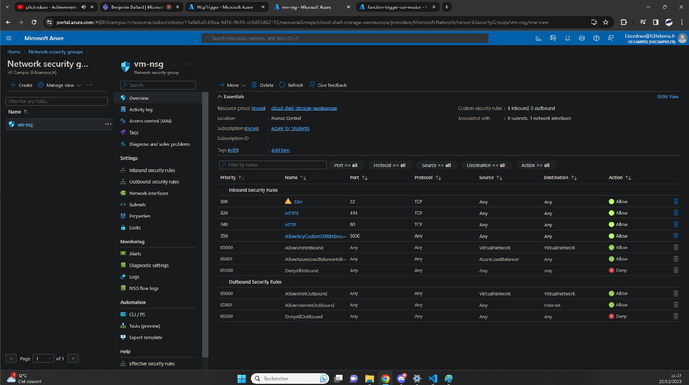

## Set Up a Networking ressource [/createnetwork]
[Back to Source](../README.md)

Suppose you have multiple VMs or services that need to communicate securely. Creating a Virtual Network in Azure allows you to isolate and manage network traffic between resources.

### Network Security Group (For VM)



### Export Template

```
{
    "$schema": "https://schema.management.azure.com/schemas/2019-04-01/deploymentTemplate.json#",
    "contentVersion": "1.0.0.0",
    "parameters": {
        "networkSecurityGroups_vm_nsg_name": {
            "defaultValue": "vm-nsg",
            "type": "String"
        }
    },
    "variables": {},
    "resources": [
        {
            "type": "Microsoft.Network/networkSecurityGroups",
            "apiVersion": "2023-06-01",
            "name": "[parameters('networkSecurityGroups_vm_nsg_name')]",
            "location": "francecentral",
            "properties": {
                "securityRules": [
                    {
                        "name": "SSH",
                        "id": "[resourceId('Microsoft.Network/networkSecurityGroups/securityRules', parameters('networkSecurityGroups_vm_nsg_name'), 'SSH')]",
                        "type": "Microsoft.Network/networkSecurityGroups/securityRules",
                        "properties": {
                            "protocol": "TCP",
                            "sourcePortRange": "*",
                            "destinationPortRange": "22",
                            "sourceAddressPrefix": "*",
                            "destinationAddressPrefix": "*",
                            "access": "Allow",
                            "priority": 300,
                            "direction": "Inbound",
                            "sourcePortRanges": [],
                            "destinationPortRanges": [],
                            "sourceAddressPrefixes": [],
                            "destinationAddressPrefixes": []
                        }
                    },
                    {
                        "name": "HTTPS",
                        "id": "[resourceId('Microsoft.Network/networkSecurityGroups/securityRules', parameters('networkSecurityGroups_vm_nsg_name'), 'HTTPS')]",
                        "type": "Microsoft.Network/networkSecurityGroups/securityRules",
                        "properties": {
                            "protocol": "TCP",
                            "sourcePortRange": "*",
                            "destinationPortRange": "443",
                            "sourceAddressPrefix": "*",
                            "destinationAddressPrefix": "*",
                            "access": "Allow",
                            "priority": 320,
                            "direction": "Inbound",
                            "sourcePortRanges": [],
                            "destinationPortRanges": [],
                            "sourceAddressPrefixes": [],
                            "destinationAddressPrefixes": []
                        }
                    },
                    {
                        "name": "HTTP",
                        "id": "[resourceId('Microsoft.Network/networkSecurityGroups/securityRules', parameters('networkSecurityGroups_vm_nsg_name'), 'HTTP')]",
                        "type": "Microsoft.Network/networkSecurityGroups/securityRules",
                        "properties": {
                            "protocol": "TCP",
                            "sourcePortRange": "*",
                            "destinationPortRange": "80",
                            "sourceAddressPrefix": "*",
                            "destinationAddressPrefix": "*",
                            "access": "Allow",
                            "priority": 340,
                            "direction": "Inbound",
                            "sourcePortRanges": [],
                            "destinationPortRanges": [],
                            "sourceAddressPrefixes": [],
                            "destinationAddressPrefixes": []
                        }
                    },
                    {
                        "name": "AllowAnyCustom5000Inbound",
                        "id": "[resourceId('Microsoft.Network/networkSecurityGroups/securityRules', parameters('networkSecurityGroups_vm_nsg_name'), 'AllowAnyCustom5000Inbound')]",
                        "type": "Microsoft.Network/networkSecurityGroups/securityRules",
                        "properties": {
                            "protocol": "*",
                            "sourcePortRange": "*",
                            "destinationPortRange": "5000",
                            "sourceAddressPrefix": "*",
                            "destinationAddressPrefix": "*",
                            "access": "Allow",
                            "priority": 350,
                            "direction": "Inbound",
                            "sourcePortRanges": [],
                            "destinationPortRanges": [],
                            "sourceAddressPrefixes": [],
                            "destinationAddressPrefixes": []
                        }
                    }
                ]
            }
        },
        {
            "type": "Microsoft.Network/networkSecurityGroups/securityRules",
            "apiVersion": "2023-06-01",
            "name": "[concat(parameters('networkSecurityGroups_vm_nsg_name'), '/AllowAnyCustom5000Inbound')]",
            "dependsOn": [
                "[resourceId('Microsoft.Network/networkSecurityGroups', parameters('networkSecurityGroups_vm_nsg_name'))]"
            ],
            "properties": {
                "protocol": "*",
                "sourcePortRange": "*",
                "destinationPortRange": "5000",
                "sourceAddressPrefix": "*",
                "destinationAddressPrefix": "*",
                "access": "Allow",
                "priority": 350,
                "direction": "Inbound",
                "sourcePortRanges": [],
                "destinationPortRanges": [],
                "sourceAddressPrefixes": [],
                "destinationAddressPrefixes": []
            }
        },
        {
            "type": "Microsoft.Network/networkSecurityGroups/securityRules",
            "apiVersion": "2023-06-01",
            "name": "[concat(parameters('networkSecurityGroups_vm_nsg_name'), '/HTTP')]",
            "dependsOn": [
                "[resourceId('Microsoft.Network/networkSecurityGroups', parameters('networkSecurityGroups_vm_nsg_name'))]"
            ],
            "properties": {
                "protocol": "TCP",
                "sourcePortRange": "*",
                "destinationPortRange": "80",
                "sourceAddressPrefix": "*",
                "destinationAddressPrefix": "*",
                "access": "Allow",
                "priority": 340,
                "direction": "Inbound",
                "sourcePortRanges": [],
                "destinationPortRanges": [],
                "sourceAddressPrefixes": [],
                "destinationAddressPrefixes": []
            }
        },
        {
            "type": "Microsoft.Network/networkSecurityGroups/securityRules",
            "apiVersion": "2023-06-01",
            "name": "[concat(parameters('networkSecurityGroups_vm_nsg_name'), '/HTTPS')]",
            "dependsOn": [
                "[resourceId('Microsoft.Network/networkSecurityGroups', parameters('networkSecurityGroups_vm_nsg_name'))]"
            ],
            "properties": {
                "protocol": "TCP",
                "sourcePortRange": "*",
                "destinationPortRange": "443",
                "sourceAddressPrefix": "*",
                "destinationAddressPrefix": "*",
                "access": "Allow",
                "priority": 320,
                "direction": "Inbound",
                "sourcePortRanges": [],
                "destinationPortRanges": [],
                "sourceAddressPrefixes": [],
                "destinationAddressPrefixes": []
            }
        },
        {
            "type": "Microsoft.Network/networkSecurityGroups/securityRules",
            "apiVersion": "2023-06-01",
            "name": "[concat(parameters('networkSecurityGroups_vm_nsg_name'), '/SSH')]",
            "dependsOn": [
                "[resourceId('Microsoft.Network/networkSecurityGroups', parameters('networkSecurityGroups_vm_nsg_name'))]"
            ],
            "properties": {
                "protocol": "TCP",
                "sourcePortRange": "*",
                "destinationPortRange": "22",
                "sourceAddressPrefix": "*",
                "destinationAddressPrefix": "*",
                "access": "Allow",
                "priority": 300,
                "direction": "Inbound",
                "sourcePortRanges": [],
                "destinationPortRanges": [],
                "sourceAddressPrefixes": [],
                "destinationAddressPrefixes": []
            }
        }
    ]
}
```