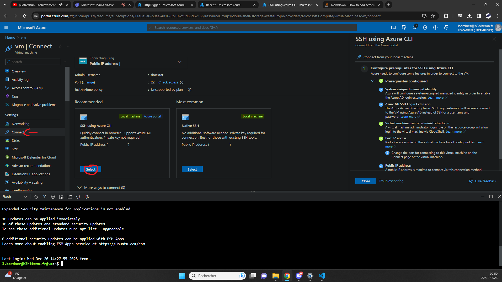

## Create VM [/createvm]
[Back to Source](../README.md)

Imagine you need to host a website or run a specific application that requires a Windows/Linux environment. Creating a VM in Azure can provide you with the required environment without needing physical hardware.

### VM Showcase


### Connecting SSH using Azure CLI



### Export Template

```
{
    "$schema": "https://schema.management.azure.com/schemas/2019-04-01/deploymentTemplate.json#",
    "contentVersion": "1.0.0.0",
    "parameters": {
        "virtualMachines_vm_name": {
            "defaultValue": "vm",
            "type": "String"
        },
        "disks_vm_OsDisk_1_3326c1cb17b84e26aa6f15d597ae6f56_externalid": {
            "defaultValue": "/subscriptions/11e0e5a0-b9aa-4d16-9b10-cc9d55d62155/resourceGroups/CLOUD-SHELL-STORAGE-WESTEUROPE/providers/Microsoft.Compute/disks/vm_OsDisk_1_3326c1cb17b84e26aa6f15d597ae6f56",
            "type": "String"
        },
        "networkInterfaces_vm493_z1_externalid": {
            "defaultValue": "/subscriptions/11e0e5a0-b9aa-4d16-9b10-cc9d55d62155/resourceGroups/cloud-shell-storage-westeurope/providers/Microsoft.Network/networkInterfaces/vm493_z1",
            "type": "String"
        }
    },
    "variables": {},
    "resources": [
        {
            "type": "Microsoft.Compute/virtualMachines",
            "apiVersion": "2023-03-01",
            "name": "[parameters('virtualMachines_vm_name')]",
            "location": "francecentral",
            "zones": [
                "1"
            ],
            "identity": {
                "type": "SystemAssigned"
            },
            "properties": {
                "hardwareProfile": {
                    "vmSize": "Standard_DS1_v2"
                },
                "additionalCapabilities": {
                    "hibernationEnabled": false
                },
                "storageProfile": {
                    "imageReference": {
                        "publisher": "canonical",
                        "offer": "0001-com-ubuntu-server-focal",
                        "sku": "20_04-lts-gen2",
                        "version": "latest"
                    },
                    "osDisk": {
                        "osType": "Linux",
                        "name": "[concat(parameters('virtualMachines_vm_name'), '_OsDisk_1_3326c1cb17b84e26aa6f15d597ae6f56')]",
                        "createOption": "FromImage",
                        "caching": "ReadWrite",
                        "managedDisk": {
                            "storageAccountType": "Premium_LRS",
                            "id": "[parameters('disks_vm_OsDisk_1_3326c1cb17b84e26aa6f15d597ae6f56_externalid')]"
                        },
                        "deleteOption": "Delete",
                        "diskSizeGB": 30
                    },
                    "dataDisks": [],
                    "diskControllerType": "SCSI"
                },
                "osProfile": {
                    "computerName": "[parameters('virtualMachines_vm_name')]",
                    "adminUsername": "dracktar",
                    "linuxConfiguration": {
                        "disablePasswordAuthentication": true,
                        "ssh": {
                            "publicKeys": [
                                {
                                    "path": "/home/dracktar/.ssh/authorized_keys",
                                    "keyData": "ssh-rsa AAAAB3NzaC1yc2EAAAADAQABAAABgQC8pqgX9GelsO/wXhy0jH7EefsZB3aIik3EWx71UTPywsmUQ7uo4LguTyVxTFp7LSi4rmUG635z8owTYsGm9sT5osKKmNsBeDbYKxwHvT/4c+0zv+e/YGmP02Y4Pn2iZ8RkK6TOtkBDtcpyfrR8Nj9lV2kk4eONuoMXdOEBSORtdwjWWLU/BsHQ/GiQACM8MaFPZdroE2GFkJFUdfGSLq9DlYQ1ZACFM0XhbaTKg65LJQiExxraG/hDACxoYrMRdgNu05RnlbypIjDlEOi0z85BkKT25fkfuXzAMATT+ER/pwpvrGt+d8PSboAfA6CuGnLjgBbYqaX1g8RZqBLAPGc5zIw1RM+s5yxYsDXfdKI1S9UbCzOGZCBQ1z3WLmKZMSn9h6dSrE0TWb9Uiu2VNxMeSI2ynP3eeVln6GoI/nxUgxa0Tvz64uiRtF2GFhsHGUvjPU/3vch7loAFAaLtFtup2aSFDgD6zYrh/q3xwWeYXWTBAKmKbDonRPk8sIYw5Ck= generated-by-azure"
                                }
                            ]
                        },
                        "provisionVMAgent": true,
                        "patchSettings": {
                            "patchMode": "ImageDefault",
                            "assessmentMode": "ImageDefault"
                        },
                        "enableVMAgentPlatformUpdates": false
                    },
                    "secrets": [],
                    "allowExtensionOperations": true,
                    "requireGuestProvisionSignal": true
                },
                "securityProfile": {
                    "uefiSettings": {
                        "secureBootEnabled": true,
                        "vTpmEnabled": true
                    },
                    "securityType": "TrustedLaunch"
                },
                "networkProfile": {
                    "networkInterfaces": [
                        {
                            "id": "[parameters('networkInterfaces_vm493_z1_externalid')]",
                            "properties": {
                                "deleteOption": "Detach"
                            }
                        }
                    ]
                },
                "diagnosticsProfile": {
                    "bootDiagnostics": {
                        "enabled": true
                    }
                },
                "priority": "Spot",
                "evictionPolicy": "Deallocate",
                "billingProfile": {
                    "maxPrice": -1
                }
            }
        }
    ]
}
```