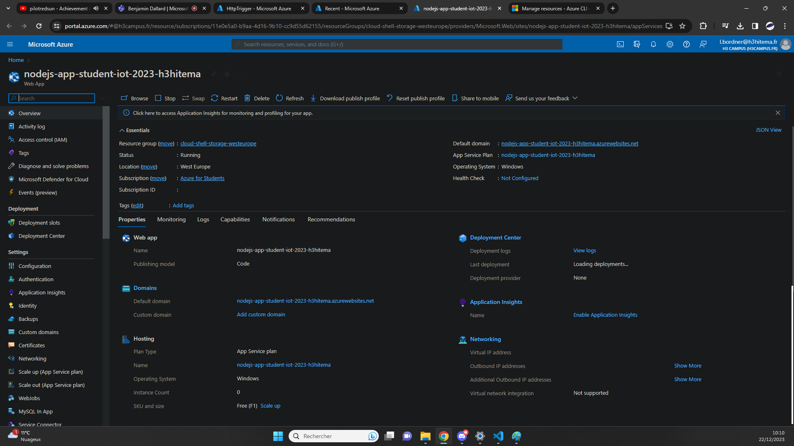
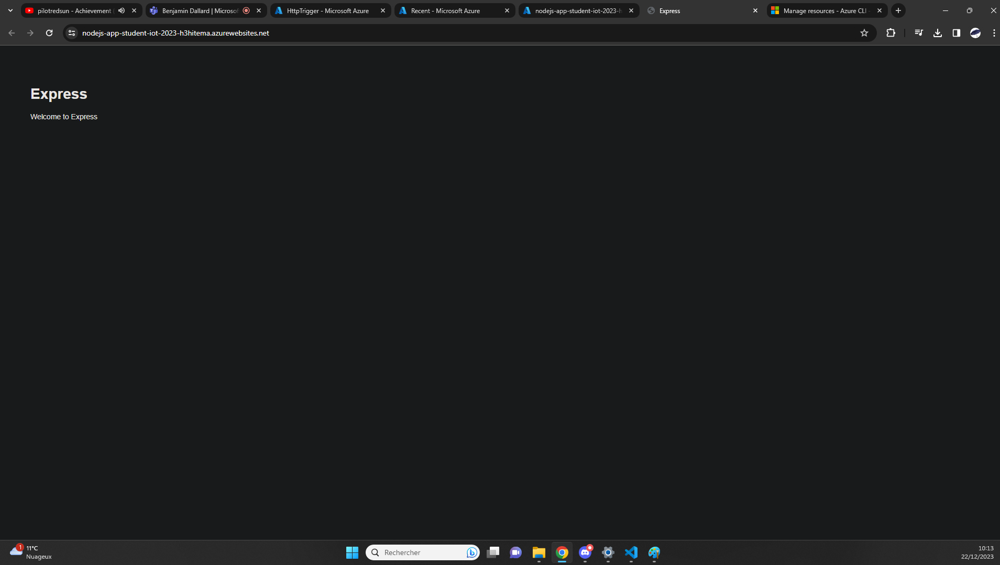

## Deploy App [/deployapp]
[Back to Source](../README.md)

Suppose you have developed a web application and you need a platform to host it. Azure App Services can provide a managed platform to deploy web apps without managing the underlying infrastructure.

### Service App Showcase

### Is the Website deployed ? (yes)

