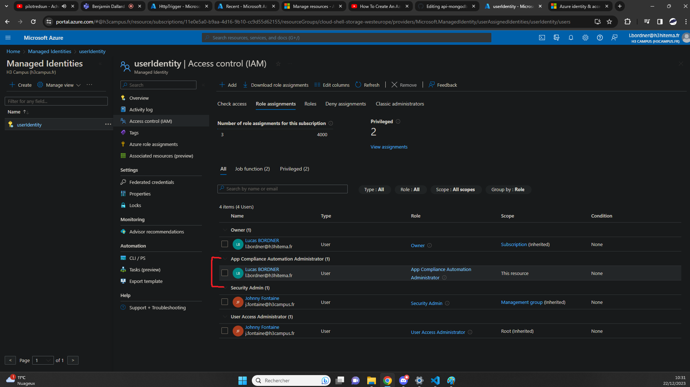
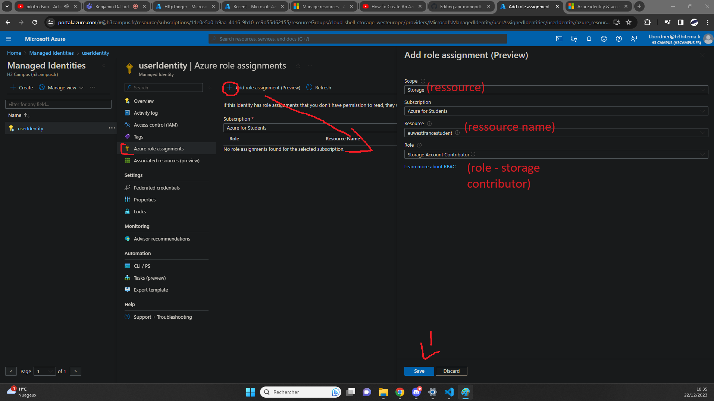

## Implement Azure Identity by creating a simple dev role [/identityrole]
[Back to Source](../README.md)

Consider a scenario where you need to manage user access to resources. Azure Active Directory allows you to manage identities and control access to resources.

### Identity Showcase



### Creating Role For Storage (Bucket) Managment (Storage Account Contributor)



### Policy for the Role (.json)

```
{
    "id": "/subscriptions/11e0e5a0-b9aa-4d16-9b10-cc9d55d62155/providers/Microsoft.Authorization/roleDefinitions/17d1049b-9a84-46fb-8f53-869881c3d3ab",
    "properties": {
        "roleName": "Storage Account Contributor",
        "description": "Lets you manage storage accounts, including accessing storage account keys which provide full access to storage account data.",
        "assignableScopes": [
            "/"
        ],
        "permissions": [
            {
                "actions": [
                    "Microsoft.Authorization/*/read",
                    "Microsoft.Insights/alertRules/*",
                    "Microsoft.Insights/diagnosticSettings/*",
                    "Microsoft.Network/virtualNetworks/subnets/joinViaServiceEndpoint/action",
                    "Microsoft.ResourceHealth/availabilityStatuses/read",
                    "Microsoft.Resources/deployments/*",
                    "Microsoft.Resources/subscriptions/resourceGroups/read",
                    "Microsoft.Storage/storageAccounts/*",
                    "Microsoft.Support/*"
                ],
                "notActions": [],
                "dataActions": [],
                "notDataActions": []
            }
        ]
    }
}
```