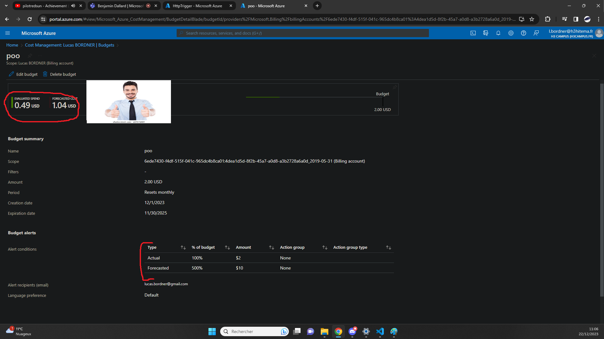
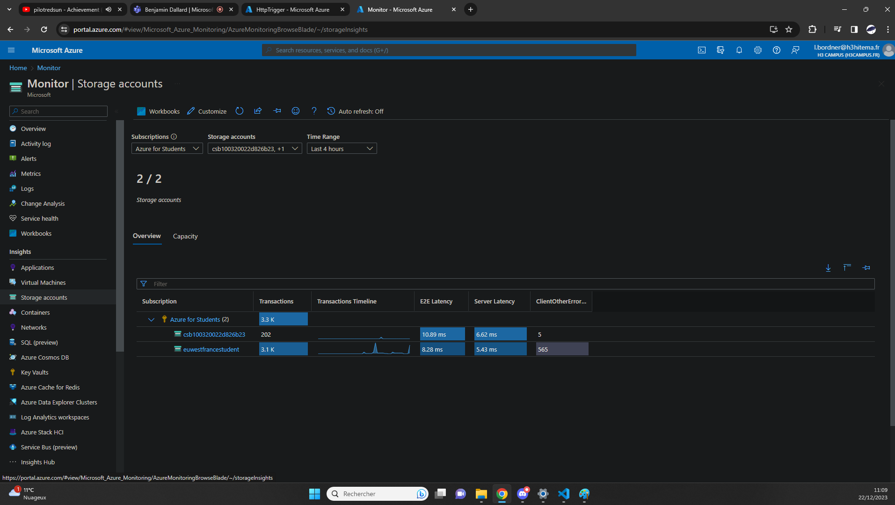
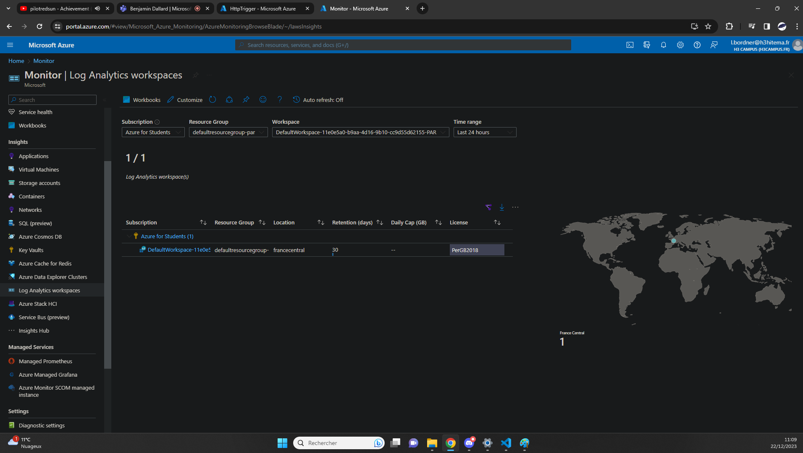

## Configure Monitoring and Logging [/createnetwork]
[Back to Source](../README.md)

Imagine needing insights into the performance and health of your resources. Azure Monitor provides detailed telemetry and logs to help you diagnose issues and optimize performance.

### Budget Alert

### Looking at Metric (Insight On Bucket)

### Hey My Resource Are In France (Insight Log Analytics Workspace)

