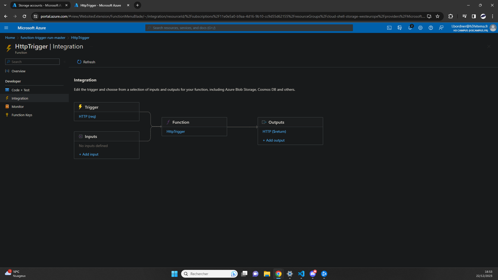
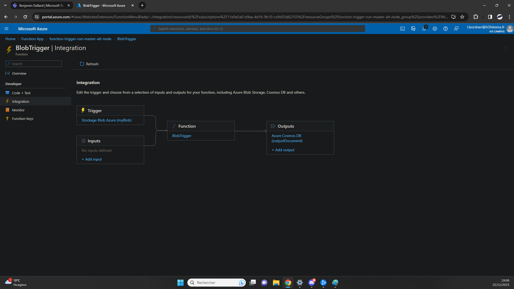

## Implement Azure Cloud Function [/secondfunction]
[Back to Source](../README.md)

First Function (Trigger HTTP) => Api Call on Third Party Website (Was supposed to add data to Mongodb Database but didn't have the time).

Second Function (Trigger Blob) => Send the name of the image in a collection when something is uploaded in the bucket.

### First Function Integration

### Second Function Integration

